# Aquanode Plugins

Free VST3 plugins and standalone apps for Windows, made with JUCE. The C++ source code is included for every plugin and should compile for Windows, Mac and Linux (I only provide Windows builds since I only have a Windows machine).

Watch the video:

[](https://www.youtube.com/watch?v=6Zfvsw8TNzE)

Thanks to the following blogs and youtubers who have featured the plugins (and thanks to anyone who I haven't found yet or forgot to mention!)

[Rekkerd](https://rekkerd.org/aqua-node-announces-free-and-open-source-plugin-suite/) - [Bedroom Producers Blog](https://bedroomproducersblog.com/2026/02/23/aqua-node) - [Synthtopia](https://www.synthtopia.com/content/2026/02/23/free-vst-collection-for-windows) - [AudiArtist](https://www.audiartist.com/grainfreeze-vst-spectral-freeze-plugin/) - [DTM-Sale](https://dtm-sale.com/111697/) - [napskint](https://projectofnapskint.com/noteadder/)

[Amner Hunter](https://www.youtube.com/watch?v=Q7LC3gFO1po) - [AnDerington](https://www.youtube.com/watch?v=0AudEeWqcZc) - [Elektronick Musick](https://www.youtube.com/watch?v=ikbNZDqRFJI) - [FreeVSTPlugins](https://www.youtube.com/watch?v=MgVobyCye6U) - [satyatunes](https://youtu.be/oBMQZzlP8Zo?si=tsx4nwl7jkHXJz2E&t=921) - [LightningPigTV](https://youtu.be/1R3FzizMVis)

If you want to support me, which I'd highly appreciate but you don't have to, then feel free to leave me a tip for my music on [bandcamp](https://aquanode.bandcamp.com), my songs are all free too!

# Downloads:
All builds (standalone .exe and .vst3) are on the [Releases](../../releases) page. 
For the source code and manuals: https://github.com/aquanodemusic/aquanode-plugins/archive/refs/heads/main.zip

🌊 [bandcamp](https://aquanode.bandcamp.com) · [youtube](https://www.youtube.com/@aquanodemusic)

## Synthesizers

| Plugin | Description |
|--------|-------------|
| 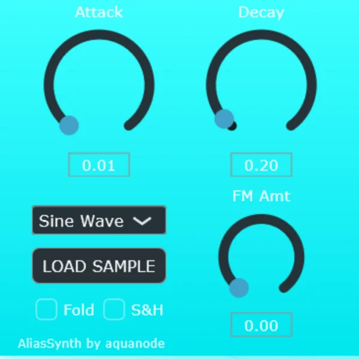<br />**[AliasSynth](synths/aliassynth/)** | A synthesizer and sample player that deliberately has no anti-aliasing built in — frequencies above the Nyquist limit get reflected back into the audible range for unusual, harsh timbres, great for pads, stabs, and extreme sample repitching. |
| 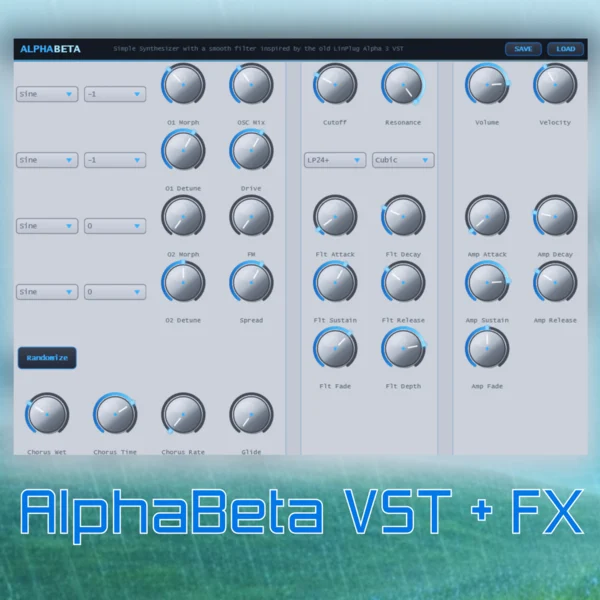<br />**[AlphaBetaSynth](synths/alphabetasynth/)** | A simple synthesizer modelled after the free but discontinued LinPlug Alpha 3, with its characteristic liquid, smooth sweeping filter sound that washes out beautifully with the chorus. |
| 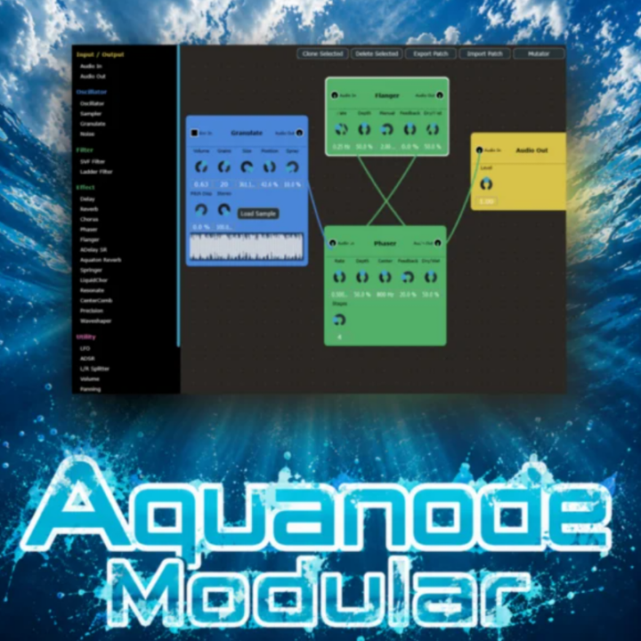<br />**[Aquanode Modular](synths/aquanode-modular/)** | A free modular synthesizer with ~80 modules, cable patching, an euclidean sequencer, granulator, physically modelled drums, spectral effects, preset mutation — and full feedback routing, including self-FM. Inspired by the Nord Modular G2 and Wren. |
| 🧵<br />**[CombWeave](synths/combweave/)** | An experimental additive synth where each sine wave is spaced equidistantly, exponentially, or harmonically from the next, with rolloff, note-lock, and bidirectional mirroring controls. |
| 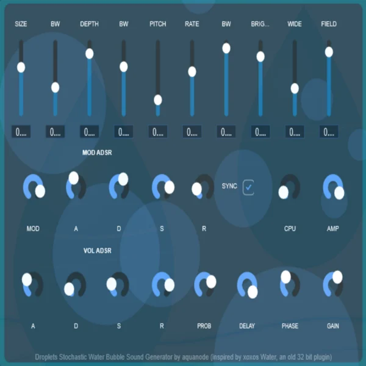<br />**[Droplets](synths/droplets/)** | A 64-bit VST3 recreation of the old 32-bit freeware plugin "Water" by xoxos — a physical water droplet model that creates individual bubble sounds, splashes, or river textures. |
| 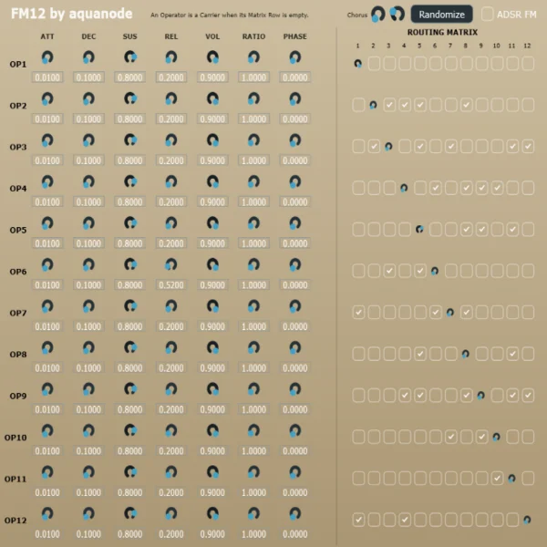<br />**[FM12](synths/fm12/)** | An easy-to-use 12-operator PM/FM synthesizer with a flexible modulation matrix, user waveform import, and integrated stereo chorus for simple yet complex sound design. |
| ✏️<br />**[Frequency Drawer](synths/frequency-drawer/)** | An experimental draft plugin with a canvas on which you draw sound that is played back left to right, with two rendering engines, frequency blur reverb, and harmonics controls. |
| 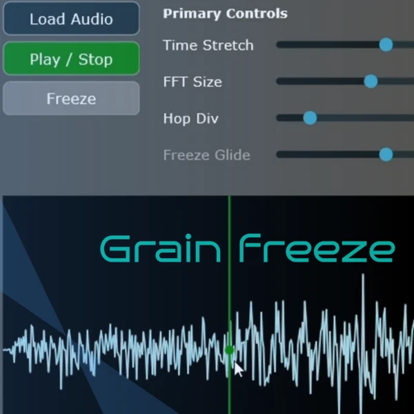<br />**[Grainfreeze](synths/grainfreeze/)** | A real-time phase-vocoder time-stretching and freeze processor: drag the playhead freely through a loaded file (backwards too), or freeze a tiny crossfaded slice in spectral freeze mode. |
| 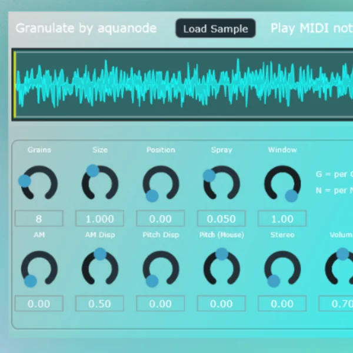<br />**[Granulate](synths/granulate/)** | A granulator focused on the essentials: grain amount, position, spread, and duration, with MIDI resampling, click-to-granulate on the waveform, and visual grain playheads. |
| 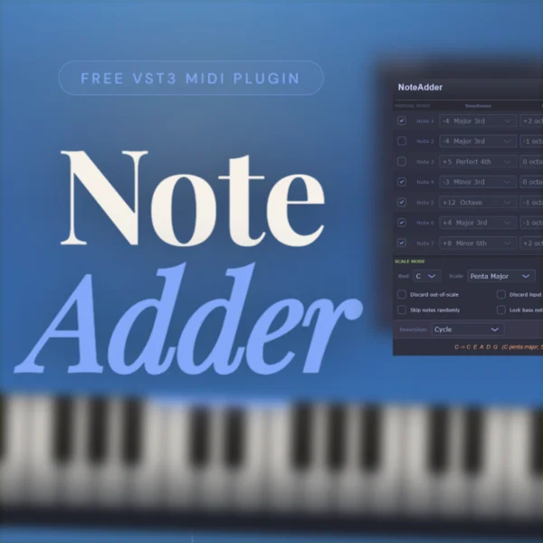<br />**[NoteAdder](synths/noteadder/)** | A MIDI plugin that analyzes the notes you play and adds extra notes around them in real time — play a note, get a chord; play a chord, get many. With scale/custom/cluster modes, animation modes, humanize, and MIDI recording. GPLv3. |
| 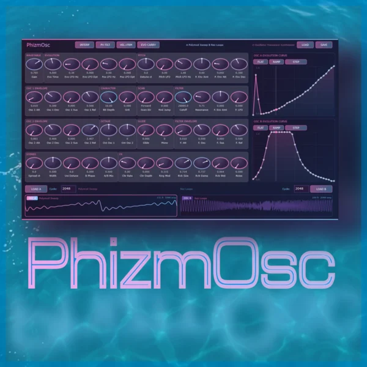<br />**[PhizmOsc](synths/phizmosc/)** | A 2-oscillator transwave synthesizer loosely inspired by the Ensoniq Fizmo hardware synth, with wavetable import, transwave envelopes, and Fizmo wavetables included. |
| 🌾<br />**[SampleField](synths/samplefield/)** | A 24-voice polyphonic sampler that continuously loops and chains random audio files from a pool of up to 128 samples for generative, evolving textures as long as a note is held. |
| 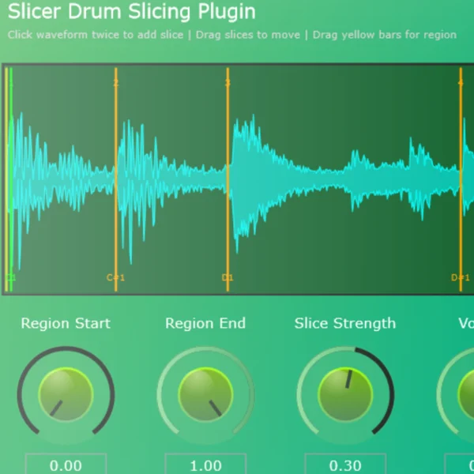<br />**[Slicer](synths/slicer/)** | A simple recreation of a well-known drum slicing plugin — slicing only, with no installers, online activations, or crowded UI. |

## Effects

| Plugin | Description |
|--------|-------------|
| 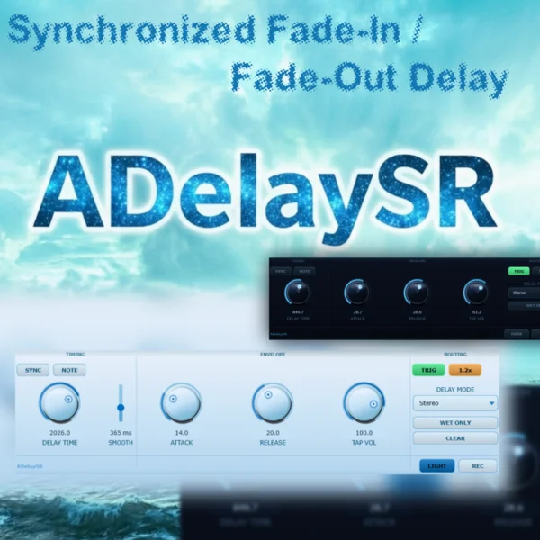<br />**[ADelaySR](effects/adelaysr/)** | A tempo-syncable stereo delay where every tap is shaped by a fade-in (Attack) and fade-out (Release) envelope — instead of abrupt echoes, each repeat blooms in and dissolves out for a washed-out delay character. |
| <br />**[AlphaBetaFX](effects/alphabetafx/)** | The filter and chorus section of AlphaBetaSynth as an effect: run any signal through the liquid, smooth sweeping Alpha 3–style filter sound. |
| 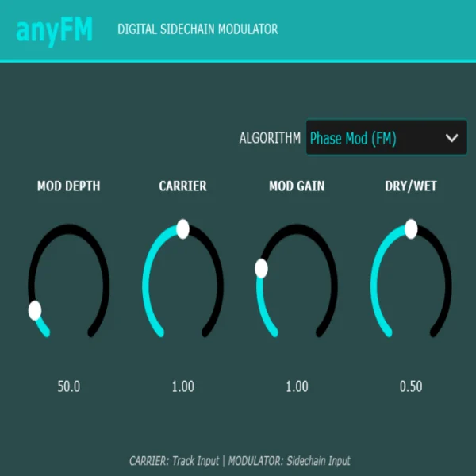<br />**[anyFM](effects/anyfm/)** | FM-modulates a sidechained signal onto a carrier signal — any sound can FM (or ring-modulate) any other sound directly in your mixer. |
| 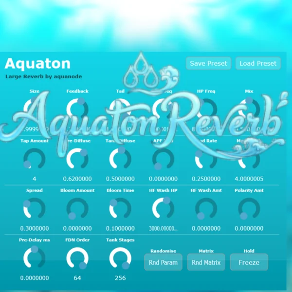<br />**[Aquaton Reverb](effects/aquaton-reverb/)** | A large reverb inspired by lush, non-natural-space reverbs like Blackhole or Supermassive, with free control over feedback, tank dispersion, bloom, HF wash, and many parameters other reverbs hide internally. |
| 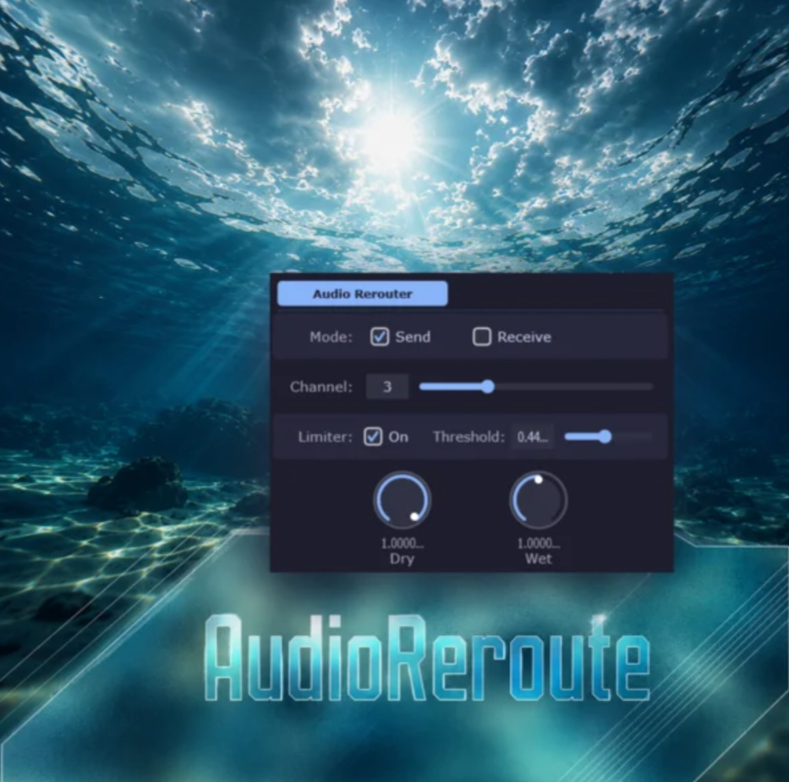<br />**[AudioReroute](effects/audioreroute/)** | A versatile DAW-routing utility and feedback loop creator — send audio between tracks in ways your DAW normally won't allow. |
| 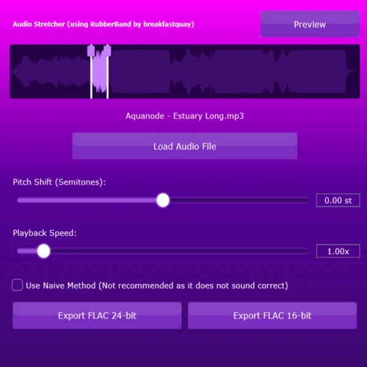<br />**[AudioStretcher](effects/audiostretcher/)** | Independent time-stretching (0.1×–10×) and pitch-shifting (±36 semitones) powered by the Rubber Band Library, with region selection and lossless FLAC export. GPL v2. |
| 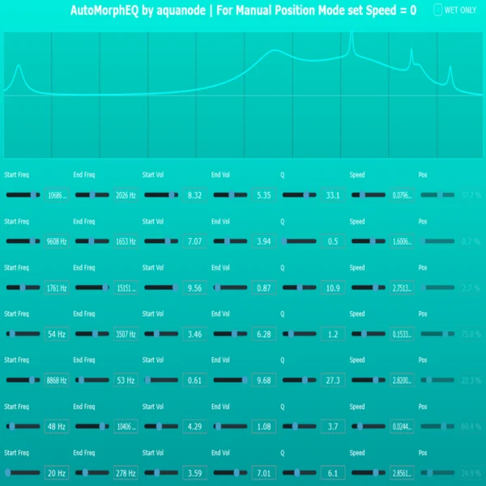<br />**[AutoMorphEQ](effects/automorpheq/)** | A VST3 port of my AutoMorph EQ Patcher preset for FL Studio: an automated morphing EQ with randomizer and multiple LFO modes. |
| 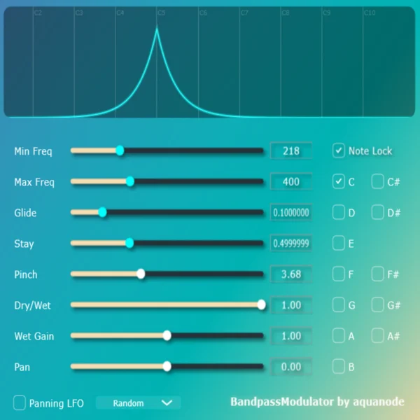<br />**[Bandpass Modulator](effects/bandpass-modulator/)** | A VST3 port of my FL Studio / PlugData bandpass modulators: a randomly jumping, skew-modulated bandpass filter with note lock — from Filter FM to bubbly effects to mellow panning. |
| 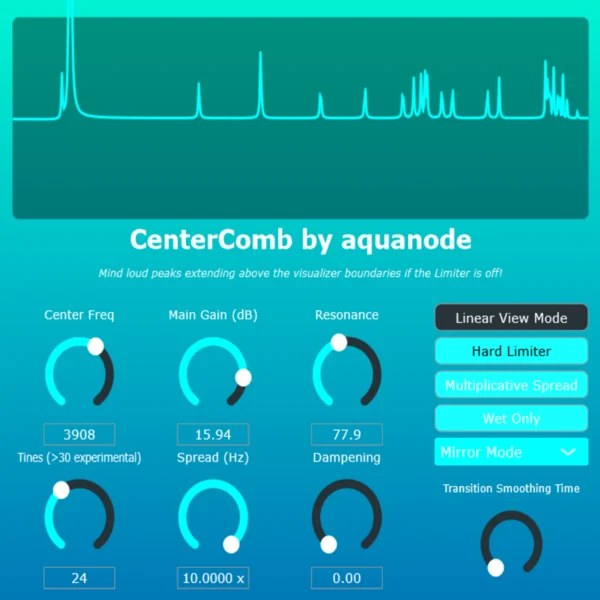<br />**[CenterComb](effects/centercomb/)** | An experimental effect using equidistantly spaced filters to create interesting tones (add a limiter — volume spikes happen!). Sibling of the CenterWeave synth concept. |
| <br />**[CepstralIR](effects/cepstralir/)** | Extracts the acoustic signature (impulse response) of any recording via cepstral processing — capture the character of a guitar, space, or effect chain as a reusable IR file. Pairs with IRConvolve. |
| ✂️<br />**[ClipPreserve](effects/clippreserve/)** | A detail-preserving clipper: it extracts the content lost to clipping via a polarity-inverted delta chain and blends it back in, so hi-hats survive on top of loud subbass. |
| 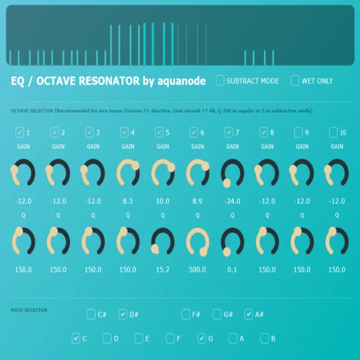<br />**[EQ Octave Resonator](effects/eq-octave-resonator/)** | An array of parallel note-tuned bandpass filters with selectable resonating octaves and notes, per-octave volume sliders, and a wet-only mode that cancels the incoming signal. |
| 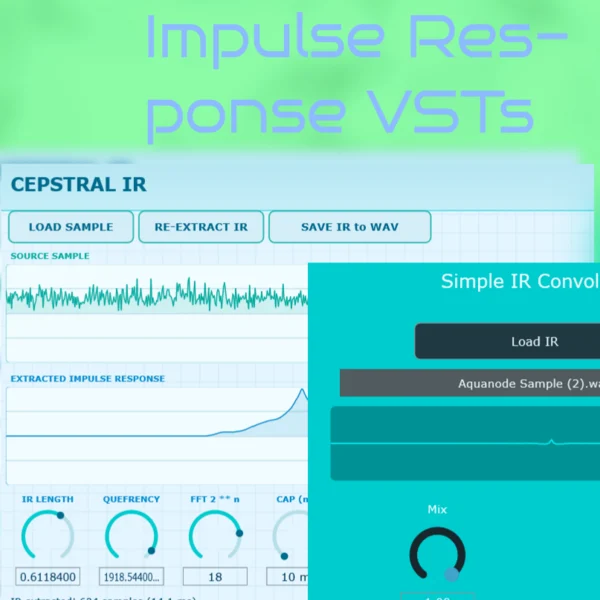<br />**[IRConvolve](effects/irconvolve/)** | The companion convolver to CepstralIR: load impulse responses and imprint their captured character onto any signal. |
| 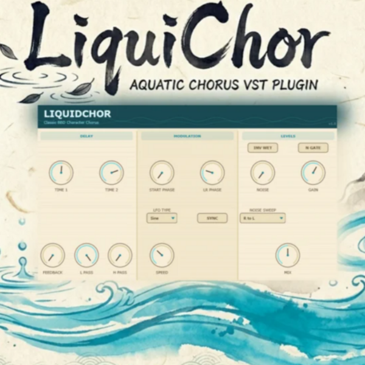<br />**[LiquidChor](effects/liquidchor/)** | A recreation of a famous BBD chorus, focused on spacious, free-flowing chorus delay lines and "analog" noise hiss reminiscent of waves crashing ashore. |
| <br />**[NoteControl](effects/notecontrol/)** | The MIDI-controlled sibling of PitchControl: select which notes pass through via MIDI input instead of the piano interface. |
| 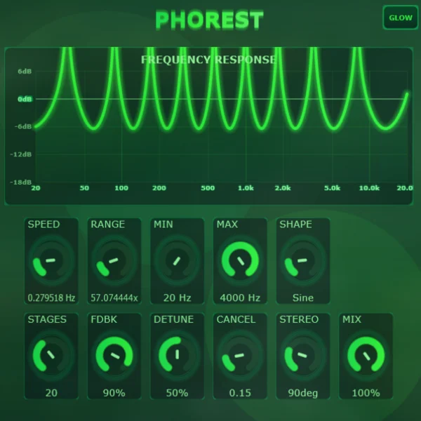<br />**[Phorest](effects/phorest/)** | A phaser modelled after a well-known stock DAW phaser but with much more extensive control ranges: more stages, extra LFO modes (including a flattened tanh sine), and a two-mode GUI. |
| 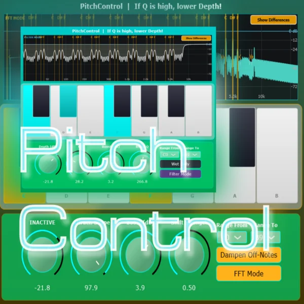<br />**[PitchControl](effects/pitchcontrol/)** | The typical "colorbass" effect: up to 120 bell filters (or an FFT bin-shifting mode) attenuate all frequencies except the notes you activate on the piano interface. |
| <br />**[PitchControlEQ](effects/pitchcontroleq/)** | The EQ-flavored variant of PitchControl, closest to my original "PitchControl EQ" Patcher preset from the AutoMorph pack. |
| 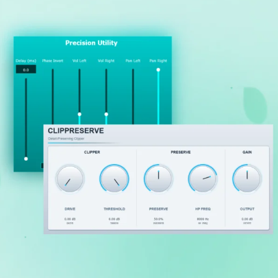<br />**[PrecisionUtility](effects/precisionutility/)** | A utility for artificial latency, phase inversion, and channel panning — precise signal alignment tools, designed to pair with SignalControl and ClipPreserve. |
| 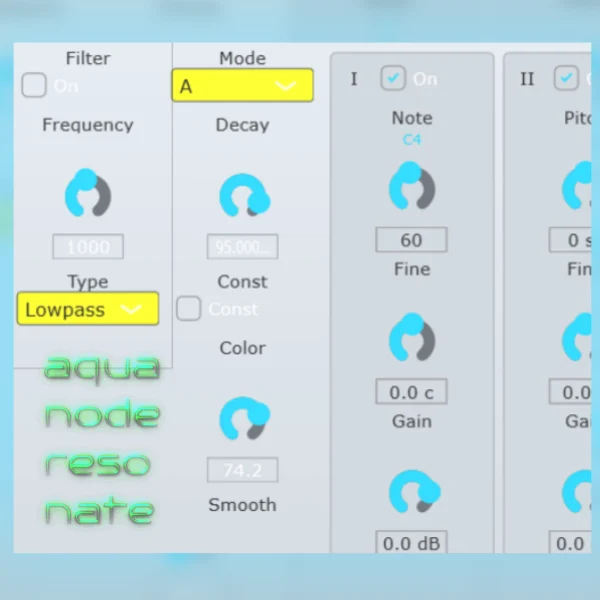<br />**[Resonate](effects/resonate/)** | A 5-voice resonator modelled after a famous DAW resonator, recreated from scratch in JUCE — with a much broader note range than the original. |
| ~<br />**[SignalControl](effects/signalcontrol/)** | Draw control voltage curves and gate signals and output them as audio (CV on the left channel, gates on the right) — reliable modulation routing for DAWs where parameter outputs aren't. |
| 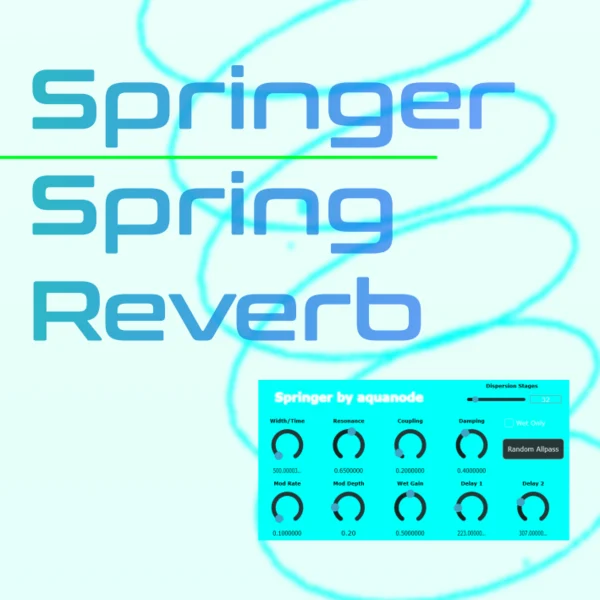<br />**[Springer Spring Reverb](effects/springer-spring-reverb/)** | An algorithmic stereo spring reverb built from dual interacting spring lines with dispersion, damping, feedback, and modulation — from dub-style springiness to phasing laser sounds. |
| 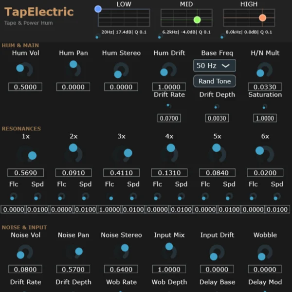<br />**[TapElectric](effects/tapelectric/)** | A tape deck simulation adding warm electric hum and white tape noise — less about transforming the sound (though saturation and wobble are there) and more about the imperfect tape atmosphere. |
| 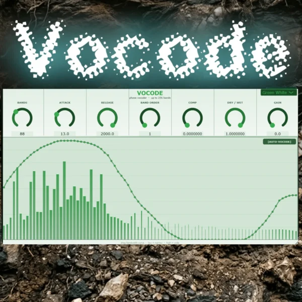<br />**[Vocode](effects/vocode/)** | A classic filter-bank vocoder with up to 256 bands: modulator envelopes gate the carrier's bands for the characteristic "talking synthesizer" effect, or richly self-gated robotic textures without a sidechain. |

## Spectral Suite

A collection of effect plugins (and one synth) built on a shared FFT-based engine for real-time spectral analysis and manipulation — especially suited for colorbass, botanica, and experimental sound design. See the [suite overview](spectral/) for details.

| Plugin | Description |
|--------|-------------|
| 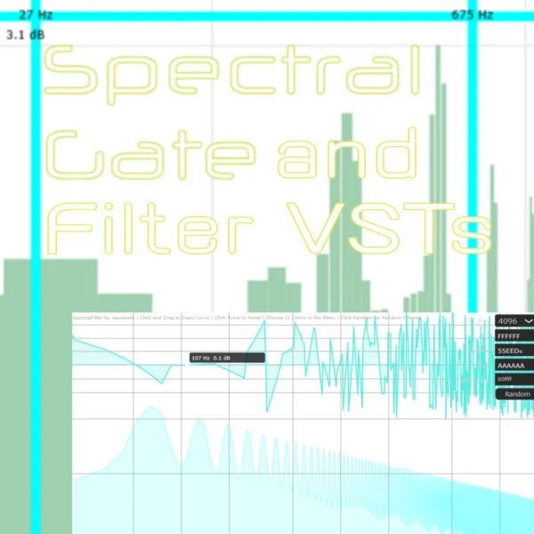<br />**[SpectralCompare](spectral/spectralcompare/)** | A live spectrogram with sidechain overlay, delta display, spectral EQ drawing, morphing/vocoding-style processing, rolling spectrogram mode, and a sharp spectral reassignment view — analysis and shaping in one interface. |
| **[SpectralEdit](spectral/spectraledit/)** | A synth that loads up to 1 minute of audio into an editable spectrogram: select, rotate, flip, blur, draw, compress, and scrub spectral content, then play it back repitched via MIDI. |
| **[SpectralEnhance](spectral/spectralenhance/)** | Same controls as SpectralGate, but frequencies are pulled *towards* the gate line instead of deleted — a spectral brickwall compressor, upwards or downwards. |
| **[SpectralFilter](spectral/spectralfilter/)** | Draw custom filter curves (±24 dB) directly onto the live spectrum, with multiple FFT resolutions, a random curve generator, per-bin frequency/phase/panning control, IR export, and a fully color-customizable UI. |
| **[SpectralGate](spectral/spectralgate/)** | Frequency-selective gating: two vertical frequency bounds and a drawable amplitude threshold decide what passes, with invert mode and tilt EQ — for band carving, noise removal, and creative filtering. |
| **[SpectralLatency](spectral/spectrallatency/)** | Spectral delay over up to 8192 FFT bins: draw a delay curve along the frequency range — including "negative" delay that sends the rest of the sound out earlier. |
| **[SpectralResolve](spectral/spectralresolve/)** | A high-resolution reassignment-based spectral analyzer focused on sharp low-frequency inspection, with FFT sizes up to 16384, decimation for enhanced bass resolution, and a sidechain comparison path. |
| **[SpectralStereoize](spectral/spectralstereoize/)** | A spectral Mid/Side processor: draw stereo width curves across the frequency spectrum, from full mono collapse to extreme expansion per frequency range, with sidechain reference display. |

## Apps

| App | Description |
|-----|-------------|
| 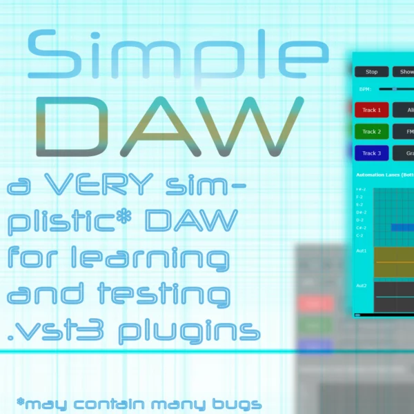<br />**[SimpleDAW](simpledaw/)** | A very simple standalone DAW that can load 64-bit Windows .vst3 plugins — a minimal host for sketching and testing. Has many flaws and bugs in it, but it is usable. |

## Repository Structure

Every plugin folder follows the same layout:

```
plugin-name/
├── README.md      description, controls, version history
├── src/           JUCE/C++ source code of the current version
├── archive/       source snapshots of previous versions (v0.1, v1.0, ...)
├── assets/        icons, banners, GUI screenshots, HTML backgrounds
├── demos/         sound examples, videos, example FL Studio projects
├── docs/          PDF/ODT manuals (only where they exist)
└── presets/       factory presets (only where they exist)
```

Most plugins were made with the help of Claude AI. Unless noted otherwise in the plugin folder (NoteAdder is GPLv3, AudioStretcher is GPL v2 due to Rubber Band), see the repository license. Have fun with the plugins! — Aquanode

---

If you scrolled this far - thank you! Here is a little more about myself. 

One thing I really don’t like as an artist is not owning my tools. Online activation, license servers, and “phone-home” plugins are common practices in modern creative software. I understand why they’re used, but I’m not sure why online activation is so prevalent rather than something like a personalized offline installer - which some vendors kindly provide. These online systems create unnecessary dependencies and take control away from artists who simply want reliable tools. That’s why all of my plugins are fully self-contained and activation-free. There are no installers, no online authorization or accounts, and nothing that can suddenly stop working because a server goes offline or similar - hence, my software is also open source so anyone can maintain it as long as they want.

Furthermore, I value creative, colorful, and genuinely human design and want interfaces that feel tactile, expressive, natural and alive. Tools should invite playful curiosity and comfort, with warmth, depth, and personality. They should be a joy to use and evoke a sense of freedom whilst having their own character. Even though I use AI to make my plugins, which goes against some of these ideals, I still care about them and am glad that these AI systems gave me the ability to create them - there are many projects I would never have found the time nor the mental energy for otherwise, so I hope that is understandable!
