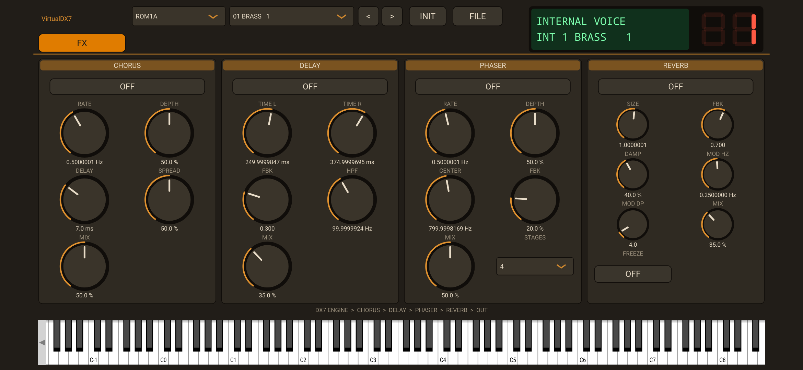

# VirtualDX7

This is the **Android Port** of the VirtualDX7 synthesizer plugin.
It is the same codebase as the version from the `synths` folder with the addition of the Android folder.
VirtualDX7, also the Android App, can load the original DX7 rom,
which however is not included due to copyright reasons. Nevertheless, it includes its own native
recreation of the DX7's engine, similar to other projects such as dexed, which captures the DX7's sound.

For more information, please have a look at the respective project and readme in the `synths` folder.

## As in the VST3 version, you will get 

A remake of the DX7 sound engine (which I call native engine), or the ability to load the original ROM.
With the rom, you get:

* **REAL SOUND**: MIDI in → authentic DX7 FM audio out, generated by the emulated
  firmware and chips (not a DSP re-implementation), but also
* **REAL LIMITATIONS**: The original sound engine only supports the keyboard range
  of the original hardware, and tweaking knobs while sound plays is not supported.

Furthermore:
* Original 6-operator editor: every voice parameter (per-operator envelopes,
  frequency, keyboard scaling, plus global algorithm / feedback / LFO / pitch
  envelope) is editable with rotary controls.
* Live emulated **LCD** and **voice-number LED** read straight from the running
  firmware.
* Factory ROM browser (ROM1A … ROM4B, 256 voices) plus an INIT voice.
* **FILE menu** (SysEx import/export):
  * *Import bank* - load any standard 32-voice `.syx` bank (4104-byte bulk dump);
    its 32 voices appear as a **USER** bank in the browser.
  * *Export current voice* - save the current (edited) voice as a 163-byte
    single-voice `.syx`.
  * *Export bank* - save the current bank as a 4104-byte 32-voice `.syx`, with the
    current edited voice written into its slot.

Only the native engine supports
* **Live edits / automation:** turning a knob sends lightweight
  parameter-change SysEx, so
  every new note instantly reflects the current knob/automation values with no
  patch-reselect glitch. The original DX7 did not have live-knob tweaking abilities while a note plays.

## Credits & license

* **VDX7** — the DX7 emulation, firmware and voice data — © chiaccona@gmail.com,
  licensed **GPLv3**. This project vendors and links it.
* The voice pack/unpack byte layout follows the public DX7 SysEx voice format,
  as also implemented by **Dexed** (which inspired this editor's layout).
* **libsamplerate** by Erik de Castro Lopo is vendored under
  `engine/samplerate/` (**BSD-2-Clause**, GPL-compatible) — see
  `engine/samplerate/LICENSE.libsamplerate`.
* This combined work is distributed under the **GNU GPL v3** — see `LICENSE`.

This project is not affiliated with or endorsed by Yamaha. "DX7" is a trademark
of Yamaha Corporation and is used here only descriptively.
