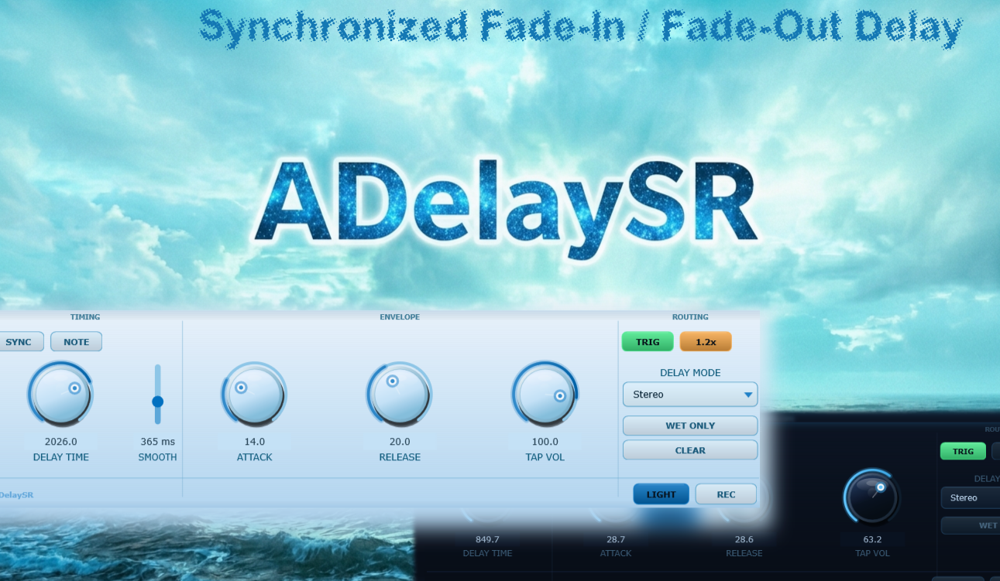

# ADelaySR

Download builds from the [Releases](../../../../releases) page.

A stereo delay with a unique twist that every tap is shaped by a fade-in (Attack) and fade-out (Release) envelope, like an ADSR volume envelope. Instead of abrupt echoes, each repeat blooms in and dissolves out. Great for gently shimmering pads, rhythmic swells, and lush textures. Also features tempo sync, a sub-millisecond resonator mode, four routing modes, and a WAV recorder.

Using the tempo sync, each individual delay tab will gently introduce the sound, and release it in the same fashion. With this you can have a hard stab sound as input, but the delay ease in and out of the sound to create a washed out delay character.

You can set the tap volume to 100% so the delay repeats the sound indefinitely at the same volume. As with most delays, interesting sound design effects can be created by then turning the delay time knob around - using this plugin's characteristic delay time change smoothing slider, this can create anything from turntable sound skewing to radio- or formant-type sounds depending on which delay mode you use.

Finally, directly recording the sound to a .wav file is also possible.

## Manual

### Timing

**SYNC button** (blue toggle)
Locks delay time to host BPM via the DIVISION combo (1/1 3/4 1/2 1/4 1/8 1/4T 1/8T). Disabled automatically when NOTE is active.

**NOTE button** (orange toggle)
Switches to sub-millisecond "Note Delay" / resonator mode (0.00001–1.0 ms, 5 decimal places). Useful for Karplus-Strong-style string/drum resonance. Disables SYNC. Very small time settings might be inaudible depending on your DAW's sample rate or outside of the audible range.

**DELAY TIME knob** (free mode: 1–5000 ms, log taper, default 500 ms)
**DIVISION combo** (shown when SYNC=on)
**NOTE DELAY knob** (shown when NOTE=on; linear, default 0.5 ms)

**SMOOTH slider** (vertical, 0–1000 ms, default 50 ms)
Controls how quickly delay time changes take effect. At 0 ms changes snap instantly (useful in NOTE mode or for intentional pitch-glide artefacts). At higher values large knob sweeps glide smoothly without clicks. Switching between NOTE and normal modes always snaps regardless of this setting to avoid sweeping through the full frequency range.

Pitch reference for NOTE mode at 44 100 Hz:
- 440 Hz (A4) ≈ 0.00227 ms
- 330 Hz (E4) ≈ 0.00303 ms
- 528 Hz (C5) ≈ 0.00189 ms

### Envelope

**ATTACK** (0–50 % of delay window)
Fade-in ramp at the start of each tap. 0 % = instant; 50 % = fades in over the entire first half of the period.

**RELEASE** (0–50 %, measured from the end)
Fade-out ramp at the end of each tap. 0 % = instant cut; 50 % = starts fading from the halfway point. Attack + Release can total up to 100 %, giving a pure triangle (no sustain plateau).

**TAP VOL** (0–100 %, default 50 %)
Controls both the echo amplitude and the feedback level. 0 % = silent; 99 % = near-infinite tail; 100 % = infinite sustain. The envelope shapes the output only — the feedback path always uses the raw TAP VOL, so each successive echo gets a fresh attack/release.

The 1.2x button raises the range ceiling to 120 % for extra drive.

### Routing

**TRIG** (green toggle, default ON)
Resets the envelope phase to zero on each new note onset (> –60 dBFS). OFF = free-running phase (classic delay; envelope position is random at the moment you play).

**DELAY MODE combo**
- Mono — L+R summed; both outputs receive the same delayed signal.
- Stereo — independent L/R buffers; preserves stereo width.
- Ping Pong — feedback crosses channels; echoes bounce L→R→L→…
- Hard PP — each successive tap is fully left or fully right, alternating.

**WET ONLY** (blue toggle)
Suppresses the dry signal; output is the delayed taps only.

**CLEAR** (momentary button)
Instantly wipes the delay buffer and silences all current echoes as if the plugin was freshly loaded. Useful for clearing a runaway feedback loop or starting fresh between takes without reloading the plugin.

### Recording

Click WAV REC to start capturing the plugin output (up to 2 minutes, stereo 24-bit). The button blinks red while recording. Click again to stop and choose a save location.

### Tips

1. **Shimmer pad** — TRIG=ON, ATTACK=40%, RELEASE=40%, TAP VOL=75–85%, MODE=Stereo. Short stab → each echo blooms in and out as a soft, evolving pad.
2. **Rhythmic gating** — TRIG=ON, ATTACK=0%, RELEASE=45%, TAP VOL=70%, SYNC=ON, DIV=1/8. Sharp attack + gentle tail pulses in time with the host.
3. **Reverse swell** — TRIG=ON, ATTACK=45%, RELEASE=5%, TAP VOL=65%. Taps fade in slowly and drop off quickly, like a reverse reverb.
4. **Infinite pad** — TRIG=ON, ATTACK=25%, RELEASE=25%, TAP VOL=99–100%. Self-sustaining texture; automate TAP VOL to fade out when done.
5. **Karplus-Strong string** (NOTE mode) — NOTE=ON, ATK=0%, REL=0%, TAP VOL=97–99%. Feed a short transient. Set NOTE DELAY to pitch (440 Hz = 0.00227 ms). Lower TAP VOL = more damping / shorter note.
6. **Flanger / chorus** — SYNC=OFF, NOTE=OFF, DELAY TIME=1–15 ms, TAP VOL=50–70%. Automate delay time for a classic Doppler-sweep flanger.
7. **Ping pong swell** — MODE=Ping Pong, TRIG=ON, ATTACK=30%, RELEASE=30%, TAP VOL=70%, SYNC=ON, DIV=1/4 → wide rhythmic stereo spread with bloom.
8. **Comb filter** (NOTE mode) — NOTE=ON, ATK=0%, REL=0%, TAP VOL=50–80%, sustained pad or noise input. Stack instances at half/double delay times for chord-tuned resonance.

### Technical notes

| | |
|---|---|
| Delay buffer | 960 000 samples (5 s @ 192 kHz); linear interpolation. |
| Latency | Zero reported to host (delay is an effect, not aligned). |
| State | Saved/restored via APVTS XML in the DAW session. |
| Format | VST3, JUCE 7+, Windows 10+ |

### Credits

Made by aquanodemusic with the help of Claude AI by Anthropic. Open-source JUCE source code. Build with Projucer.
