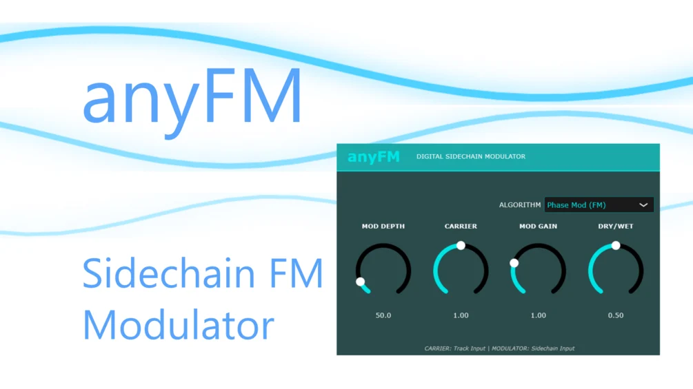

# anyFM

**Latest version:** 1.2 — download builds from the [Releases](../../../../releases) page.

anyFM is an effect that FM-modulates a sidechained signal onto a carrier signal.

For that, it naturally must be placed on a mixer track that has another track routed to it via sidechain.

You'll thus need in general two sounds: the track anyFM is inserted on acts as the carrier and the sidechained track is used as the FM modulator. However, self-FM options are also available. The feedback-FM mode can turn sine waves into saw waves at low values and produces experimental noises at higher values. In this feedback mode, volumes are hard-capped at 75% for safety, while the other modes remain uncapped.

The controls are mostly self-explanatory. Modulation Rate controls the FM depth/strength, while the remaining knobs handle volume balance. In addition to FM, you can also switch to Ring Modulation.

It gives you the option of which sound should modulate which without changing how you need to route the plugin. For example, you can have the sound of the sidechain as the carrier output sound and the sound the plugin is routed to as the modulator.

Version 1.1 has a larger FM range if you want it to sound heavier, otherwise the functionality is identical.

## Setup Guide

**IMPORTANT!** Make sure your routing is set up correctly. Incorrect routing can result in unintended behavior, most prominently self-FM, where you in fact modulate the carrier with itself and not with the sidechain.

For actual FM of the sidechain input as modulator, insert anyFM on a mixer track, then route another mixer track to this track and set it to Sidechain. At the bottom of the mixer, select the track you want to use as the modulator, click the small upward arrow to sidechain it, and turn the send volume down to 0 for a pure sidechain signal. Optionally, unlink the sidechain track from the Master to make it behave like a true FM modulator, similar to an FM synth.

Then, and this is the important part to make it work, open the plugin wrapper settings (the cog icon above the plugin GUI in FL Studio), go to Processing, and click Auto map inputs. Now anyFM is live and waits for sound input on both channels.

Example setup in FL Studio:

1. Insert anyFM on a mixer track.
2. Route another mixer track to this track and set it to Sidechain:
   - At the bottom of the mixer, select the track you want to use as the modulator.
   - Click the small upward arrow to sidechain it.
   - Turn the send volume down to 0 for a pure sidechain signal.
   - (Optional) Unlink the sidechain track from the Master to make it behave like a true FM modulator, similar to an FM synth.
3. Open the plugin wrapper settings (the cog icon above the plugin GUI), go to Processing, and click Auto map inputs. **This is the important part to make it work.**
4. anyFM is now live and waits for sound input on both channels.

A video walkthrough of the FL Studio setup is included in `demos/`.

Hope it works well! Have fun with it!

Made by aquanode with the help of Claude AI.
