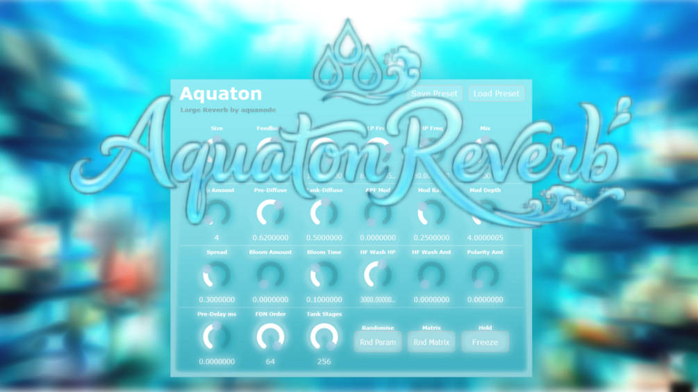

# Aquaton Reverb

**Latest version:** version 1.0 — download builds from the [Releases](../../../../releases) page.

Aquaton (from "Aqua" + "Ton(e)") Reverb is a Large Reverb inspired by lush, non-natural-space reverbs such as Blackhole or Supermassive. It is loosely based on my Springer Spring Reverb plugin, but completely reworked to create large and bright, washed out reverbs. It can be easy on the CPU or heavy depending on the settings (especially the amount of feedback and tank dispersion stages) - you have free control over many parameters that many other reverb plugins usually hide internally.

I made this reverb with the help of Claude AI to have a free and open source reverb code base to learn from and share with the world, as I strongly believe in open source software and easy distribution. The price of 3€ is only a suggestion, simply type in 0€ and you get it for free (but I of course highly appreciate any tips).

Here is an example how it sounds like, using a short impulse to capture its sound character:

You can probably notice that the initial character resembles that of a spring, and then it washes out. This sound used a rather long tail, shorter values can sound like hitting on a sheet of metal (typical plate / tank reverb type of sound).

Thanks for checking it out!

## Controls

| Control | What it does |
|---------|--------------|
| Save Preset | Saves all current parameter values to an .xml file. |
| Load Preset | Restores parameter values from a saved .xml file. |
| Size | Scales all delay line lengths. Larger values produce a bigger, more spacious reverb; smaller values tighten it to a room. |
| Feedback | How much signal recirculates through the delay network. Values above 1.0 push into self-oscillation territory (tanh saturation keeps it from blowing up). |
| Tail | Smoothly extends the decay by interpolating the effective loop gain from the Feedback knob value toward the stability ceiling. At 0 the tail length is determined by Feedback alone; at 1 the loop gain is held barely below unity for a near-infinite tail, regardless of where Feedback is set. |
| LP Freq | Low-pass filter cutoff inside the feedback loop. Lower values create darker, warmer tails. Fully open at max (20 kHz). |
| HP Freq | High-pass filter cutoff inside the feedback loop. Higher values thin out the low end of the reverb tail. Fully open at min (20 Hz). |
| Mix | Dry/wet blend. 0 = fully dry, 1 = fully wet. |
| Tap Amount | Number of input diffuser allpass stages applied before the FDN. More stages smooth out the attack; 0 gives a sharp onset. |
| Pre-Diffuse | Allpass coefficient for the input diffuser chain. |
| Tank-Diffuse | Allpass coefficient inside the feedback loop. Higher values produce a denser, less metallic character. |
| APF Mod | Modulates the tank allpass coefficients with the main LFO. Higher values smear transients into a wash-like texture. |
| Mod Rate | LFO speed for delay line modulation. Higher values add noticeable chorus or pitch shimmer to the tail. |
| Mod Depth | LFO excursion in samples. Higher values = more sweeping motion. |
| Spread | Maximum stereo width applied to the output. 0 = mono, 1 = full left/right separation across delay lines. |
| Bloom Amount | Scales how wide the stereo field opens during bloom build-up. |
| Bloom Time | Delay-time threshold for stereo build-up. Lines shorter than this stay central; lines longer open outward progressively. |
| HF Wash HP | Crossover frequency above which the HF Wash chorus is applied. |
| HF Wash Amt | Depth of the airy chorus effect on high frequencies. |
| Polarity Amt | Continuously blends each delay line between its normal polarity (0) and a randomised ±1 sign (1). Intermediate values produce partial cancellation for a smeared, diffuse character. Signs are re-randomised each time Rand. Matrix is pressed. |
| Rand. Param | Randomises all knob parameters to new values for quick exploration. Tank Stages and FDN Order are left unchanged to avoid sudden CPU spikes. |
| Rand. Matrix | Randomises the ±1 sign pattern of the Hadamard mixing matrix and re-draws random polarity signs. Also has a 50% chance of switching to log-spaced delay times for a different character. |
| Tank Stages | Number of allpass stages inside each feedback loop line. More stages = smoother, denser tail but noticeably higher CPU. |
| FDN Order | Number of active delay lines (1–64). Higher orders produce smoother, denser reverb with less flutter. Lower orders are more characterful and lighter on CPU. |

Sound examples comparing Aquaton with other reverbs are in `demos/`.
