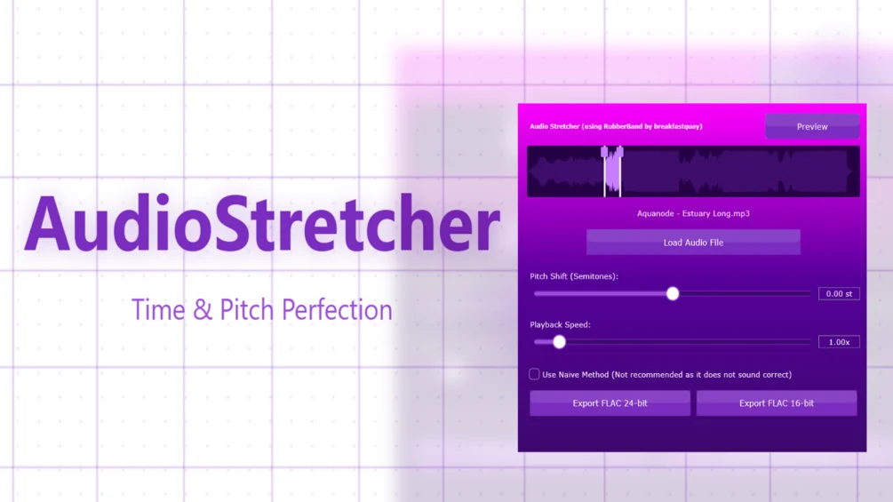

# AudioStretcher

Download builds from the [Releases](../../../../releases) page.

AudioStretcher VST Plugin

A free, versatile audio time-stretching and pitch-shifting plugin.

AudioStretcher is a Wrapper for the RubberBand Time/Pitch Shifting Library by Breakfast Quay, that lets you independently timestretch and pitch shift an audio file you load into the program / vst3 plugin. It was written in JUCE/C++. With the help of Claude AI I made a GUI for it where you can easily load any sound file and:

- Speed up or slow down audio from 0.1x to 10x without changing pitch
- Pitch shift up or down by 36 semitones without changing speed
- Combine both for creative effects
- Export processed audio as high-quality FLAC files (sample rate unchanged, 16 or 24 bit)

Please note if you use the .vst3 version instead of the .exe and wonder why the created FLAC file sounds a little different than the internal playback: The preview buffer plays back at your host/DAW's sample rate, while the export writes at the original file's sample rate.

At First click of the preview button, it renders a preview of your settings, at second click it plays the preview through your audio output. Preview automatically clears when you change any settings. FLAC exports only your selected region at the original sample rate.

## Manual

### Controls and UI Elements

**Waveform Display**
- Visual representation of your loaded audio file
- White vertical bars mark the start and end of your selection
- Click and drag the bars to select which part of the audio to process
- Purple highlight shows the selected region

**Load Audio File**
- Click the "Load Audio File" button or drag and drop audio files directly
- Supports: WAV, MP3, FLAC, OGG, AIF, AIFF

**Pitch Shift**
- Range: -36 to +36 semitones
- Click the number to type exact values
- 0 = original pitch, +12 = one octave up, -12 = one octave down

**Playback Speed**
- Range: 0.1x (very slow) to 10x (very fast)
- Click the number to type exact values
- 1.0x = original speed, 2.0x = twice as fast, 0.5x = half speed

**Preview Button** (top right)
- First click: Renders a preview of your settings
- Second click: Plays the preview through your audio output
- While playing: Click again to stop
- Preview automatically clears when you change any settings

**Use Naive Method**
- Toggle between processing algorithms:
- Unchecked (default): Uses RubberBand - highest quality, slower processing
- Checked: Uses original naive method - faster, lower quality, buggy, not recommended

**Export Buttons**
- Export FLAC 24-bit: Highest quality
- Export FLAC 16-bit: Standard quality, smaller file size
- Both export only your selected region at the original sample rate

**Progress Bar**
- With stage indicators during processing
- Precise control with editable value boxes
- Lossless FLAC export with maximum compression (level 8)

## License

This plugin is licensed under the GNU General Public License v2; the full GPL v2 license text, the Rubber Band Library license by Breakfast Quay, complete corresponding source codes, required copyright notices, and full attribution are all included in the downloadable ZIP archive, and users are expressly permitted to redistribute and modify the software under the terms of the GPL v2 without any additional restrictions.

Pay what you want - default $0. Source code and License files included in the respective folders!

### Source Notes

AudioStretcher is GPL v2 (it embeds the [Rubber Band Library](https://breakfastquay.com/rubberband/), also GPL). See `src/LICENSE.txt`, `src/CREDITS.txt` and `src/HOW TO COMPILE.txt`.
