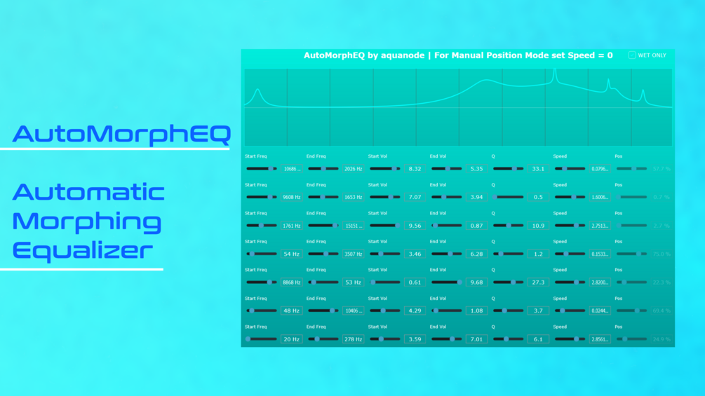

# AutoMorphEQ

**Latest version:** 1.1 — download builds from the [Releases](../../../../releases) page.

AutoMorphEQ is a VST3 "port" written in JUCE for my AutoMorph EQ for FL Studio. See it in action:

It is free and open source, but if you want to support my work I highly appreciate it!

With it you can control the movement of 7 bell filters from some initial to some final position. They automatically oscillate back and forth and can do so very quickly, that you get Filter FM like tones. A wet only / delta mode further enables you to hear only the altered sound.

It also contains a randomize button as well as different LFO shapes (sine, triangle, ramp up, ramp down, square, tanh, randomly sample and hold).

The source code can be compiled using JUCE for Windows, Mac and Linux. I only have a windows machine, so I only provide a .vst3 and standalone .exe for Windows.

## Version History

- **1.0** — Initial release.
- **1.1** — Adds the randomizer button and the different LFO modes like ramps, triangle and random sample and hold.
