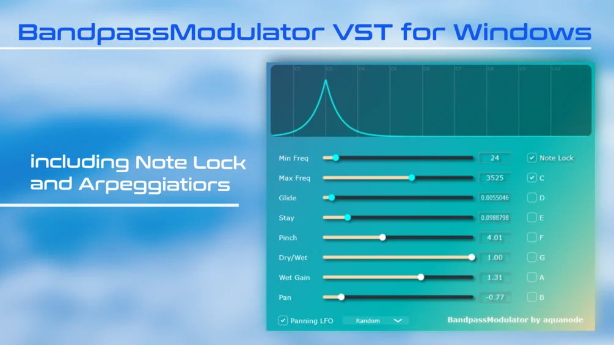

# Bandpass Modulator

**Latest version:** 1.1 — download builds from the [Releases](../../../../releases) page.

BandpassModulator is a free VST3 "port", written in JUCE/C++, of my other bandpass modulator modules I made for FL Studio and PlugData, so you can use it without any other requirements other than any DAW that supports VST3 on a Windows PC.

See (an older version of) it in action here:

Its unique feature is that the filter can be locked to a selection of all 12 notes across a chosen frequency range. With that, you can easily spice up your sound design and create everything from colorful sparkles to pure filter FM-like tones.

It features a single state variable filter / bandpass filter that automatically jumps to random frequencies in a predefined frequency window. The filter first stays for a duration of "Stay" seconds at a random position, then takes "Glide" seconds to reach a new frequency, where it stays another "Stay" seconds. A Note Lock feature restricts the random filter jumps to frequencies corresponding only to selected notes.

There are three frequency jumping modes:
- **Random**: The default mode where Stay and Glide behave as described above.
- **Up**: The frequency slides upwards, or jumps through the lowest to the highest note if Note Lock is active.
- **Down**: Same as Up, but with downward jumps.

Please note that the Glide slider functionality is deactivated for the filter (but not the panning) when Up or Down mode is selected. Stereo panning of the filter can also be automated. A graphical filter representation that cycles in color between white and cyan shows the current position of the filter.

The code is open source and part of this download. You can compile it yourself for Mac and Linux if you want to. The precompiled Windows VST is also free. You can of course type in €0 or $0 in the payment box, but if you want to support me, I hope the suggested €3 is a reasonable price. In the download, you can also find a manual including installation instructions and the source code. The VST3 was tested on Windows 11 22H2 with FL Studio 25, Ableton Live 11 and Tracktion's pluginval VST tester.

## Version History

**Version 1.0**
This is the initial release.

**Version 1.1**
- Added Sharp Notes / Black Keys to the Note Lock functionality.
- Added Standalone .exe program for windows.

Please Note that for version 1.0 you only need the .vst3 file in your VST3 directory, but version 1.1 needs the full .vst3 folder - as provided - to be in the directory.
