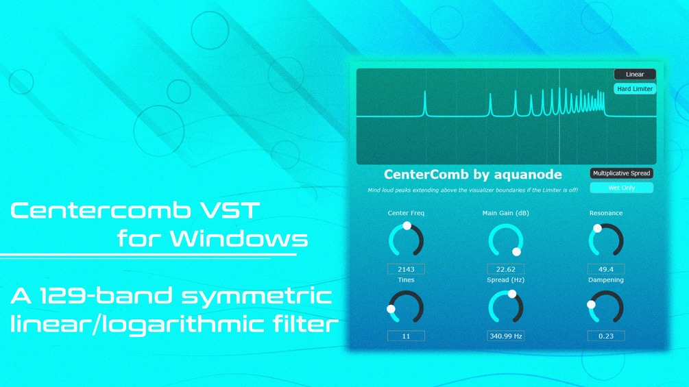

# CenterComb

**Latest version:** 1.1 — download builds from the [Releases](../../../../releases) page.

CenterComb / CenterWeave are a VST effect and VST synthesizer that use equidistant spacing techniques of filters or oscillators to create interesting tones. They are both experimental plugins, and I highly recommend adding a limiter to your effect chain to avoid volume spikes, especially for CenterComb.

## CenterComb

CenterComb is a flanger-like comb filter VST effect consisting of up to 129 parallel bell filters that can drastically alter the sound of any input and can be used for creative sound design. It was inspired by one of my earlier "AutoMorph" patches for FL Studio, which you can also find on my Gumroad page.

See (an earlier version of) it in action:

A short introduction to the new Smoothness and Frequency Reflection Modes can be found here: https://www.youtube.com/shorts/uwdKCpsKwNI

At its core, CenterComb places a bell filter at a chosen center frequency, then mirrors additional bell filters above and below it, creating a controllable comb-like response that can range from subtle coloration to radical spectral shaping. It offers linear and multiplicative bell peak distribution modes, allowing adjacent bell filters to be spaced evenly in Hertz, creating noisy FM-like tones, or exponentially by frequency ratio, creating metallic sounds. It is designed for flanging, resonator effects, harmonic sculpting and experimental sound design.

**Features:**

- Up to 129 simultaneously active bell filters, each ranging from −24 dB to +24 dB.
- Linear and multiplicative bell peak distribution modes, allowing filter spacing by fixed Hertz values or exponential frequency ratios.
- A real-time graphical frequency response display, independently switchable between linear and logarithmic frequency visualization modes.
- Center frequency anchoring, with symmetrical bell filter placement above and below the selected frequency.
- Resonance (Q) control for shaping filter sharpness from smooth tonal curves to extreme spectral peaks.
- Spectral dampening control to progressively attenuate outer filter tines for smoother or more aggressive responses.
- Wet-only output mode for pure spectral processing without dry signal.
- Smoothing for smooth transitions between filter states when you move knobs. This can create very nice bubble or liquid sounds.
- Mirror and Wrap modes. If Mirror mode is active, frequencies outside the audible range are mirrored at 20 and 22000 Hertz respectively. This acts like an "aliasing" mode and can produce interesting tones. In Wrap mode, frequencies leaving one boundary reappear at the other one. Using both Multiplicative Spread and either Mirror or Wrap mode at the same time is highly experimental and can eventually produce loud and harsh noises due to unstable calculations, especially when increasing the amount of tines in this state. I implemented some safety measures on the fly, but they are not intended to be mathematically correct.
- Optional hard limiter to control extreme resonant peaks during aggressive sound design (always on when both Multiplicative Spread and Mirror or Wrap modes are active).

The code is open source and provided alongside the download. Feel free to compile, edit and share it however you like, but don't sell it unaltered.

## CenterWeave

CenterWeave is a synth based on the CenterComb logic. It is an additive synthesizer with up to 128 partials that are either linearly, exponentially or harmonically spaced to create noisy, metallic or musical tones - so instead of bell filters, you have sines at those frequencies.

You have two oscillators with 5 voices each, which can be slightly detuned to create more pleasing tones than the harsh ones each oscillator would produce on its own. Feel free to experiment with it!

Thank you for your support, I highly appreciate it!
