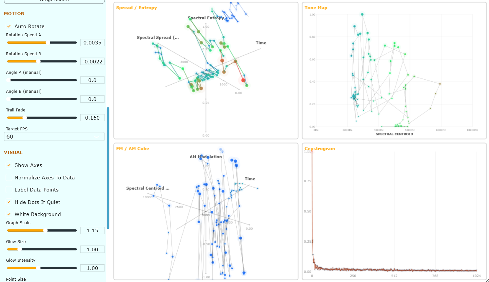

# EcoSee Ecological Visualizer VST

A visualizer inspired by Lucio Arese's ornithological spectral constellation visualizations,
made with the help of Claude Sonnet (Anthropic).

EcoSee visualizes incoming audio by applying various spectral analysis concepts to it, 
that especially find applications in bioacoustic ecology (bird calls, field recordings, 
but it works with anything). Or more precisely: EcoSee is real-time spectral visualizer for spectral analysis and especially build for bioacoustic exploration; a VST audio visualizer focused on spectral, amplitude and temporal analysis. 
It is designed with bird calls, vocalisations, and ecological field recordings in mind, but works with any audio source. Comes in a light and dark color mode.

# Features

EcoSee by default shows you four displays. A fifth Cepstral Analyzer can be replaced with a Vocal Signature Wheel. You can also only select one of these views or build your custom 3d viewer.

**New in version 1.1:** Option to choose how many datapoints are visible at once (was 3x 32 by default, now a slider from 1 to 96) and choose whether you want to see the dot-per-dot graph or a spline-interpolated smooth curve.

| Feature | Description |
|---|---|
| Real-time analysis | Continuous FFT-based audio analysis |
| Spread / Entropy | 3D spectral spread, entropy, and time |
| Tone Map | Spectral centroid vs amplitude |
| FM / AM Cube | 3D centroid, AM modulation, and time |
| Cepstrogram | Real cepstrum visualization |
| Vocal Signature | Five-axis timbral radar |
| Custom 3D Grid | Configurable X/Y/Z analysis fields |
| Custom colours | Three-point global colour gradient |
| 3D interaction | Rotate, pan, and zoom |
| Normalization | Fit axes to current data |
| Trails / glow | Persistence and point glow |
| Themes | Light and dark backgrounds |
| Target FPS | 30 / 45 / 60 FPS |

# Visualizations

### Spread / Entropy - 3D - rotatable Spectral Entropy Distribution Viewer

**x-Axis** is Spectral Spread, **y** is Spectral Entropy and **z** is Time. Spectral Spread describes how widely spectral energy is distributed across frequencies. Spectral Entropy describes how evenly distributed the spectrum is. Low is concentrated and tonal, high is flat and noise-like. Point size and colour are influenced by amplitude. Silent or noise-floor frames can be hidden using `Hide Dots If Quiet`.

### Tone Map - Spectral Centroid over Amplitude.

Spectral Centroid represents the centre of mass of the spectrum and is commonly used as an indicator of spectral brightness.

### FM / AM Cube

Spectral Centroid on x, y is AM modulation which is calculated from frame-to-frame amplitude change and is sensitive to pulsing, fluttering, tremolo-like modulation, and rapid loudness changes, and z is time. `AM Mod Scale` controls modulation-axis sensitivity. Point colour follows Spectral Flatness. Near 0 is tonal / whistle-like, near 1 noise-like.

### Cepstrogram

Displays the real cepstrum of the current analysis frame. x is Quefrency, y is Cepstral Magnitude. Cepstral peaks can indicate periodic or harmonic structure and may be useful for investigating pitch, vocalisations, bird calls, and other periodic acoustic signals. `Cepstrum Smoothing` applies temporal smoothing. The number of cepstral coefficients follows the FFT size, while rendered points are capped for performance.

### Vocal Signature

A 2d radar chart with five timbral descriptors: Spectral Skewness, Entropy, Crest, Slope and Flatness. The values are smoothed using the `Cepstrum Smoothing` parameter, reused here as it works well visually.

### Custom 3D Grid

Any available analysis field can be assigned independently to the three coordinates in this mode. Options are:

| Field | Meaning |
|---|---|
| Spectral Centroid | Centre-of-mass frequency |
| Spectral Spread | Distribution width |
| Spectral Entropy | Spectral complexity / distribution |
| Spectral Flatness | Tonal vs noise-like character |
| Amplitude | Current frame amplitude |
| Spectral Skewness | Spectral asymmetry |
| Spectral Crest | Peak-to-average spectral ratio |
| Spectral Slope | Overall spectral tilt |
| Time | History-buffer position |

# Controls

| Section | Control / Topic | Description |
|---|---|---|
| **Analysis** | **FFT Size** | Controls the length of each FFT analysis window. Larger FFT sizes provide better frequency resolution and more detailed spectral information, at the cost of lower time resolution and higher processing requirements. |
| **Analysis** | **Window** | Selects the FFT windowing function. Common choices include Hann, Hamming, and Blackman. Hann is a good general-purpose starting point. |
| **Analysis** | **Overlap** | Controls how much consecutive analysis frames overlap. Higher overlap generally provides smoother temporal movement but requires more processing. |
| **Range** | **Freq Low (Hz)** | Lower frequency boundary for frequency-based visualizations. |
| **Range** | **Freq High (Hz)** | Upper frequency boundary for frequency-based visualizations. Affects frequency mapping in the Tone Map, FM / AM Cube, and relevant Custom 3D Grid axes. |
| **Range** | **Spread Range** | Sets the nominal maximum range for spectral spread. |
| **Range** | **Amplitude Gain** | Scales measured amplitude before it is used for visual properties such as point size, brightness, and amplitude-related axes. |
| **Range** | **AM Mod Scale** | Controls the sensitivity of the AM modulation axis. Higher values make smaller amplitude changes produce larger movement. |
| **View** | **View Mode** | Available modes: All Panels, Spread / Entropy, Tone Map, FM / AM Cube, Cepstrogram / Vocal Signature, and Custom 3D Grid. |
| **View** | **All Panels** | Uses a 2×2 layout. |
| **View** | **Single-Panel Modes** | Expands the selected visualization to fill the main viewing area. |
| **View** | **Single-Panel Macro Zoom** | Adds an additional scale multiplier when viewing a single panel. Particularly useful for 3D visualizations. |
| **View** | **Bottom-Right Panel** | Selects which visualization appears in the fourth panel: Cepstrogram or Vocal Signature. |
| **View** | **Drag: Rotate / Drag: Move** | Switches mouse-drag behaviour. `Drag: Rotate` rotates 3D visualizations; `Drag: Move` pans plotted content. |
| **Custom 3D Grid** | **X Field** | Selects the analysis value mapped to the X axis. |
| **Custom 3D Grid** | **Y Field** | Selects the analysis value mapped to the Y axis. |
| **Custom 3D Grid** | **Z Field** | Selects the analysis value mapped to the Z axis. |
| **Motion** | **Auto Rotate** | Automatically rotates the 3D visualizations. |
| **Motion** | **Rotation Speed A** | Controls automatic rotation of Spread / Entropy and Custom 3D Grid. |
| **Motion** | **Rotation Speed B** | Controls automatic rotation of FM / AM Cube. |
| **Motion** | **Angle A (manual)** | Manual viewing angle for Spread / Entropy / Custom Grid when Auto Rotate is disabled. |
| **Motion** | **Angle B (manual)** | Manual viewing angle for FM / AM Cube when Auto Rotate is disabled. |
| **Motion** | **Trail Fade** | Controls how quickly previous frames disappear. Lower values produce longer trails and higher persistence; higher values produce shorter, crisper trails. |
| **Motion** | **Target FPS** | Target visualization frame rate: 30 FPS, 45 FPS, or 60 FPS. |
| **Visual** | **Show Axes** | Shows or hides axis lines, tick marks, axis labels, and grid rings in the Vocal Signature radar. |
| **Visual** | **Normalize Axes To Data** | Fits visualization ranges to currently observed audible data. Useful when the signal occupies only a small portion of a nominal range. |
| **Visual** | **Label Data Points** | Displays coordinate/value labels next to selected data points. Only a subset is labelled in dense visualizations. |
| **Visual** | **Hide Dots If Quiet** | Enabled by default. Frames below approximately -90 dB are treated as quiet and are not plotted. |
| **Visual** | **White Background** | Switches the visualizer to a light presentation while retaining the data colour scheme. Glow behaviour is also changeable for readability. |
| **Visual** | **Graph Scale** | Controls the overall size of plotted content. |
| **Visual** | **Glow Size** | Controls the size of the soft outer glow around points. |
| **Visual** | **Glow Intensity** | Controls glow brightness. |
| **Visual** | **Point Size** | Controls data-point size. |
| **Visual** | **Line Thickness** | Controls connecting-line thickness. |
| **Visual** | **Cepstrum Smoothing** | Controls temporal smoothing of the Cepstrogram and Vocal Signature. Higher values produce smoother but slower movement. |
| **Colour Scheme** | **Lowest / Middle / Highest** | Three configurable colour stops forming the global gradient used throughout the visualizer. |
| **Colour Scheme** | **Colour Gradient** | Affects Spread / Entropy, Tone Map, FM / AM Cube, Custom 3D Grid, and Cepstrogram. |
| **Interaction** | **Mouse Drag — Rotate** | Rotates Spread / Entropy, FM / AM Cube, and Custom 3D Grid. |
| **Interaction** | **Mouse Drag — Move** | Pans plotted content while leaving panel frames, titles, and sidebar fixed. |
| **Interaction** | **Mouse Wheel** | Zooms the panel under the cursor. Each panel has an independent zoom level. |
| **Interaction** | **Trails** | Maintains a rolling history of analysed frames, allowing plotted data to form trails. |
| **Interaction** | **Silent Frames** | Break connections between points so unrelated audible sections are not connected through silence. |
| **Audio Analysis** | **Spectral Centroid** | Measures the spectral centre of gravity. |
| **Audio Analysis** | **Spectral Spread** | Measures the distribution of spectral energy around the centroid. |
| **Audio Analysis** | **Spectral Entropy** | Measures the distribution/uniformity of spectral energy. |
| **Audio Analysis** | **Spectral Flatness** | Indicates how noise-like or tone-like the spectrum is. |
| **Audio Analysis** | **Amplitude** | Measures signal amplitude and can drive visual properties such as size, brightness, and axes. |
| **Audio Analysis** | **Spectral Skewness** | Describes asymmetry in the spectral distribution. |
| **Audio Analysis** | **Spectral Crest** | Measures the prominence of spectral peaks. |
| **Audio Analysis** | **Spectral Slope** | Describes the overall slope of spectral energy across frequency. |
| **Audio Analysis** | **Cepstral Coefficients** | Provide timbral information derived from the spectral representation. |
| **Audio Analysis** | **Time / Frame Position** | Represents the temporal position of each analysis frame. |
| **Audio Analysis** | **Rolling History** | Continuously stores analysed frames for generating visualizations. |
| **Performance** | **FFT Size** | Larger sizes increase frequency resolution but require more processing and reduce time resolution. |
| **Performance** | **Overlap** | Higher overlap increases the number of analysis frames and processing requirements. |
| **Performance** | **Target FPS** | Higher frame rates increase graphical update frequency. |
| **Performance** | **Cepstrogram Point Limit** | Limits rendered points to keep rendering predictable with large FFT sizes. |
| **Performance** | **State / Rendering Separation** | Separates lightweight state updates from heavier graphical rendering, allowing JUCE to coalesce repaint requests under load. |
| **Performance** | **If Interface Is Less Responsive** | Reduce FFT Size, Overlap, and Target FPS. |
| **Suggested Settings** | **Bird Calls / Ecological Recordings** | Window: **Hann**; Overlap: **Moderate / High**; Hide Dots If Quiet: **On**; Show Axes: **On**; Normalize Axes: **Off**; Trail Fade: **Low / Moderate**; Cepstrum Smoothing: **Moderate**; Auto Rotate: **Optional**. |
| **Custom 3D Grid** | **Centroid × Entropy × Time** | Explores spectral position and complexity over time. |
| **Custom 3D Grid** | **Centroid × Flatness × Amplitude** | Compares tonal/noise characteristics with frequency centre and level. |
| **Custom 3D Grid** | **Skewness × Crest × Slope** | Explores spectral shape and peak characteristics. |
| **Custom 3D Grid** | **Amplitude × Entropy × Time** | Examines changes in signal strength and spectral complexity over time. |

# Credits

Lucio Arese's work on bird call analyses.
