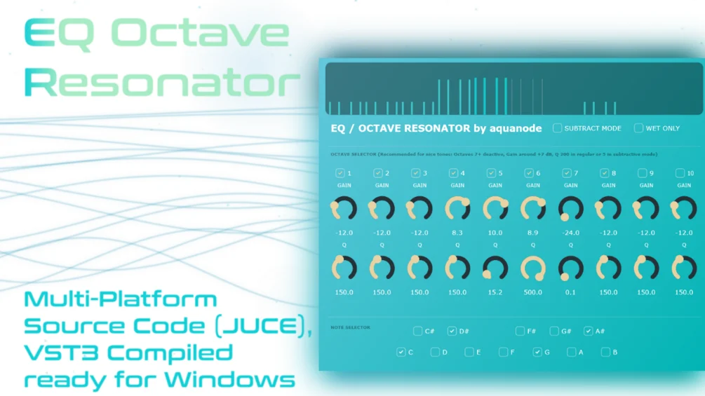

# EQ Octave Resonator

**Latest version:** 1.1 — download builds from the [Releases](../../../../releases) page.

EQ Octave Resonator is a free VST3 effect for any Windows DAW. An array of parallel bandpass filters with high peaks is tuned to notes to sound musical. The unique feature of this plugin is that you can choose how many resonating octaves and notes should be actively enhancing incoming signals, and you have a "Wet" only function that cancels the incoming signal.

A graphical representation of the bandpass filters is shown on top. There are bands for all active notes and octaves. The higher the Q (peak focus) value is, the more the band looks white, otherwise it looks blue. It also has a notch mode, which subtracts the chosen frequencies. This is a somewhat experimental feature, as here all the bandpass filters are routed in series instead of parallel, and there is no wet gain for the notch mode. A wet only mode is available to hear ONLY the boosted frequencies instead of the boosted frequencies on top of the original signal. With the octave selector, you can choose the octaves where the resonator should work on. For musical, string like tones, you should disable the higher octaves (7 and up). Each octave has its own q slider, low values correspond to wide bandpasses, high values to narrow sharp peaks. Finally, the Note Selector where you can check which notes across the chosen octaves should be boosted.

Thanks for your support!

## Version History

- **1.0** — Initial release.
- **1.1** — Added volume sliders for each octave.
