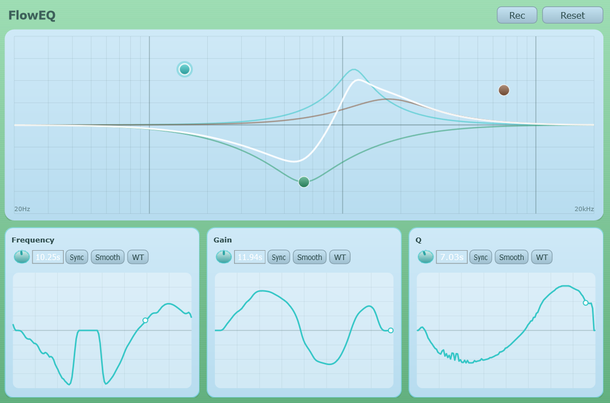

# FlowEQ

A 3-band parametric EQ plugin where every filter parameter can be
freely animated over time, inspired by morphing EQs.

## What it does

- **3 bell/peak filters** (cyan, teal, brown), each with its own frequency,
  gain and Q, shown as draggable circles on a Hertz/dB graph with live
  individual and summed response curves.
- **Freehand modulation curves**: for every filter, Frequency, Gain and Q
  each have their own 128-point curve you draw by hand in the panel below
  the graph. The curve cycles continuously (0.01–120s, or tempo-synced to
  the host, including triplets/dotted values) and modulates that
  parameter around its base value.
- **Wavetable mode**: instead of drawing by hand, load a mono WAV file
  (a multiple of 2048 samples) to use it as the modulation source, and
  scrub/scroll through its frames.
- **Smooth**: softens a hand-drawn curve's hard edges and jitter with one
  click, without flattening its shape.
- **Record mode**: click-drag one of the three filter circles on the graph
  directly while it plays; the gesture is written straight into that
  filter's Frequency and Gain curves at the point matching the curve's
  current cycle position, turning a live tweak into a repeatable, animated
  curve.

## Layout

- **Top half**: the EQ graph: drag a circle to set frequency/gain, scroll
  to change Q, toggle Record to capture the gesture into the curves.
- **Bottom half**: three curve panels (Frequency / Gain / Q): draw
  directly on the curve, with cycle-time/sync, Smooth, wavetable-load and
  draw-mode controls in a single row above each one.
- **Reset**: restores all filters, curves and settings to their defaults.
