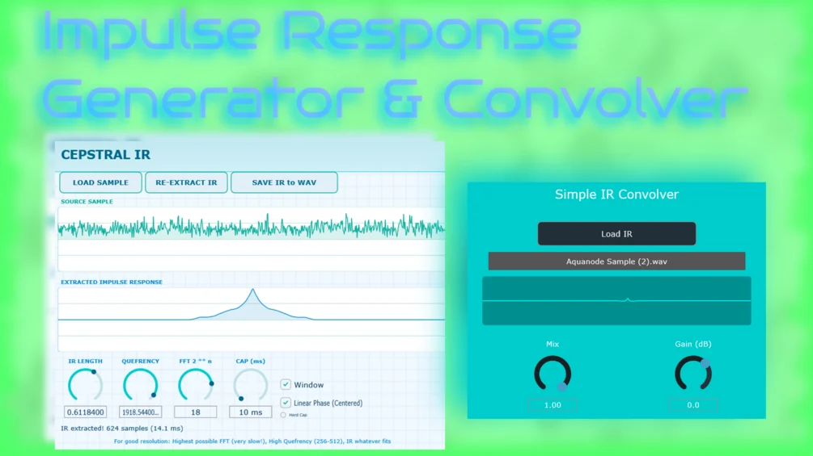

# IRConvolve

Download builds from the [Releases](../../../../releases) page.

Cepstral IR and IR Convolver

This is a bundle of two plugins to create and use Impulse Responses.

First you can create impulse responses using Cepstral IR:

Cepstral IR extracts the acoustic signature (impulse response) from any audio recording. For example, record a guitar strum and you get that guitar's tone. Record any sound through any space or effect chain and you capture its character as a reusable impulse response file. They don't take up much space at all, but have a static sound character.

Normal audio has two parts mixed together: the source sound (like a clap) and the space/system response (the reverb, tone, or overall character). In the time domain those are convolved, but when you perform an FFT on the audio, convolution becomes multiplication. In cepstral analysis, we then first take the logarithm of the FFT spectrum, because the log turns multiplication into addition, which is easier to separate. Then, we take another FFT of the logarithmized spectrum to finally create the cepstrum. In a cepstrum, you will find fast spectral ripples from the sound source at higher values (now called quefrencies), while the system shapes the sound more slowly as a smooth spectral envelope at lower quefrencies. By filtering (or "liftering" as the analogous term in cepstral analysis) out the high-quefrency components (the source) and keeping the low-quefrency components (the system), and then transforming back by inverse FFT, exponentiating to undo the log, and inverse FFT again, you effectively perform a form of what can be called "homomorphic deconvolution", recovering an estimate of the pure impulse response of the space or character without (most of) the original source sound.

## Controls

- **IR LENGTH** (0.01 to 1.0): How much of the extracted impulse to keep. Lower values give you shorter, snappier IRs. Higher values keep more of the tail and reverb decay. This is a multiplier on the automatically detected length.
- **QUEFRENCY** (4 to 2048): Controls the cutoff point in the cepstral domain. This determines how smooth versus detailed your extraction is. Low values (4-64) keep everything including noise and fine details. High values (256-512) smooth things out and give you a cleaner, more musical response by filtering out the noisy high-quefrency components. Think of it like a low-pass filter in the cepstral domain.
- **FFT 2^n** (12 to 20): The FFT size used for analysis. Larger FFTs give better frequency resolution and higher quality extraction but take exponentially longer to process. 15 means 2^15 = 32768 samples. Going to 17 or 18 gives excellent results but can take several seconds to process. In the output, an automatic usable length detection is used, so the impulse responses don't get too unusably long.
- **CAP** (10 to 5000 ms): When Hard Cap is enabled, this forces the output IR to be exactly this length in milliseconds. Useful when you need precise timing control.
- **WINDOW** (toggle): Applies a fade-in and fade-out window to the edges of the IR. This prevents clicking and artifacts from hard cuts. Should almost always be on.
- **LINEAR PHASE** (toggle): Changes the phase response of the output. When off (minimum-phase), the impulse sits at the start of the file and sounds most natural. When on (linear-phase), the impulse is centered in the middle of the file with symmetric decay on both sides. Minimum-phase is arguably the more common kind.
- **HARD CAP** (toggle): Enables the CAP control. When off, the plugin automatically detects how long the IR needs to be. When on, you get exact control over the output length in milliseconds.

Then you can use IRConvolver to hear the sound!

IRConvolver works in real time, e.g. with your synth's output, while CepstralIR needs an already available sound file in non-real time. IRConvolver then uses convolution, like in a convolution reverb, to imprint the sound character you have saved in the Impulse Response .wav file on the sound that plays.

For example, let any synth you want play regular white noise, and apply a guitar impulse response - the noise will then sound like the note or chord you played, which you transformed into the impulse response.

Have fun with the plugins! As usual, they were made with the help of Claude AI.
