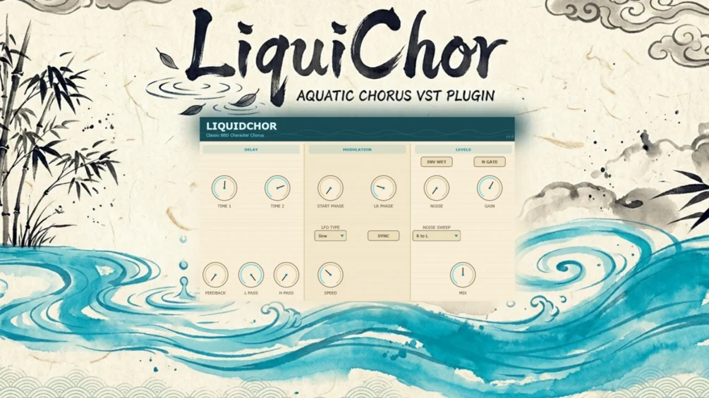

# LiquidChor

Download builds from the [Releases](../../../../releases) page.

LiquiChor (A portmanteau of Liquid, Petrichor and Chorus) is a recreation of a famous BBD chorus as it is found in my favourite DAW, made with the help of Claude AI. It focuses on spacious, free flowing chorus delaylines and "analog" noise hiss reminiscent of waves crashing ashore, creating a crisp but gentle character to the sound.

The controls are pretty self-explanatory: Two delay lines between which the chorus sweeps back and forth, controlled by the LR Phasing Knob. The noise can sweep from left to right, right to left, or back and forth. Feedback will enhance the chorus sound. You can sync to tempo or let the LFO flow freely.

Thanks for checking it out!
