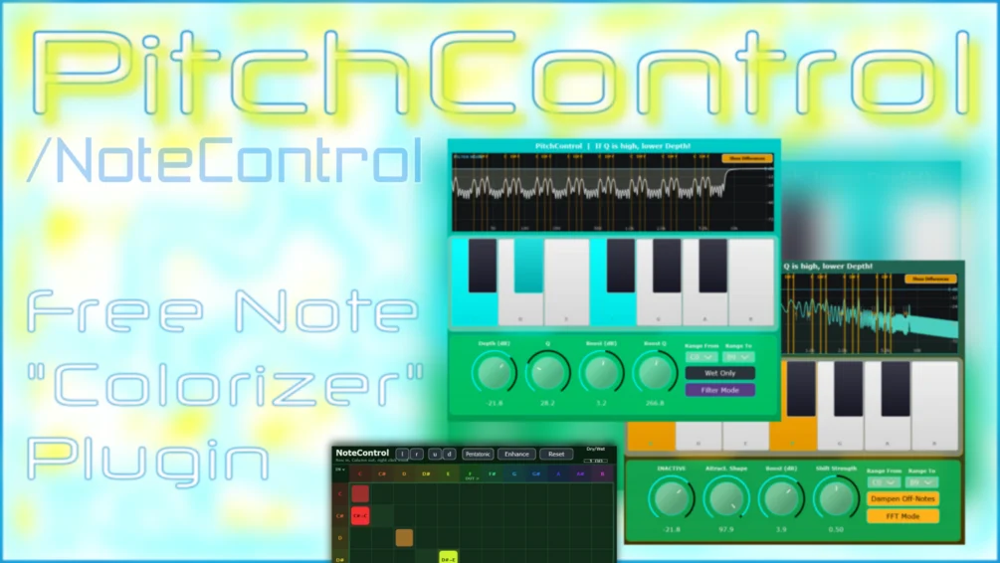

# NoteControl

Download builds from the [Releases](../../../../releases) page.

PitchControl VST and NoteControl VST

PitchControl is your typical "Color Bass" sound effect plugin. It either uses up to 120 bell filters to attenuate frequencies that correspond to notes you have not activated in the provided piano interface, or uses an FFT algorithm to shift frequency bins around activated notes to the frequency a note represents. It has an overall "sharp" sound character rather than a smooth one that can be found in some related commercial products, so depending on what you want it might not be able to replace the original but sort of reproduces that sound at least. It is a VST version of my "PitchControl EQ" Preset for FL Studio, part of my AutoMorph Preset Pack for FL Studio also available here on my gumroad page.

## Controls

- **Piano Roll**: You can select the notes you want to keep unfiltered, all not-activated notes will be attenuated for that note colorization effect.
- **dB**: Controls the attenuation (up to -64dB).
- **Q**: The higher the Q, the sharper the filtering effect. Higher Q needs lower dB.
- **Wet Only**: Inverts the dry signal (and internally the Piano Roll), enhancing the effect.
- **Start/End Note**: Chooses the region in which the effect takes place.
- **NEW in Version 2.0 — FFT mode**: If active, an FFT algorithm actually shifts frequencies around rather than using EQ curve techniques like in the regular mode. Here, the Q knob becomes a shift strength knob.
- Boost Unfiltered Frequency and Q Knob Combination to enhance the sound effect even further.
- FFT pitch / frequency shift mode towards the notes you activate
- "Ring Mod" Type Knob to the FFT
- A global gain to the regular mode

The filters will change the phase of your input signal, which in normal circumstances is not really audible but i wanted to note that. The FFT mode will introduce some sound artifacts, which is expected too.

## NoteControl VST

NoteControl uses the same FFT algorithm from PitchControl and some elements from my Spectral Filter with its bin frequency / pitch shifting. NoteControl gives you a 12 x 12 matrix where you can map all the FFT bins corresponding to the nearest note onto the range that another note occupies. It is a very basic implementation of this type of note remapping with hard bin remapping, hence it does sound very digital.

Thanks for using the plugins!
