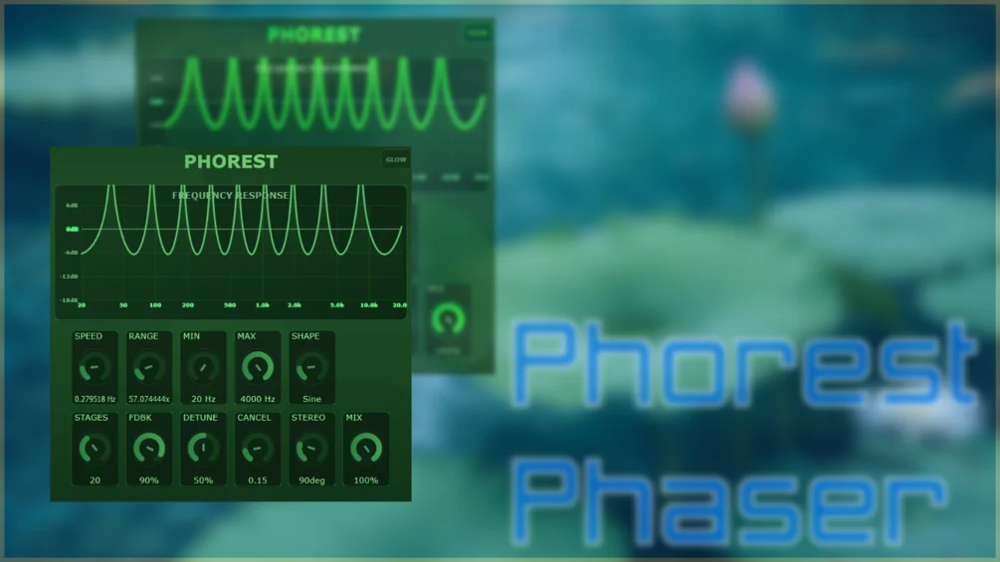

# Phorest

Download builds from the [Releases](../../../../releases) page.

Phorest is a Phaser modelled after the stock Phaser that comes with my favourite DAW, but the control ranges are much more extensive. You have more stages (the more stages, the higher the CPU), different LFO modes (Tanh mode is tanh(2*sin(x)), a flattened sine wave), and a nice gui with two different modes.

## Manual

### Knob Reference

**Row 1**
- Speed: LFO rate (0.01–100 Hz)
- Range: sweep ceiling in Hz (20–20k, centre = 1500 Hz)
- Min: lower bound of LFO travel within the band
- Max: upper bound of LFO travel within the band
- Shape: LFO waveform: Manual / Sine / Triangle / Ramp Up / Ramp Down / Square / Tanh
- Pos: static sweep position, visible in Manual mode only (0–1)

**Row 2**
- Stages: number of cascaded allpass filters (4–48)
- Fdbk: feedback amount, sharpens resonant notches (0–0.99)
- Detune: spreads alternating stages apart in frequency (0–1), this is not very audible in regular settings
- Cancel: subtracts dry signal to accentuate notches (0–1), but as there is no clear dry signal to subtract due to the allpass shifting it only partially cancels the sound, recommended values around 0.15
- Stereo: LFO phase offset between L and R (0–1, where 0.5 = antiphase), values inbetween will make heavy stereo sound fields
- Mix: dry/wet blend (0–1)

Thanks for checking it out!
