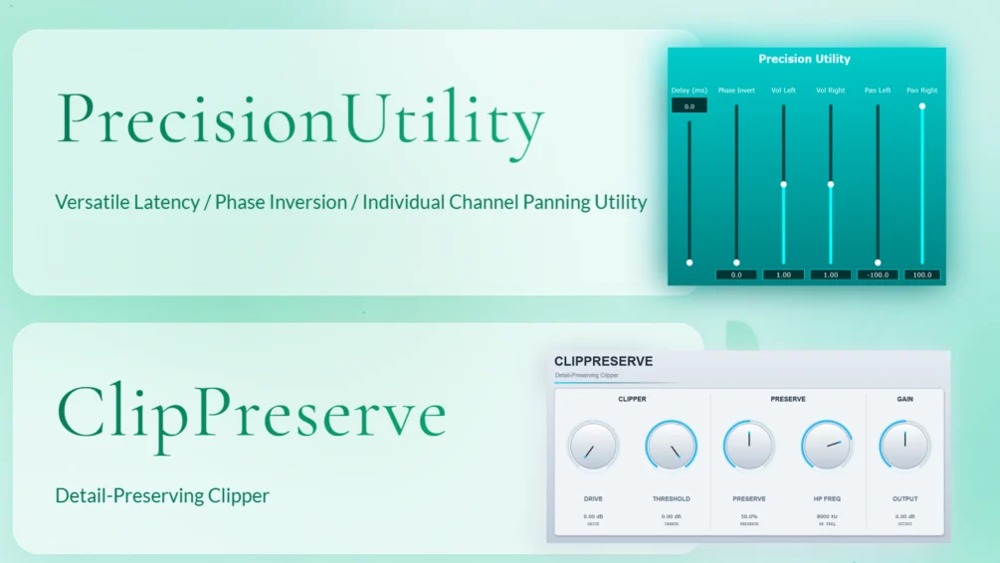

# PrecisionUtility

**Latest version:** 1.1 — download builds from the [Releases](../../../../releases) page.

ClipPreserve Detail Preserving Clipper / PrecisionUtility Artificial Latency, Phase Inversion and Channel Panning Utility VSTs (Free and Open Source)

ClipPreserve is a detail-preserving clipper plugin. A signal that is pushed past its threshold usually clips and does not keep higher frequency content, for example HiHats that travel on a loud subbass for example. ClipPreserve extracts the clipped contents, isolates them and blends them back into the final output. It does so using a "Delta Chain", a polarity inverted signal. This means that you don't even need sidechaining tools or similar to restore the signal. The plugin has a sidechain knob, but this is for loud sidechain signals that - while they are louder than the remaining signal - further boost the quieter signals.

Precision Utility is a stereo utility plugin for precise audio manipulation. It provides independent control over signal delay, phase inversion, and stereo panning with bit-perfect pass-through at default settings (i.e. a zero delay does not change anything in the audio). Signal delay is not to be confused with a delay effect - in this plugin, the signal is delayed as if it had latency.

It features a delay (0 - 10000 ms) to introduce time delay to the audio signal with 0.1 ms precision as artificial latency (which is deliberately NOT reported to your DAW), useful for phase alignment, timing correction or comb filtering effects that sound similar to Pulse Width Modulation due to phase cancellations if you add it on a sidechain channel.

You can also phase invert the signal by any percent you like (0 to 100%), where 50% is complete cancellation and 100% is fully flipped for aligning phases, cancel out only specific sounds or convert ramp up signals to ramp down signals.

Furthermore, the left and right channels can be panned individually towards the center or the respective other channel without affecting the other.

Technical specifications are Sample-accurate delay processing, Independent delay buffers per channel (no channel crosstalk), Up to 10 seconds of artificial signal delay, Zero latency at 0 ms delay, Bit-perfect pass-through at default settings, Stereo processing (2 channels), Deliberately NO reporting of latency and no trigger of global plugin delay compensation to the host / DAW.

Made with the help of Claude AI. Thanks for checking it out!

## Manual

Version 1.1 adds individual volume control for the left and right channels.

### Features

**1. Delay (0 - 10000 ms)**
- Introduces time delay to the audio signal
- Can be set in milliseconds with 0.1 ms precision
- Useful for phase alignment, comb filtering effects, or timing corrections
- Zero latency at 0 ms (complete bypass)
- Independent delay buffer per channel

> **Tip:** Low delay values (< 20 ms) create comb filtering effects that can sound similar to PWM (Pulse Width Modulation) due to phase cancellation between delayed and non-delayed signals when mixed, especially when you route the same signal into two mixer tracks and put PrecisionUtility on one of the two channels.

**2. Phase Invert (0 - 100%)**
- Inverts the polarity of the audio signal
- 0%: Original signal (no inversion)
- 50%: Complete cancellation (silence)
- 100%: Fully inverted signal (180° phase shift)
- Linear interpolation between normal and inverted signal
- Processed before delay in the signal chain

> Use case: Phase alignment when combining multiple microphones or tracks. Also useful to convert ramp up saw waves to ramp down saw waves for example.

**3. Pan Left (-100 to +100)**
- Controls where the LEFT INPUT channel is routed
- -100 (default): Left input → Left output only (no change)
- 0: Left input → Both outputs equally (mono center)
- +100: Left input → Right output only (full swap)

**4. Pan Right (-100 to +100)**
- Controls where the RIGHT INPUT channel is routed
- +100 (default): Right input → Right output only (no change)
- 0: Right input → Both outputs equally (mono center)
- -100: Right input → Left output only (full swap)

> Note: Pan controls operate independently - you can route each input channel to any position in the stereo field without affecting the other.

### Signal Flow

Input → Phase Invert → Delay → Panning → Output

Each processing stage is completely bypassed when at default values, ensuring zero CPU overhead and bit-perfect audio pass-through.

### Default State (Transparent)

- Delay: 0 ms
- Phase Invert: 0%
- Pan Left: -100
- Pan Right: +100

At these settings, the plugin is completely transparent and does not modify the audio signal in any way.

### Technical Specifications

- Sample-accurate delay processing
- Independent delay buffers per channel (no channel crosstalk)
- Maximum delay: 10 seconds
- Zero latency at 0 ms delay
- Bit-perfect pass-through at default settings
- Stereo processing (2 channels)
- No reporting of latency to host (delay only affects this track)

### Use Cases

1. Phase alignment between multiple microphone recordings
2. Stereo width manipulation via independent channel panning
3. Creating comb filtering/flanging effects with short delays
4. Time-aligning tracks in multi-track recordings
5. Swapping left/right channels or creating custom stereo routing
6. Mid-side processing preparation (routing channels to specific positions)

### Notes

- Delay does NOT trigger global Plugin Delay Compensation (PDC)
- Only the track with this plugin loaded will be delayed
- Phase invert at 100% with identical signals results in cancellation
- Combining low delay values with phase inversion creates interesting timbral effects due to frequency-dependent phase relationships.

Made with the help of Claude AI. Thanks for checking it out!
