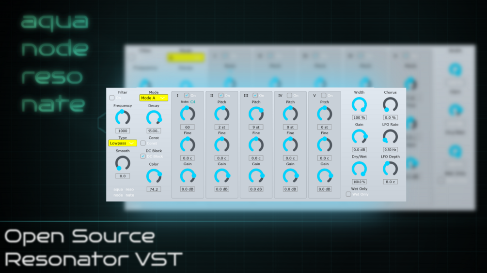

# Resonate

**Latest version:** 1.2 — download builds from the [Releases](../../../../releases) page.

Resonate is a 5 voice resonator. It is modelled after a famous resonator available in a certain DAW. Resonate recreates most of its controls and functionalities, but not 100% perfectly so, as the code for Resonate was completely done from scratch (in the JUCE framework) and with the help of Claude AI. However, its note range is much broader than the original.

Resonate includes a per-Resonator Decay and Color logic and can add exponential decay / DC offset to sound closer to the original. It also includes a subtle chorus and a square resonator mode (Mode B in the selector).

Next to the usual filter, decay, stereo and dry/wet controls, you have the five resonators. With Resonator 1 you set the main pitch, while the others are tuned around it in semitones. It might be a little hard to see but a cyan text display will show you which note is active. The number box below the respective knob shows which MIDI note value this corresponds to.

As mentioned, the source code is completely made from scratch using the help of Claude AI and written in JUCE / C++. I provide the .vst3 and a standalone .exe for Windows, but you can compile the source code yourself for Mac and Linux as far as I know, as JUCE supports these platforms.

## Version History

- **1.0** — Initial release.
- **1.1** — Adds a subtle chorus and a working "square" resonator mode (Mode B in the selector).
- **1.2** — Adds a per-Resonator Decay and Color logic and adds exponential decay / DC offset to sound closer to the original.

Thanks for downloading and have fun with it!
