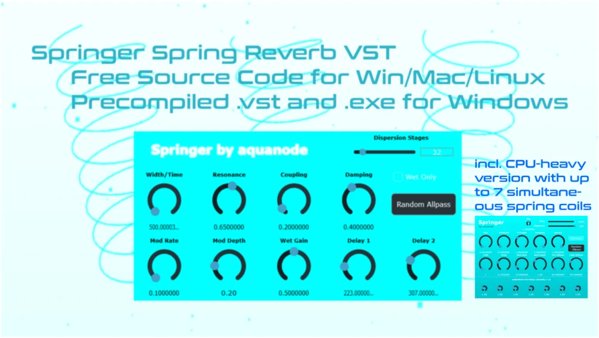

# Springer Spring Reverb

**Latest version:** 1.2 — download builds from the [Releases](../../../../releases) page.

Springer (crudely german for "jumper" but also referring to the chess figure) is an algorithmic stereo spring reverb inspired by physical spring tanks, though it is still a very crude model, built from dual interacting spring lines with dispersion, damping, feedback and modulation. It's designed to go from dub-style springiness to phasing laser sounds.

Watch it in action:

A video with only the pure impulse response output, using an older version of the plugin, can be found here: https://www.youtube.com/shorts/heJc9tRdocU

The plugin supports up to 7 coils with expanded delay controls for all of them, as well as a pitch slider which makes the coils sound "thicker" and deeper at low values.

Please note that with all 7 coils and 256 dispersion stages active, this plugin can be quite CPU-intensive (around 15% CPU usage on my mid-tier machine). I recommend using 2 coils and about 200 stages, as the amount of coils beyond 2 most often does not make a huge difference.

## Controls

| Control | What it does |
|---------|--------------|
| Individual Coil Control | New in Version 1.2. You can now activate up to 7 springs and control their delay times. |
| Pitch | New in Version 1.1. Changes the "thickness" of the coil, making the sound lower. |
| Dispersion Stages | How many smear blocks are in the spring. More = thicker, more high-frequency goodness. |
| Width / Time | How long the spring is. Bigger number = longer delay and tail. |
| Resonance | How much the spring feeds back. More = more ringing and possible self-oscillation (be careful for values >1). |
| Coupling | How much spring 1 and spring 2 feed into each other. More = weirder stereo behavior. Renamed to X-Fade in version 1.2. |
| Damping | High-frequency loss in the spring. More = darker and less splashy. |
| Wet Only | Outputs only the spring, no dry signal. |
| Random Allpass | Randomizes the internal allpass values. Changes the spring character. |
| Mod Rate | How fast the spring delay moves. Slow = gentle wobble, fast = pitch wobble. |
| Mod Depth | How far the spring delay moves. More = more unstable sound. |
| Wet Gain | How loud the reverb is. |
| Delay 1 / 2 | Density delays for spring 1 and spring 2. Changes how busy and smeared the spring sounds. |

## Installation

Simply copy the Windows VST (the provided .vst3 folder) in `C:\Program Files\Common Files\VST3`.

The source code was mostly made with AIs, notably Gemini, so it's open source. Use it however you like!

Thanks for using the plugin!
