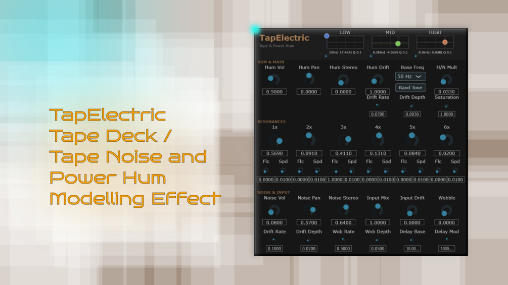

# TapElectric

**Latest version:** 1.0 — download builds from the [Releases](../../../../releases) page.

TapElectric (Tape-Electric) is a tape deck simulation that adds a warm electric hum and white tape noise to your input signal. The focus is not on transforming the input sound too much (although some saturation and wobble controls are provided), but on creating the imperfect atmosphere a tape deck provides.

The default hum and noise soundscape playing when you load up the VST was crafted after the tape noise present throughout my favourite ambient dub techno album, Infinite Cycles by the artist Ekhozone, who used a DX7 synth, probably Ableton's resonator and a cassette deck to create more than an hour of pure, blossoming synthesizer soundscapes. I coincidentally also created an FM synthesizer and a Resonator VST you can check out on my gumroad profile ... :) I am not affiliated with the original artist in any way, but highly appreciate and recommend their work. It has been a huge inspiration for me to start my sounddesign journey and it is safe to say I resonate with these four amazingly beautiful tracks so much, that it lastingly changed my life. A snippet from the end of his first track, Within, served as the reference sound. Extensive frequency-spectrum and stereo-field analysis was used to capture its character, and the default values aim to be close to this reference when a new instance of the VST is first loaded.

Most prominently, this sound is comprised of electric hum in the form of 50 Hz and its multiples, as well as a curved white noise with a relatively flat low end. The electric hum is nonlinear, so controls are provided for each harmonic. While the original only changes very slightly in volume per harmonic over time, almost ignorable, additional drift controls were added which are nice to have in general to create your own sound with it. The same applies to the white noise, which includes a 3-band EQ with carefully tuned default values.

Included are the full release version as well as a beta version with fewer controls and more focus on the tone (version 0.9, some controls not working). Like my other synths and VST effects, Claude AI helped me to code it, but I spend a large amount of time getting the default patch right by ear, and thought up the controls and overall design. It is a free product and in the download you also get the open source code for JUCE/C++ so you can compile it also for Mac and Linux.

## Controls

- **Noise EQ** (next to the title): 3-band Low / Mid / High EQ affecting the noise signal only. Horizontal movement changes frequency, vertical movement gain and the little knob to the bottom left of each EQ controls the Q, or filter bandwidth.
- **Hum Vol / Pan / Stereo / Drift**: Level of the hum generator, its Panning and Stereo position of the hum dependend on where the panning center is. Drift Enables slow level modulation per harmonic.
- **Base Freq** (50 Hz / 60 Hz): Fundamental frequency of the hum.
- **Rand Tone**: Randomizes harmonic balance. Every second click of it will restore the original hum and noise tone, but not the other settings like mix gain.
- **H/N Mult**: Global level multiplier for hum and noise, both have their own gain earlier in the signal chain and this one controls them both once more for finetuning.
- **Drift Rate / Depth**: Speed and amount of hum level modulation.
- **Saturation**: Amount of tanh-based saturation applied to the input signal, but not noise or hum.

### Resonances (Hum Harmonics)

The 1x to 6x controls set the level of the fundamental hum frequency and its harmonic multiples. Together, they define the tonal balance of the hum component.

Each harmonic has two additional parameters below it. Flc controls the fluctuate amount, determining how strongly the harmonic level is modulated over time. Spd controls the speed of this modulation. These parameters allow subtle movement or more pronounced instability per harmonic.

### Noise & Input

- **Noise Vol / Pan / Stereo**: Controls the level of the noise generator, its stereo position, and stereo width.
- **Input Mix**: Controls the level of the dry input signal before modulation and saturation.
- **Input Drift**: Applies slow pitch modulation to the input signal, simulating long-term tape speed instability.
- **Wobble**: Applies faster pitch modulation to the input signal, producing short-term pitch fluctuations.
- **Drift Rate / Depth**: Speed and amount of the input drift modulation.
- **Wob Rate / Depth**: Speed and amount of the wobble modulation.
- **Delay Base**: Sets the base delay time used for pitch modulation. Lower values result in more flanger-like effects, higher values produce more chorus-like behavior.
- **Delay Mod**: Controls the depth of delay-time modulation and therefore the intensity of pitch variation.

### Signal Flow (Summary)

Input → Delay (Drift / Wobble) → Saturation
Hum & Noise → Noise EQ
Final Output = Input + Hum + Noise
