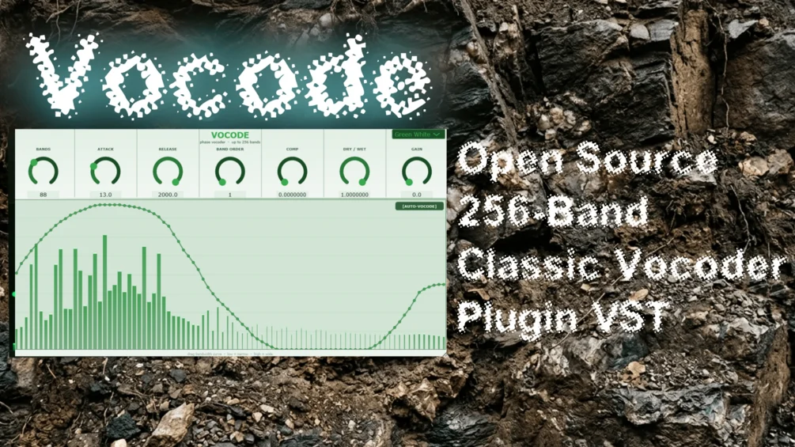

# Vocode

**Latest version:** 1.2 — download builds from the [Releases](../../../../releases) page.

VOCODE is a classic filter-bank vocoder plug-in built with the JUCE framework. It splits an audio signal into up to 256 frequency bands, analyses the amplitude envelope of each band from a modulator source, and uses those envelopes to gate the same bands of a carrier signal. The result is the characteristic "talking synthesiser" effect, or without a sidechain a richly self-gated robotic texture.

Unlike modern FFT-based vocoders, VOCODE uses traditional cascaded IIR biquad band-pass filters for its analysis and synthesis banks, and with 256 bands the most you'll probably encounter. This gives it a warm, slightly coloured sound characteristic of hardware vocoders from the 1970s and 80s, while allowing individual band-widths and their volumes to be sculpted in real time via the interactive display, perfect for explorative genres like atmospheric dub techno.

If you use exactly 133 bands, you can find a "Chromatic Lock" button that will tune the vocoder band centers to frequencies corresponding to the notes C-1 to C9, giving you a "colorizing" character.

You can control the number of bandwidths, the bandwith and volume of each vocode band by drawing bandwidth curves, Attack and Release Time for a blurring effect, the band order, compression and gain. It features both an auto-vocode mode where the bandpass is applied on the carrier signal itself - this is the default when you do not route a sidechain signal into it - or the classic sidechain vocode mode. For this to work you need to sidechain some channel's audio into the audiotrack where vocode lies (the carrier channel), and depending on your daw you need to activate the sidechain input for the plugin itself (In FL Studio, something along the lines of: Cog Symbol in the top left right above the opened GUI window of the plugin -> Processing -> Connections -> "2. Modulator" -> Set Number to 1 from a sidechain input from the mixer track connections -> and activate).
