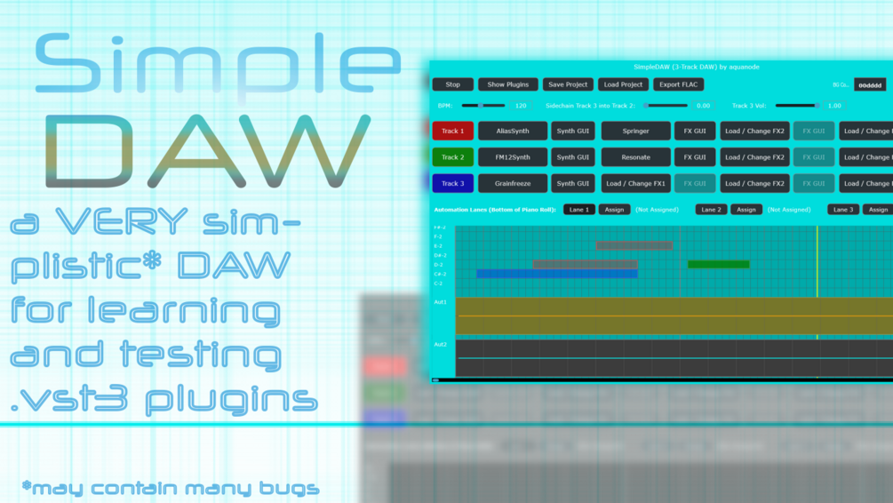

# SimpleDAW

**Latest version:** 1.2b — download builds from the [Releases](../../../../releases) page.

---

## 📖 Overview

**SimpleDAW** is a VERY simple, free, and open-source standalone Digital Audio Workstation (DAW) designed to host 64-bit `.vst3` Windows plugins. It serves as a testing ground for quick plugin loading, a learning tool for beginners, or a lightweight sketchpad for making music outside of a massive DAW environment.

*Note: SimpleDAW covers the absolute basics—expect some bugs and limitations (e.g., you can't record microphone input directly unless your loaded synth supports it).*

### ✨ Why SimpleDAW?
* **Completely Free & Open Source:** No licensing, no caveats (just please don't sell the unaltered source code).
* **Portable:** No installation required. Everything is contained in a single 7 MB `.exe` file.
* **Offline & Private:** Works completely offline; no accounts required.
* **Ultra-Lightweight:** Uses far less than 1 GB of RAM during regular operation.
* **Direct VST Loading:** Loads `.vst3` files directly from your disc (e.g., `C:/Program Files/Common Files/VST3`) instead of requiring massive, time-consuming folder scans.

---

## ⏳ Version History

* **Version 1.0:** Initial release. A basic 3-track DAW.
* **Version 1.1:** Added MIDI import and export functionalities.
* **Version 1.2a:** Improved keyboard MIDI sound (removed clicky noises at the start/end of pressing a key). *Recommended stable version.*
* **Version 1.2b (Latest):** Added two additional tracks (5 total), more automation lanes, and sidechaining from track 5 into track 4. *(Note: May contain additional bugs).*

---

## 🎛️ Architecture & Controls

> 💡 **CRITICAL WORKFLOW TIP:** You **must** press the specific Track button (1, 2, or 3) to be able to draw notes for it in the Piano Roll. The same rule applies to the Automation Lanes—the active lane you are editing will be highlighted in yellow.

| Feature | Description |
| :--- | :--- |
| **Fixed Architecture** | Fixed layout of 3 tracks (or 5 in v1.2b). Beginner-friendly with color-coded MIDI lanes. |
| **VST Section** | Three track rows (Red, Green, Blue). Click to load a `.vst3` file directly. GUI buttons open the plugin interface in a new window. |
| **Routing & FX** | Each VST loaded in the main tracks can have up to **three FX plugins** routed in series after it. |
| **Sidechaining** | Route one signal into another (Track 3 into Track 2, or 5 into 4 in v1.2b) as a control/modulation source. |
| **Piano Roll** | Draw notes from `C-2` to `G8`. You can draw manually or play via your computer keyboard (if the track is active). |
| **Automation** | Three lanes at the bottom of the piano roll. The last turned plugin knob will be assigned when pressing the assign buttons. Click and drag to draw curves. |
| **General Controls** | Start/Stop the Audio Engine, set the BPM, and Save/Load projects as `.xml` files. |
| **Export** | Render your track to a lossless `.flac` file. *(Note: Exports will be slightly quieter than direct audio output).* |
| **Coloration** | Customize the GUI and Piano Roll backgrounds using Hex codes (e.g., `00ffff` for cyan). |
| **Keyboard MIDI** | Use `a-w-s-e-d-f-t-g-z-h-u-j` for an octave of notes. Press `y` to shift down, `x` to shift up. *(Requires audio engine ON; may have minor crackle).* |

---

## 🛠️ How to Build from Source (Windows)

I consider the current release to be the final version of SimpleDAW, but you are free to build on top of it and create your own DAW! Here is how to compile it yourself using Visual Studio and JUCE.

1. **Prepare the Folders:** Create a new folder called `SimpleDAW` and place the `.jucer` file inside it. Create another folder next to the `.jucer` file called `Source` and place the three source code folders inside it.
2. **Open in JUCE:** Launch the JUCE Projucer. Go to `File -> Open` and select your `.jucer` file.
3. **Generate IDE Files:** Click the Visual Studio icon (or "Save and Open in IDE" button) in JUCE. If prompted, allow it to load any additional files it recommends.
4. **Build in Release Mode:** Once Visual Studio opens, change your build configuration from "Debug" to "Release". Click on **Build -> Build Solution** in the top menu.
5. **Locate the Executable:** Wait roughly 2 minutes for the build to finish. You will find a new `Builds` folder generated next to your `.jucer` file, containing the compiled `.exe`.