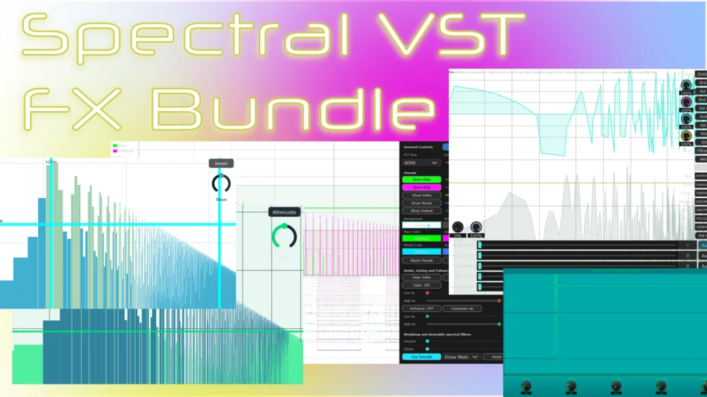

# Spectral Suite

SpectralCompare, SpectralEdit, SpectralEnhance, SpectralFilter, SpectralGate, SpectralLatency, SpectralResolve and SpectralStereoize are a collection of effect plugins and one synth plugin built on a shared FFT-based engine for real-time spectral analysis and manipulation. Together, they allow you to visualize audio in detail and shape it in highly creative ways, making them especially suited for genres like Colorbass, Botanica, and experimental sound design.

**Downloads:** all builds (standalone .exe and .vst3) are on the [Releases](../../../releases) page. Demo videos of several plugins are on my youtube channel [aquanodemusic](https://www.youtube.com/@aquanodemusic).

## The Plugins

### [SpectralCompare](spectralcompare/)

SpectralCompare lets you view a live spectrogram of the sound on the track it is inserted into, and overlay a sidechained input signal on top of it. This makes it useful for visual sound matching, analysis, and reconstruction using direct visual feedback. It also includes a delta display that shows how far the processed signal deviates from the reference input. Drawing on the waveform is possible and will perform spectral EQing (frequency volume filtering / enhancing).

It additionally supports spectral morphing / vocoding-style processing, allowing the sidechained signal to imprint its spectral characteristics onto the carrier sound. You can smooth the morph speed by activating the "Smooth Morph" button, which will turn the horizontal morph speed slider - previously only used for visual smoothing - into a real audio smoothing slider. A rolling spectrogram mode provides a continuous time-based view of evolving audio content, and integrated spectral processing tools make it possible to analyze, compare, and shape signals within the same interface.

Furthermore, a spectral reassignment view is also included, offering significantly sharper and more detailed frequency-time representation for both main and sidechain signals than regular FFT would allow.

### [SpectralGate](spectralgate/)

SpectralGate is a frequency-selective gating processor that only lets through specific spectral regions based on both frequency position and amplitude.

It provides two vertical frequency boundaries that define the active pass band, as well as a horizontal amplitude threshold that determines which spectral components are allowed through based on loudness. Frequencies outside the selected band or below the threshold are removed in real time, enabling spectral band carving, hard cutoff noise removal, and creative filtering effects.

An invert mode allows you to reverse the behavior, removing what would normally pass and passing what would normally be removed. A tilt EQ control further shapes the behavior of the amplitude threshold, and a clear visual system shows active and suppressed spectral regions in real time.

### [SpectralEnhance](spectralenhance/)

For SpectralEnhance, the controls are exactly the same as in SpectralGate, but rather than deleting frequencies we take them towards the level of the gate line! It thus acts like a spectral brickwall compressor, either upwards or downwards at a time (but you can of course always use two instances of these plugins in your DAW to achieve both effects at the same time).

### [SpectralEdit](spectraledit/)

SpectralEdit is a synth plugin that loads up to 1 minute of audio (you can specify the starting time for longer files), and you can edit the spectrogram content in various ways, like spectral blurring, adding frequencies in FFT bins, rotating or flipping sound content in both time and frequency, and deleting spectral contents - all in a region you select. Different FFT settings achieve different types of sound, with lower FFT values having more artefacts, which however can also sound rich, especially when blurred. Play the result back repitched via MIDI.

### [SpectralFilter](spectralfilter/)

SpectralFilter is a real-time spectral shaping processor that allows direct drawing and manipulation of the frequency spectrum. Incoming audio is analyzed and displayed visually, and you can draw custom filter curves directly onto the spectrum display to boost or attenuate specific frequency ranges from 20 Hz to 20 kHz, quantized to FFT bin resolution with up to ±24 dB of gain. It includes multiple FFT resolutions for balancing precision and latency, a random curve generator for instant experimental filtering shapes, and a fully customizable UI with editable colors for all visual elements. A selectable wet mode allows the full processed output to sound through without the dry signal.

SpectralFilter also supports exporting filter shapes as impulse responses for use in convolution-based processing or compatible IR tools, though the resulting tone may differ slightly due to the conversion method. Additional capabilities include automatizable curve movement, per-bin frequency, phase and panning control, global modulation scaling for frequency, phase and amplitude, and a selectable processing frequency window.

### [SpectralLatency](spectrallatency/)

With SpectralLatency, you can create spectral delay effects over all FFT bins - up to 8192 frequency ranges that you can delay individually to create all sorts of interesting effects that generally sound quite smooth. You can not only delay the sound that SpectralLatency is routed to, but also delay everything else, effectively sending out the source sound "earlier" than it would normally. Draw the delay curve along the frequency range with your mouse; the overall latency time, FFT size, and (in 32-bin mode) per-bin delay times can be automated in your DAW.

### [SpectralResolve](spectralresolve/)

SpectralResolve is a high-resolution real-time spectral analysis plugin designed for detailed inspection of audio signals. It focuses on the resolution of low-frequency sounds, with many settings being able to delete higher frequency content for even better bass resolution (hence, high frequency content may appear blurred in general). SpectralResolve uses a reassignment-based spectral method combining multiple windowed transforms to achieve significantly sharper time-frequency localization than standard FFT visualization. The engine supports configurable FFT sizes from 1024 up to 16384 points, tweakable hop sizes for temporal resolution, and flexible frequency windowing for zoomed analysis of any spectral region. A decimation system enables enhanced low-frequency resolution by visually deleting high-frequency content through multi-stage filtering.

It also includes a sidechain analysis path, allowing a second signal to be displayed simultaneously with an inverted color mapping for direct comparison. Temporal interpolation ensures smooth scrolling and visually stable spectrogram rendering without artifacts. A runnable Python example of the reassignment method is included in the [SpectralResolve docs](spectralresolve/docs/how_reassignment_works.py).

### [SpectralStereoize](spectralstereoize/)

SpectralStereoize is a spectral stereo width processor that provides frequency-dependent stereo control using FFT-based analysis. It visualizes stereo distribution with a real-time spectral display and allows direct manipulation of stereo width by drawing curves across the frequency spectrum. This makes it possible to widen or narrow specific frequency ranges with high precision, from full mono collapse to extreme stereo expansion. A sidechain reference input can also be visualized for comparison, allowing you to match or contrast stereo characteristics between signals.

## Bonus: Frequency Drawer

The bundle additionally relates to an experimental draft for a [Frequency Drawing plugin](../synths/frequency-drawer/) inspired by MetaSynth, which in contrast to the other plugins does not operate on a spectral FFT level. It is a simple synth where you can draw frequencies on a canvas, with two different engines to render the sound - both quite slow, hence it remains a draft only, but it can produce interesting tones for sound design if you invest the time.

---

Each plugin folder contains its own README with controls, version notes, and the JUCE/C++ source code. Have fun with the suite! - Aquanode
