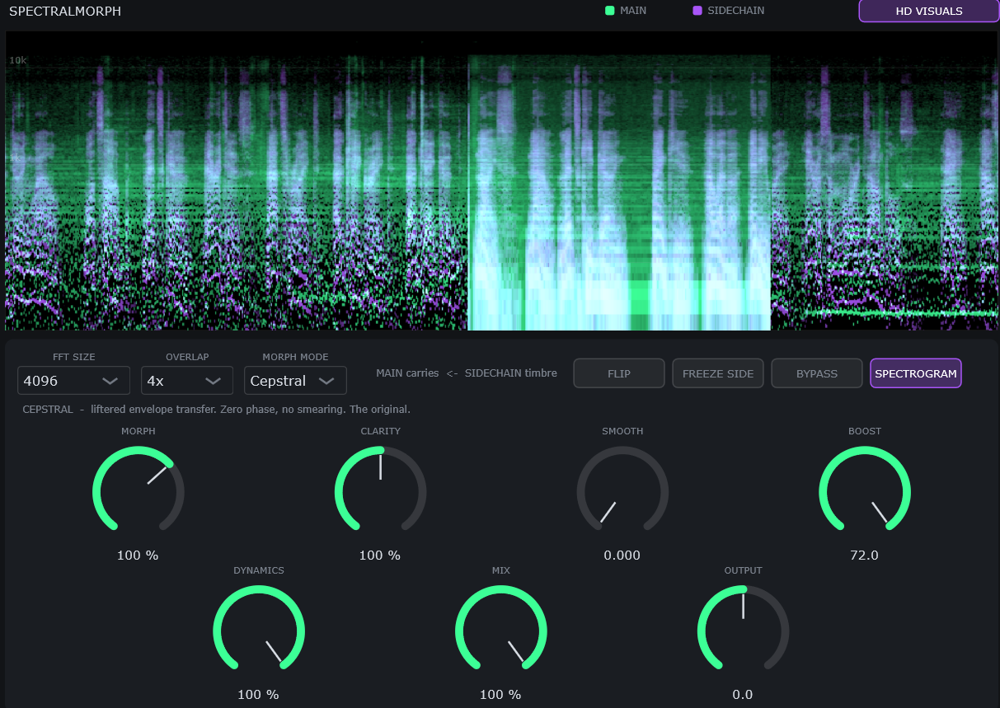

# SpectralMorph

A spectral morphing (cross-synthesis / vocoder) plugin. It takes two signals — **Main**
(the carrier, what you actually hear) and **Sidechain** (the modulator, what
donates its timbre) — and morphs the carrier's spectral envelope toward the
modulator's, using an STFT analysis/resynthesis engine with five different
morph algorithms, from a transparent envelope filter up to full partial-
tracking resynthesis.

Includes a rolling spectrogram (green = Main, purple = Sidechain, white =
overlap) with an optional **HD Visuals** mode for a sharper, frequency-
reassigned render.

---

## Signal flow

- **Main input** — the carrier. This is the audio that comes out the other
  end, reshaped.
- **Sidechain input** — the modulator. Route whatever timbre you want to
  impose (a voice, a synth, noise, anything) into this bus.
- **Flip** swaps the two: instead of Sidechain shaping Main, Main shapes
  Sidechain. This saves you the hassle to manually change the sound source routing.
- Mono and stereo are both supported on every bus.

If you don't route anything into the Sidechain bus, the plugin still runs
(Morph simply has nothing to pull toward), so it's safe to leave in a chain
even when you're not actively using it — you can also turn **Bypass** on, or set
**Mix** to 0.

---

## Morph Mode

Five algorithms, selected from the **MORPH
MODE** dropdown, each mode only shows the knobs it actually uses.

| Mode | What it does |
|---|---|
| **Cepstral** | Envelope transfer via real cepstrum + low-quefrency liftering. Zero-phase, no smearing. The classic spectral vocoder-filter sound, and arguably the best sounding option. |
| **Spectral** | Envelope via proportional-width box-averaging of the linear magnitude spectrum. Cheaper than Cepstral, a touch softer around sharp peaks. This version is also build into my other effect plugin called SpectralCompare, but a bit harder to access there. |
| **Vocoder** | Cepstral envelope plus three extras that make consonants survive: **Flatten** whitens the carrier's own fine structure so the modulator's formants land cleanly; **Sibilance** detects noise-like modulator content (esses, breath, cymbals) and randomizes the carrier's phase by the same amount so fricatives stay noisy instead of turning into a filtered tone; and real-time-constant **Attack/Release** envelope smoothing. |
| **Inject** | Vocoder, plus synthesis. Where the carrier has no energy to shape (e.g. a pad with nothing above 5 kHz being asked to say "sh"), a filter can only give up — Inject measures the shortfall and adds the missing energy back in, either as noise or as an octave-folded copy of the carrier's own lower spectrum. |
| **Partials** | The real morph. Peak-picks both spectra, matches carrier partials to modulator partials by log-frequency proximity, and physically moves each carrier partial toward its match, phase-locked frame to frame. At **Glide = 0%** this collapses exactly back to Cepstral; at 100% the carrier's partials land on the modulator's. |

---

## Global knobs

These appear in every mode:

| Knob | Range | Default | What it does |
|---|---|---|---|
| **Morph** | 0 – 150% | 100% | How much of the modulator's envelope replaces the carrier's. 100% is full replacement, is the default value and the one that sounds best; above that, it overshoots for an exaggerated effect. |
| **Clarity** *(labeled "Detail" in Spectral mode)* | 0 – 200% | 100% | Envelope resolution. Low = broad, blurred formant shapes; high = sharp, detailed — above 100% starts tracking individual harmonics rather than the broad envelope, which makes it sound like there is a dull reverb on the input. |
| **Boost** | 3 – 72 dB | 72 dB | Hard ceiling on the per-bin gain the morph is allowed to apply. Turn this down if extreme Morph/Clarity settings get too aggressive or noisy, but this value should usually be high for a clear effect. |
| **Dynamics** | 0 – 100% | 100% | 0% preserves the carrier's own loudness contour (its natural dynamics survive under the new timbre). 100% lets the modulator's loudness contour pass through untouched instead. Continuous in between. |
| **Mix** | 0 – 100% | 100% | Dry/wet. |
| **Output** | ±24 dB | 0 dB | Final output trim. |

## Mode-specific knobs

| Knob | Modes | Range | Default | What it does |
|---|---|---|---|---|
| **Smooth** | Cepstral, Spectral | 0 – 95% | 0% | Per-frame envelope smoothing (its time-feel drifts with FFT size — prefer Attack/Release in the other modes if you want a fixed feel). |
| **Attack** | Vocoder, Inject, Partials | 0 – 80 ms | 5 ms | Envelope rise time. Fast attack keeps consonant onsets intact. |
| **Release** | Vocoder, Inject, Partials | 0 – 500 ms | 60 ms | Envelope fall time. Slower release keeps the timbre from chattering. |
| **Flatten** | Vocoder, Inject, Partials | 0 – 100% | 65% | Whitens the carrier's own fine structure so the modulator's formants land on it cleanly instead of re-weighting whatever carrier harmonics happen to be nearby. |
| **Sibilance** | Vocoder, Inject | 0 – 100% | 60% | Amount of phase randomization applied where the modulator is noise-like, so fricatives/breath/cymbals survive as noise rather than as a filtered tone. |
| **Fill** | Inject | 0 – 100% | 70% | How much missing energy gets synthesized in where the carrier has none to shape. |
| **Fold** | Inject | 0 – 100% | 0% | Blends the synthesized fill between noise (0%) and an octave-folded copy of the carrier's own spectrum (100%). |
| **Glide** | Partials | 0 – 100% | 50% | How far carrier partials travel toward their matched modulator partials. 0% = no movement (identical to Cepstral). |
| **Lock** | Partials | 0 – 100% | 100% | Phase-lock amount for moved partials, keeping the shift coherent frame to frame. |
| **Peaks** *(Peak Floor)* | Partials | −90 to −20 dB | −60 dB | Threshold below the frame peak for partial picking — lower catches more (quieter) partials. |

## Toggles

| Toggle | Default | What it does |
|---|---|---|
| **Flip** | Off | Swaps which bus is carrier and which is modulator. |
| **Freeze Side** | Off | Holds the sidechain envelope at its current shape instead of continuously updating — useful for freezing a captured timbre. |
| **Bypass** | Off | Full bypass. |
| **Spectrogram** | On | Shows/hides the rolling spectrogram display. Turning it off also stops its internal timer, saving a little CPU. Purely visual — no effect on the audio. |
| **HD Visuals** | On | Switches the spectrogram to a frequency-reassigned render (sub-bin-accurate placement instead of 256 coarse bands), for a sharper, thinner-lined display. Also purely visual, and it's the CPU on/off switch for that extra analysis — turn it off if you're on a very small FFT + high overlap combo and want to save CPU. |

## FFT Size / Overlap

- **FFT Size**: 512 – 32768 (default 4096). Bigger = better frequency
  resolution, worse time resolution (and more latency — the plugin reports
  its exact PDC to the host). Smaller = the reverse; good for percussive or
  fast-consonant material. 4096 is a good middle ground, you may also prefer 2048 for sharper sound but less morphing quality.
- **Overlap**: 2x, 4x, or 8x (default 4x). Higher overlap = smoother output
  and finer time resolution at the same FFT size, at higher CPU cost. 2x is
  offered for CPU headroom but carries a faint amplitude ripple since the
  window doesn't sum perfectly flat at 50% overlap — 4x/8x are artifact-free.

Both can be changed live; the plugin updates its latency reporting to the
host automatically when you do.

---

## Quick start

1. Route your target timbre into the **Sidechain** bus.
2. Pick a **Morph Mode** — start with **Vocoder** if you want intelligible,
   consonant-preserving cross-synthesis (voice-through-synth, etc.), or
   **Cepstral** for a clean classic envelope-filter sound which I recommend for high-quality morphing.
3. Turn **Morph** up until you hear the sidechain's character take over (the defaul setting should cover this already very well).
4. If consonants/transients are getting lost, increase **Sibilance** and
   check **Attack** is fast enough.
5. If it starts sounding harsh or over-boosted, pull **Boost** down.
6. Use **Flip** to try it the other way around and experiment a bit.

---

## A note for FL Studio users

FL Studio does **not** use fixed-size audio buffers by default — block sizes
sent to plugins can vary from call to call. That's fine for most effects,
but it's a common source of glitches, clicks, or misbehaving latency
compensation in FFT/STFT-based plugins like this one, which do their real
work in fixed-size analysis frames.

**Enable "Fixed size buffers" in FL Studio's audio settings of the plugin**
(`Options (Dropdown and Cog Symbol at the top left right above the plugin) → Audio Settings → Fixed size buffers`) if you notice any
crackling, dropouts, or spectrogram/latency weirdness. This is standard
advice for any spectral/FFT plugin in FL Studio too!
