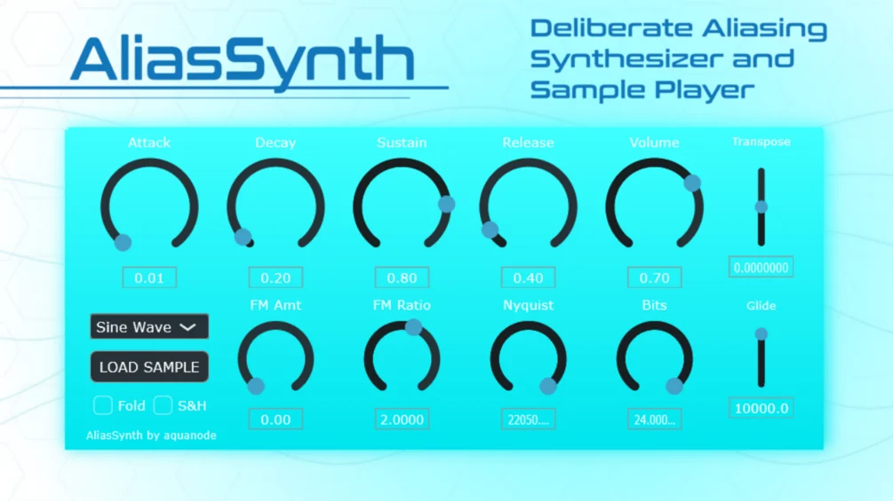

# AliasSynth

**Latest version:** 1.1 — download builds from the [Releases](../../../../releases) page.

AliasSynth is a synthesizer and sample player that deliberately has no anti-alias built in to allow harsh frequencies to come through the signal chain. Frequencies above the Nyquist Limit of 22050 Hz will get reflected back into the audible range. Its intended use is for:

*   Creating unusual timbres for pads or stabs that I recommend you to shape further using your favourite filters and effects to make them sound nice,
*   Loading up samples, especially in the C0 setting, and playing them at high notes to make them very short and high pitched to create the classic "data glitch sounds",
*   Using low Nyquist cutoffs for interesting bass sounds,
*   And general experimental sound design.

Next to a simple ADSR, a sine modulator in the 2 operator FM engine that is on by default (except you turn the knob to zero), frequency / bitrate controls a separate transpose/glide logic and wavefolding / sample and hold functions, it has the following modes:

*   **Subtractive Saw:** CPU-friendly. Only the fundamental frequency is explicitly generated and folded.
*   **Additive Saw:** A CPU-heavy sawtooth constructed from 64 individual harmonics. Each harmonic frequency is folded independently around the Nyquist Limit.
*   **Sine Wave:** A single sine oscillator. Good and classic choice for the FM engine.
*   **Sample (Root C0):** Plays a loaded mono sample with its root pitch assumed to be C0. Nyquist folding affects playback speed, not harmonic content. Higher notes drastically shorten playback.
*   **Sample (Root C5):** Plays the loaded sample at original pitch when C5 is played.
*   **Sample (Root C10):** Plays the loaded sample with root pitch at C10. Lower notes stretch playback drastically.

Samples are played back without any interpolation (or "nearest neighbor interpolation"), which is not audible when you play it back normally but it adds a certain Lo-Fi crunchyness when resampling at lower / higher registers.

AliasSynth is designed as an explicit aliasing and spectral-folding instrument, not a clean or “correct” synthesizer. Unexpected behavior at extreme settings is intentional.

Made with the help of Google Gemini and chatGPT and the code is open source, written in JUCE! You may do whatever you like with the source code, except sell it unaltered.

Thanks for checking it out!

Feel free to write $0 or €0 in the amount, the €3 is only a recommendation if you want to support me. But please test the synth first (i.e. download it for free) to make sure it is useful and works on your machine :)

---

## Manual

AliasSynth is a simple synthesizer VST that intentionally contains no band-limiting or anti-aliasing. Instead of preventing aliasing, the synth exposes it directly by either folding oscillator frequencies around a user-defined virtual Nyquist limit, or by reducing the effective sample rate using sample-and-hold, depending on availability.

**How to install:** Place the `.vst3` folder anywhere in `C:\Program Files\Common Files\VST3` and re-scan your plugin list in your DAW.

### Controls

*   **ADSRV:** Attack, Decay, Sustain, and Release controlling the amplitude envelope of each voice, Volume the peak amplitude.
*   **FM:** If FM Amount is non-zero, a sine wave modulates the oscillator frequency (two-operator FM). FM is applied before aliasing or folding, so FM sidebands are also subject to aliasing.
*   **Fold:** Applies a nonlinear sine-based waveshaper after signal generation, introducing additional harmonics that may alias further.
*   **SR:** If active, sample-rate reduction is used instead of frequency-domain folding. Then, the nyquist knob controls the hold rate.
*   **Bits:** Bit depth, from 1 bit (basically square wave reduction) to 24 bit (clean).

### Mode Menu

*   **Subtractive Saw:** CPU-friendly. Only the fundamental frequency is explicitly generated and folded.
*   **Additive Saw:** A CPU-heavy sawtooth constructed from 64 individual harmonics. Each harmonic frequency is folded independently around the Nyquist Limit.
*   **Sine Wave:** A single sine oscillator. Good and classic choice for the FM engine.
*   **Sample (Root C0):** Plays a loaded mono sample with its root pitch assumed to be C0. Nyquist folding affects playback speed, not harmonic content. Higher notes drastically shorten playback.
*   **Sample (Root C5):** Plays the loaded sample at original pitch when C5 is played.
*   **Sample (Root C10):** Plays the loaded sample with root pitch at C10. Lower notes stretch playback drastically.

**New in version 1.1:** 
*   **Transpose in Octave and Glide Time for Transposing:** Play any note, and around it you can shift the base frequency by up to 7 octaves. This can give extra aliasing to the signal.

AliasSynth is designed as an explicit aliasing and spectral-folding instrument, not a clean or “correct” synthesizer. Unexpected behavior at extreme settings is intentional.

Made with the help of Google Gemini and chatGPT. The code is open source! you may do whatever you like with it (except sell it unaltered).

Thanks for checking it out!  
aquanode