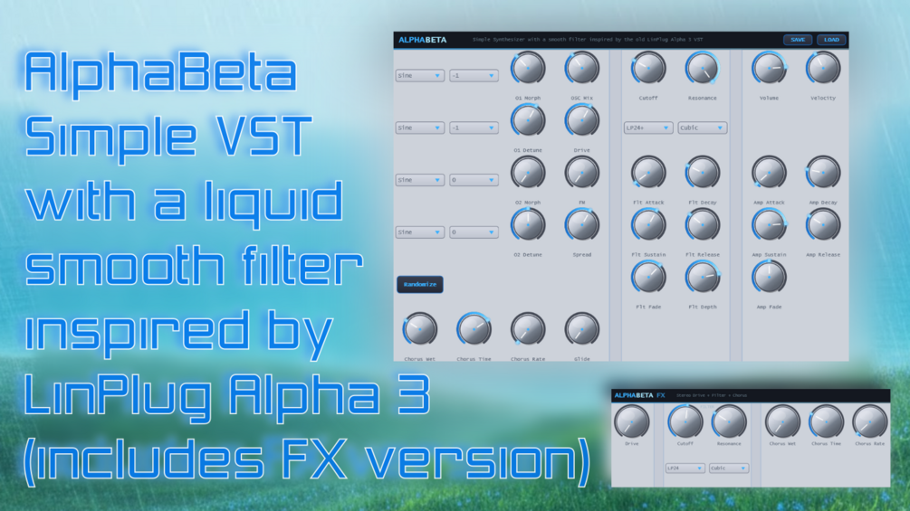

# AlphaBetaSynth

**Latest version:** 1.1 — download builds from the [Releases](../../../../releases) page.

AlphaBeta is a simple synthesizer modelled after the free, but discontinued Linplug Alpha 3 synthesizer. It is by far not as versatile as the original, and I coded it (with the help of Claude AI) to understand the signal path of such synthesizers. However, AlphaBeta has, like the original, a characteristic, liquid smooth sweeping filter sound character which together with the chorus washes out the signal really nice.

Since the Filter is the unique feature, I also added a separate AlphaBetaFX Effect VST that you can put in your FX chain. It also has an envelope control (ADSR, Amount and Retrigger). As it is an FX plugin, it can not easily / reliably retrigger on each midi note, but the filter ADSR will retrigger after each short amount of silence.

AlphaBeta has a randomize button to let you quickly get new ideas out of the synth. Per Oscillator, you have two voices you can morph between. Other controls are pretty standard, but the most important ones are the fade and depth knobs: Fade sets the depth at which the filters cutoff frequency moves from the sustain value to either the cutoff parameters value when the dial is turned completely counter-clockwise orenvelope depth when the dial is turned completely clockwise. The depth dial is used to set the degree to which the filter's envelope effects the signal. -100% means that the envelope has full negative effect on the filter. A middle position means that it has no effect on the filter. 100% (i.e. turning the dial completely clockwise) means that the filter is modulated by the envelope's full range.FM from Oscillator 2 to Oscillator 1 is active when it has values higher than 0.

I provided a few simple presets in the download as well.

Thanks for checking it out!
