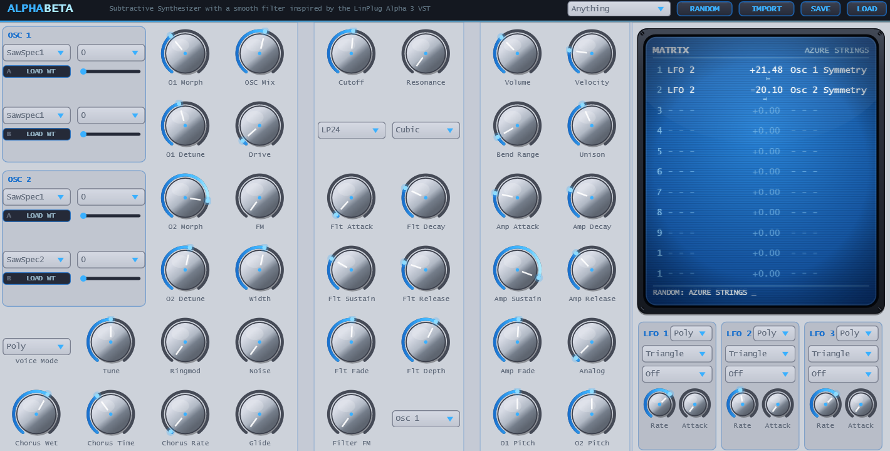

# AlphaBetaSynth

**Latest version:** 3.0.0 - download builds from the [Releases](../../../../releases) page.
In the Downloads you will find AlphaBeta.vst3, an older / simpler version, and AlphaBetaSynth.vst3, the "full" version.

## About AlphaBeta

AlphaBeta is a simple synthesizer modelled after the free, but discontinued Linplug Alpha 3 synthesizer. It has the same overall functions as the original but sounds different. It can load original presets, but they will only sound very loosely like the original. However, AlphaBeta has, like the original, a characteristic, liquid smooth sweeping filter sound character which together with the chorus washes out the signal really nice.

The smooth Filter is the unique feature of AlphaBeta. I also added a separate AlphaBetaFX Effect VST that you can put in your FX chain. It also has an envelope control (ADSR, Amount and Retrigger). As it is an FX plugin, it can not easily / reliably retrigger on each midi note, but the filter ADSR will retrigger after each short amount of silence.

AlphaBeta has a CRT-like screen with a modulation matrix that lets you easily link LFOs to many other parameters as well as a randomize button to let you quickly get new ideas from the synth.

Per Oscillator, you have two voices you can morph between. Other controls are pretty standard, but the most important ones are the fade and depth knobs: Fade sets the depth at which the filters cutoff frequency moves from the sustain value to either the cutoff parameters value when the dial is turned completely counter-clockwise or envelope depth when the dial is turned completely clockwise. The depth dial is used to set the degree to which the filter's envelope effects the signal. -100% means that the envelope has full negative effect on the filter. A middle position means that it has no effect on the filter. 100% (i.e. turning the dial completely clockwise) means that the filter is modulated by the envelope's full range. FM from Oscillator 2 to Oscillator 1 is active when it has values higher than 0.

I provided a few simple presets in the download as well, these are made for the older versions of the synth though - both versions are in the download.

Thanks for checking it out!

## Features and Extras

**Oscillators.** 30 waveform names (26 re-imagined from the original), -2..+2 octave ranges, two oscillators with two voices each plus noise, ring modulation, detune, filter with its own envelope and drive, amp envelope with fade, velocity, spread (as Unison), 11-slot modulation matrix, 3 LFOs with tempo sync, glide with mono/legato modes, chorus, 32 voices, analogness, master tune. Oscillator symmetry (via the matrix), noise mix, ring modulation on OSC 2, audio-rate filter FM with source select, pitch-bend range. Further additions are 2-op FM, oscillator pitch knobs, per-oscillator detune, resonance curve, stereo Width, selectable filter-FM source and user wavetables.

**Wavetables.** Every wave slot (wave A and wave B of both oscillators, four in total) has its own table strip and position slider under its wave chooser. Click *LOAD WT* to import a .wav / .aif / .flac file (right-click to clear or to choose a frame size); that slot's waveform switches to *Table*. Each slot is either a built-in wave or its own wavetable, and the oscillator's morph knob blends A and B as always. Frames are resampled to 2048 samples internally, up to 256 frames per table. Tables work with morph, symmetry, FM, ringmod and unison like any other waveform. Wave A and wave B of each oscillator have separate wavetables and position sliders, so an oscillator can morph between two different tables, or between a table and a built-in wave.

**LFOs.** Sine, Triangle, Sawtooth, Square, Noise and SampleHold; rate 0.01-32 Hz or tempo sync (dotted and triplet values); attack; Mono (shared, locks to the song position when synced) or Poly (restarts per note).

**Modulation matrix.** AlphaBeta has a Modulation Matrix with 11 slots on a blue CRT-inspired screen, like the original. Sources and destinations follow the original: note (log/lin), velocity, aftertouch, pitch wheel, mod wheel, breath, foot, expression, CC16-19, both envelopes, three LFOs and Constant, routed to oscillator amplitude/pitch/symmetry, ringmod, noise, cutoff, cutoff FM, resonance, main amplitude/pitch, matrix depth 1-3 and LFO 1/2 speed. Click a source or destination to choose it, drag the amount (Shift = fine), mouse wheel nudges, click twice to set the amount to 0 and back, right-click clears a slot. Pitch amounts are shown as semitones:cents. Scaling constants are 100% pitch = 24 semitones, 100% cutoff = 5 octaves and 100% LFO speed = 4 octaves.

**Preset Randomizer.** Pick a kind of sound in the menu next to RANDOM, then press RANDOM for a new patch of that kind. Each random preset character is a profile of waveform pools, register, oscillator interval, filter type and window, both envelopes, chorus, unison, glide and voice mode, plus behaviour flags that wire up the LFOs and the matrix (tempo-synced wobble, delayed vibrato, PWM shimmer, sample & hold steps, key tracking, pitch drops and rises, the Alpha factory-bass key scaling).

## Filter

The smooth Filter is the unique feature of AlphaBeta, providing the characteristic liquid-smooth sweeping filter sound. Together with the chorus it can wash out the signal really nicely. The filter has its own envelope and drive, with filter cutoff, resonance, fade and depth controls. Audio-rate filter FM is available with a selectable source. The filter's **Fade** sets the depth at which the filter's cutoff frequency moves from the sustain value to either the cutoff parameter's value when the dial is turned completely counter-clockwise or the envelope depth when the dial is turned completely clockwise. The **Depth** dial sets the degree to which the filter's envelope affects the signal. **-100%** means that the envelope has full negative effect on the filter. **0%** means that the envelope has no effect on the filter. **100%** means that the filter is modulated by the envelope's full range. FM from Oscillator 2 to Oscillator 1 is active when it has values higher than 0.

## Alpha 3 Preset Import

Alpha 3 preset import is experimental. The matrix, waveforms, ranges, A/B balance, filter type, resonance, drive and LFO shapes/sync are decoded reliably; envelope times, cutoff and LFO rate scaling are best guesses, and osc mix, detune, noise, env depth, fade, volume and chorus are not decoded. Every import writes `Documents/AlphaBeta/Alpha3 import report.txt` listing what was mapped and with what confidence, plus the raw data. Treat an imported patch as a starting point, and use SAVE / LOAD for your own sounds.

## Saving Patches

**SAVE** writes an `.abpreset` file containing the complete plugin state: every parameter, the patch name and any loaded wavetables (stored inside the file, so the patch doesn't depend on the original .wav). The format is JUCE's parameter tree as XML, wrapped in a small binary header. This is the preferred way to keep your sounds: it round-trips exactly, while Alpha 3 import is experimental and approximate. Your DAW's project/preset recall stores the same state. Presets saved with 1.1 still load; parameters they don't contain get their defaults.

## Layout

Knob labels sit directly under the knobs; each oscillator's two wave choosers (A / B) and their octave choosers are grouped in an OSC box. The Voice Mode chooser is located in the oscillator column, next to Master Tune. The matrix screen is a bright blue tube with near-white phosphor, retaining the CRT-like appearance of the original Alpha.

## Thanks

Claude Sonnet provided the initial version of the synth, refinements using Claude Opus 5.5.
I provided a few simple presets in the download as well, though these were made for older versions of the synth.

Thanks for checking it out!
