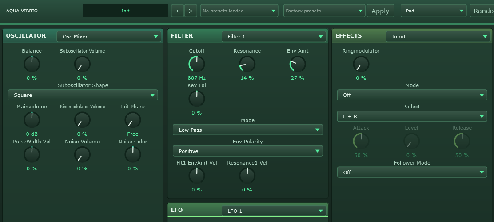

# Aqua Vibrio



A Virus-style virtual analog / wavetable polysynth in JUCE. Not a 1:1 emulation —
the aim is the same possibility space and the same character, with every control
on one scrollable panel and every knob doing exactly what its label says.

The sound engine is built from the Aquanode Modular Synth modules, molded into the
shape of the Virus's signal flow.

Almost every parameter in `Source/AquaVibrioParameters.h` is generated from the
hardware's own specification — 430+ program parameters with their ranges, defaults,
bipolarities and enumerated value names (the oscillator models, filter types,
saturation curves, filter bank modes, clock divisions, the modulation matrix
vocabulary, and so on).

## The voice

```
Osc 1 ─┐                            ┌─ Filter 1 ─ Saturation ─ Filter 2 ─┐
Osc 2 ─┤                            │     (serial, parallel or split)    │
Osc 3 ─┼─ mixer ─ Osc Volume ───────┤                                    ├─ Amp ─ Pan
Sub   ─┤  (ring mod, noise, input)  └────────────────────────────────────┘
Noise ─┘
```

Three oscillator models — Classic, HyperSaw and Wavetable — per oscillator, with
hard sync, pitch preserving sync, FM in seven modes, a sub oscillator, noise with
a sweepable colour filter, and ring modulation. Sixteen voices, with Poly, four
Mono modes (multi trigger, legato, and portamento only when you play legato) and
Hold, plus a sustain pedal and portamento that works in poly too.

Two filters with digital and ladder modes, serial / parallel / split routing, and
fifteen saturation curves between them driven by the Osc Volume knob.

Four envelopes, three LFOs and a six slot modulation matrix (three destinations
per slot), plus LFO 1 and 2's own Assign routes.

## The effects rack

In signal order: Input, Distortion, Filter Bank (ring modulator, frequency
shifter, vowel, comb, and crossfading / variable slope filters), Vocoder,
Character, EQ, Phaser, Chorus, Delay and Reverb as true sends, and a Granulator.

The Granulator is the Aquanode Modular's granulation effect in place of the
hardware's Atomizer: a rolling buffer of whatever played, resprayed as a
cloud of windowed grains, with Freeze to hold the buffer and scan it.

## The panel

Every knob reads in the units the engine actually uses — "807 Hz", "72.6 ms",
"+6.3 ct", "152 bpm", "-8.0 dB" — computed from the same curves the sound engine
uses, so a knob can never say something the engine does not do. Typing a value
("2 s", "440 Hz", "1.5k") snaps to the nearest setting.

A control whose effect is off in the current mode or choice of parameters is dimmed.

## Presets

All parameters are recalled on startup and in presets, so the host saves and
restores the complete state automatically. Patches can also be saved to and
loaded from disk with the Save / Load buttons, and there are factory presets in
the picker in the top bar.

The Randomise button generates a usable patch of the chosen character (Bass, Acid,
Reese, Hoover, Psy Lead, Pad, Glass Pad, Bell, Pluck, Metallic, Riser, Formant,
Granular and more) rather than scattering values at random — each character is a
profile describing register, oscillator model, filter window, envelope shapes and
effect balance, and the generator randomises inside those windows. Super Random,
at the bottom of the list, randomizes every parameter in a hopefully audible way.

## Notes

Some elements are approximations rather than close implementations — the
wavetables are the Aquanode table rather than the hardware's, and the built-in
arpeggiator patterns are generated rather than the original's.

Made with Claude Opus 5 as a free and open source option to an Access Virus-style
synthesizer. Thanks for trying it out!