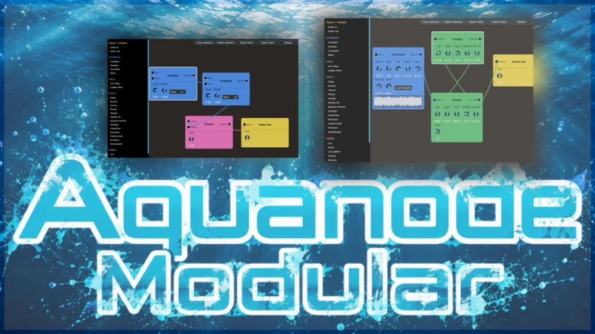

# Aquanode Modular

**Latest version:** 2.3 — download builds from the [Releases](../../../../releases) page.

---

## 📖 Overview

**Aquanode Modular** is a free modular synthesizer compiled as a VST3 plugin and standalone `.exe` for Windows. The JUCE/C++ source code is included in the download, allowing cross-platform compilation for any environment supported by JUCE. It was created with the assistance of Claude Fable 5.

Inspired by classic hardware and digital modular environments like the Nord Modular G2 and Wren Modular, it serves as an experimental playground. The interface allows you to easily place modules, drag patch cables, and sculpt complex sounds out of simple building blocks. 

### ⚡ Key Features
* **Feedback Routing:** Unlike many digital systems, Aquanode Modular supports true audio feedback loops. You can route an Audio Out back into an Audio In or FM In—even creating self-feedback on a single oscillator. *Warning: Feedback loops can get very loud, very quickly!*
* **Preset Mutation:** The built-in Mutator can gently (or wildly) randomize your patch's knob settings to spark instant inspiration, complete with a one-click Undo button.
* **Self-Contained Patches:** Export your creations as `.zip` files that package all routings, module coordinates, and custom audio samples together.

---

## 🚀 Quick Start Guide

Getting sound out of a blank canvas takes only a few simple steps:

1. **Add a Sound Source:** Click on **Oscillator** in the left sidebar to drop it into the patch area.
2. **Add an Output:** Click on **Audio Out** in the sidebar. *You must have an Audio Out module to hear anything.*
3. **Patch the Cable:** Click and drag from the round **Audio Out** socket of your Oscillator over to the round **Audio In** socket of your Audio Out module.
4. **Play:** Play notes on your MIDI keyboard. Oscillators and envelope modules respond natively to incoming polyphonic note data.
5. **Navigate:** Click and drag on any empty space in the patch area to smoothly pan your view around the grid.

---

## 🔌 Connection & Routing Rules

* **Sockets:** Round sockets handle **Audio** signals. Square sockets handle **Modulation** signals (LFOs, envelopes). 
* **Direction:** Sockets on the left side of a module are **Inputs**; sockets on the right side are **Outputs**.
* **Knob Modulation:** You can drag a cable directly from an output socket onto *any rotary knob* to instantly modulate that specific parameter.
* **Mixing & Splitting:** One output can feed multiple inputs simultaneously. Conversely, dragging multiple cables into a single input will automatically mix those signals together.
* **Removing Elements:** 
  * Click a cable twice to delete it.
  * Click a module or cable once to select it (white outline), then press `Delete` or `Backspace`.
  * Triple-click a module to instantly clear all self-routed cables (loops connected to the same module).

---

## 🎛️ Top-Right Global Actions

* **Default Patch:** Wipes the canvas and generates a basic *Oscillator* ➡️ *Audio Out* routing.
* **Clone Selected:** Duplicates the currently highlighted module along with its exact knob settings (does not copy attached cables).
* **Delete Selected:** Removes the highlighted module and snaps all attached cables.
* **Export / Import Patch:** Saves or loads your modular patches (use Import to try out the factory presets like *FM Bells*, *Wobble Bass*, or *Dreamy Pad*).
* **Mutate:** Reveals the patch mutation drawer to introduce controlled randomness to your parameters.

---

## 💡 Practical Patching Tips

* **Shape Your Volume:** Connect an **ADSR** module's square output into an Oscillator's **Env In** socket to shape the sound's volume over time (Attack, Decay, Sustain, Release). If `Env In` is empty, the oscillator drones indefinitely while a key is held.
* **Classic FM Synthesis:** Route the audio output of Oscillator A into the **FM In** of Oscillator B. Oscillator A becomes the "Modulator" and B becomes the "Carrier." Use the **FM Ratio** knob to finetune their harmonic relationship.
* **Expressive Polyphonic FM:** To make an FM sound fade out naturally when a key is released, route the output of a single **ADSR** into the **Env In** sockets of *both* oscillators in the chain.
* **Chords & Polyphony:** Use the **Midi Add** module to automatically generate up to four extra notes at specific semitone offsets. For complex FM patches, ensure the Midi Add module is routed to both the modulators and carriers down the line.

---

## 📦 Module List

<strong>Click to expand: All modules by category</strong>

| Category | Module | Description |
| :--- | :--- | :--- |
| **Input / Output** | Audio In | Passes the host's audio input into the patch, with a level knob. |
| **Input / Output** | Audio Out | Sends the patch's signal back out to the host, with a level knob. |
| **Sound Generation** | Additive | Builds a tone by drawing up to 64 harmonic bars directly, shaped further by Tilt, Odd/Even and Stretch. |
| **Sound Generation** | Analog Drift | The FM Oscillator with the precision sanded off - per-voice pitch/phase drift, random start phases and up to 7-way unison. |
| **Sound Generation** | Bowed | Physically-modelled bowed/blown string that sustains for as long as a note is held, patch Pressure In for expression. |
| **Sound Generation** | Clap | Classic 808 clap made of three quick noise bursts plus a diffuse tail, fires from Trig In or MIDI note-on. |
| **Sound Generation** | Complex Osc | Buchla-style FM-into-wavefolder voice with no filter, Timbre controls the fold amount instead of a cutoff. |
| **Sound Generation** | Formant | Singing oscillator that morphs through vowels A-E-I-O-U via the Vowel In socket, no modulator signal needed. |
| **Sound Generation** | Granulator | Granular sampler playing a cloud of pitched grains per note, patch an ADSR into Env In for note-level shaping. |
| **Sound Generation** | Hats | 606/808-style metallic hi-hats from six detuned square oscillators, Decay sets closed vs. open hat. |
| **Sound Generation** | Kick | 808-style kick drum with a pitch-drop envelope and drive, triggered by Trig In or MIDI note-on. |
| **Sound Generation** | Modal Drum | Physically-modelled percussion (marimba to bell-like tones) via Inharm and Bright, with Pitch In for melodic tuning. |
| **Sound Generation** | Noise | Per-voice white/pink noise source, useful as a percussion excitation gated by an ADSR (try feeding it into a Resonator). |
| **Sound Generation** | Oscillator | The core polyphonic FM operator (DX7-style phase modulation) with FM In and Env In sockets for per-note modulation. |
| **Sound Generation** | Phase Distort | CZ-style phase-distortion oscillator where the DCW control morphs the wave shape without moving the pitch. |
| **Sound Generation** | Pluck | Karplus-Strong plucked string, fully polyphonic from the keyboard, or a mono string driven from a sequencer's Pitch In. |
| **Sound Generation** | Sampler | Keyboard-mapped one-shot sample player, root fixed at C4, with its own per-voice Env In. |
| **Sound Generation** | Snare | Two detuned "shell" tones plus a band-passed noise burst for the wires, Snap balances the two. |
| **Sound Generation** | Unison | Supersaw-style stack of up to nine detuned, panned copies of one note - thickens a single note. |
| **Sound Generation** | Wavetable | Loads a sample as single-cycle frames and scans through them with Position, morphing timbre without changing pitch. |
| **Filter** | 3-Bell EQ | Three peaking bells over a graphic curve - drag the dots for frequency and gain, wheel for Q, and every knob takes modulation. |
| **Filter** | Comb Filter | Bank of peaking filters spread symmetrically around a centre frequency, shaped by Count and Damp (colours, but never rings - see True Comb). |
| **Filter** | Formant Filter | The Formant oscillator's vowel bank aimed at incoming audio, morph A-E-I-O-U via Vowel In to make any source talk. |
| **Filter** | Ladder Filter | Moog-style 4-pole ladder filter with drive and self-oscillating resonance, switchable between 12/24 dB LP/HP. |
| **Filter** | Pitch Lock Filter | Dampens every note NOT on the chosen pitch classes (and can boost the ones that are), musically "re-tuning" the signal. |
| **Filter** | SVF Filter | State-variable filter offering LP/BP/HP, running one instance per voice when fed a per-voice signal. |
| **Filter** | True Comb | An actual delay-line comb (the Vital kind) that rings at a pitch, with signed feedback, loop damping and Pitch In for tracking. |
| **Effect** | ADSR Delay | Creative delay/resonator with a shapeable per-cycle envelope and four routing modes including hard ping-pong. |
| **Effect** | Align | Sub-sample per-channel delay, volume and polarity invert, for phase alignment and Haas-style stereo tricks. |
| **Effect** | AquaChorus | Liquid chorus/flanger using two LFO-swept delay lines with tunable L/R phase offset and feedback. |
| **Effect** | AquaReverb | Lush 8-line feedback-delay-network reverb with a Freeze control that holds the tank indefinitely. |
| **Effect** | Bitcrush | Bit-depth reduction for digital grit, continuously variable from subtle warmth to harsh 1-bit crush. |
| **Effect** | Chorus | Modulated delay line per channel with an LFO phase offset between channels for stereo width. |
| **Effect** | Compressor | Feedforward stereo-linked compressor with attack/release smoothing and makeup gain. |
| **Effect** | Delay | Stereo tempo-synced delay with independent times per channel and a filtered feedback loop. |
| **Effect** | FM | Cross-modulates two arbitrary signals via phase modulation, ring modulation or self-feedback, patch cables define the routing. |
| **Effect** | Flanger | Short modulated delay with switchable positive/negative feedback for classic jet-swoosh effects. |
| **Effect** | Limiter | Fast stereo-linked peak limiter with instant attack and zero latency, for catching a patch before it clips. |
| **Effect** | Phaser | 2 to 12-stage allpass phaser swept by an internal LFO around a centre frequency, with feedback. |
| **Effect** | Resonator | Tuned comb resonator with two feedback modes, pitch is set directly in MIDI note numbers. |
| **Effect** | Reverb | Simple pre-delay plus algorithmic reverb core with decay time and room size controls. |
| **Effect** | SR Reduce | Sample-rate reduction (decimator) that aliases the highs into inharmonic digital shimmer. |
| **Effect** | Spring Reverb | Physically-modelled spring reverb with up to 7 parallel "coils" and a Chirp control for the springy character. |
| **Effect** | Stereo Width | Mid/side widener with a Haas micro-delay and a Bass Mono crossover, plus a Width Mod input for a breathing image. |
| **Effect** | Tape Wobble | A worn tape machine: wow, flutter, gain-compensated saturation, dropouts and ducked hiss - Analog Drift for finished signals. |
| **Effect** | Vocoder | Classic vocoder: the Mod In signal's spectral envelope shapes Carrier In (voice into Mod, saw into Carrier = robot voice). |
| **Effect** | Waveshaper | Drive-based distortion with a choice of curves - Tanh, Sine Fold, Hard Clip, Rectify. |
| **Effect - Spectral** | Spectral Delay | Gives each FFT bin its own delay time drawn as a curve, so highs and lows arrive at different times. |
| **Effect - Spectral** | Spectral Enhance | Boosts quiet bins up to a drawn target curve, or caps loud ones down to it, for spectral exciting or soft limiting. |
| **Effect - Spectral** | Spectral Filter | A per-bin gain curve drawn freehand - notches, brick walls, or comb shapes. |
| **Effect - Spectral** | Spectral Gate | Gates each bin independently against a drawn per-bin threshold, Invert turns it into a residual/noise extractor. |
| **Effect - Spectral** | Spectral Morph | Morphs Main In's spectral envelope toward Morph In's envelope, with a drawn curve controlling how much per bin. |
| **Utility** | ADSR | Per-voice envelope generator, patch its Mod Out into a generator's Env In for classic per-note amplitude shaping. |
| **Utility** | Always Midi | Holds one note down forever so a generator drones without a keyboard, re-triggering it every "Renew" seconds. |
| **Utility** | Arp | Holds a chord and plays it back as an arpeggio via its Midi Out, replacing (not adding to) what a listening generator hears. |
| **Utility** | Audio Thru | Does nothing at all - audio in, identical audio out, purely for bunching cables into a junction or giving a long run a waypoint. |
| **Utility** | Clock | Tempo-synced pulse generator with swing and gate width, for driving Step Seq, Euclid, S&H and other Trig/Clock inputs. |
| **Utility** | Crossfade | Equal-power A/B mixer with a modulation input for auto-morphing or hard-switching between two sources. |
| **Utility** | DAW Mod | Exposes a host-automatable parameter as a modulation source, up to twelve instances can be active at once. |
| **Utility** | DC Offset | Shifts and scales a signal (Out = In x Gain + Offset), handy for turning a bipolar LFO into a unipolar one or inverting a mod signal. |
| **Utility** | Discard Midi | Twelve toggle boxes, one per note class - every class switched on never sounds, so wrong notes stop existing for a listening generator. |
| **Utility** | Draw LFO | An LFO whose 1024-point shape you draw by hand, with a stepped read mode that turns it into a step sequencer for modulation. |
| **Utility** | Env Follow | Turns any audio signal into a modulation signal by rectifying and smoothing it - the basis for sidechain-style ducking. |
| **Utility** | Euclid | Euclidean rhythm generator that spreads a chosen number of pulses as evenly as possible across a chosen number of steps. |
| **Utility** | Gate | Outputs 1 while a voice's note is held and 0 after release, with a small anti-click ramp. |
| **Utility** | KeyTrack | Outputs each voice's note pitch as a modulation signal, scaled for exact 1-octave-per-octave tracking at 100% depth. |
| **Utility** | L/R Splitter | Splits a stereo signal into separate left- and right-only outputs. |
| **Utility** | LFO | Per-voice low-frequency oscillator that re-triggers its phase on every note-on, so each note gets the same modulation shape. |
| **Utility** | Logic | Combines two gate/modulation signals with boolean or comparison operators (AND, OR, XOR, etc.) for generative triggers. |
| **Utility** | Midi Add | For any note it hears, emits four extra notes at chosen semitone offsets. |
| **Utility** | Mixer | Four audio inputs each with its own level knob, summed to a master output. |
| **Utility** | Panning | Stereo balance control with an additive bipolar modulation input. |
| **Utility** | Quantize | Snaps a pitch-scaled modulation signal to the nearest note of a chosen scale - pair a random S&H and a Pluck with this for instant melodies. |
| **Utility** | Ring Mod | Multiplies two audio signals together, with Depth blending from clean input A to full ring modulation. |
| **Utility** | S&H | Clocked sample & hold, samples an internal random source when nothing is patched into Signal In, giving the classic burbling random voltage. |
| **Utility** | Slew Limiter | Rate-limits how fast a signal can rise and fall, useful for portamento, custom AR shapes, or softening a square LFO into a trapezoid. |
| **Utility** | Step Seq | G2-style 16-step pitch/gate sequencer, edited directly in its own step display and running from the host tempo or an external clock. |
| **Utility** | Velocity | Outputs each voice's note-on velocity as a modulation signal, e.g. for touch-sensitive volume or brightness. |
| **Utility** | Volume | Level control with a multiplicative modulation input that reads as 1.0 when unpatched, so an ADSR into Mod In becomes a per-voice amplitude envelope. |

