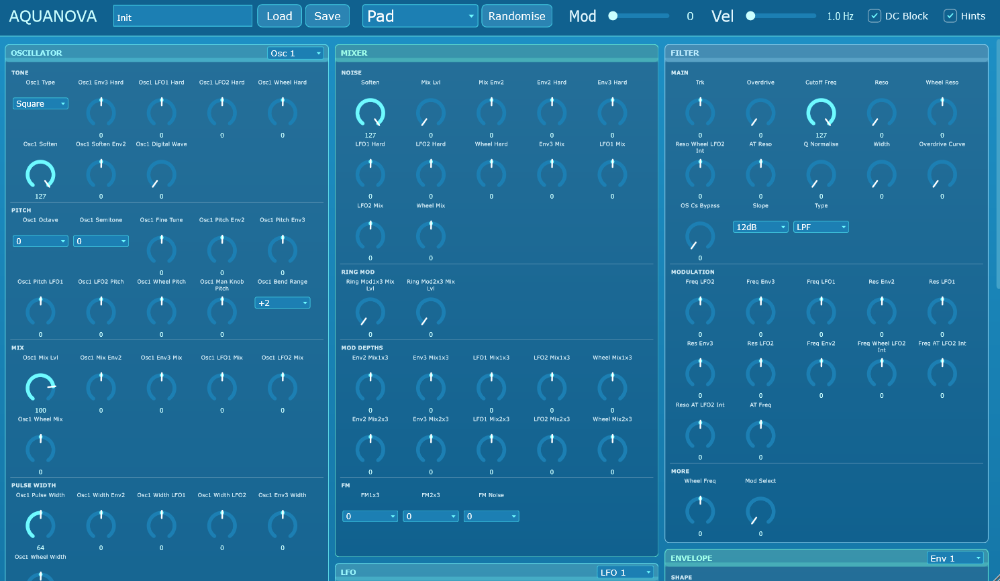

# AquaNova

A Supernova style polysynth in JUCE. Not a 1:1 emulation - the aim
is the same possibility space and the same character, with every control in
one scrollable window and every knob range matching the hardware.

The sound engine and DSP is recycled from my Aquanode Modular Synth, molded into 
the shape of the Supernova's flow.

Every parameter in `Source/ParameterTable.cpp` is generated from the Supernova II's
own specification — 346 program parameters with their exact ranges,
defaults, bipolarities and enumerated value names (12 filter types, 16 reverb
programs, the 19 effect configurations, the sync divisions, and so on) checked against 
the MIDI controller table in the Supernova II manual.

Some minor elements may not work or are not closely implemented, such as user-defined arpeggios.

## Presets

Every one of the 346 parameters are recalled on startup and in the presets, 
so the host saves and restores the complete state automatically. Patches
can also be saved to disk as `.aquanova` XML with the Save / Load buttons.
Some default presets are provided in the release inside the additional files archive.

The Randomise button generates a usable patch of the chosen character (Bass,
Lead, Pad, Pluck, Arp, Brass, Bell, Drone, Noise FX and more) rather than
scattering values at random (this is implemented as one option too, if you want creative sounds).