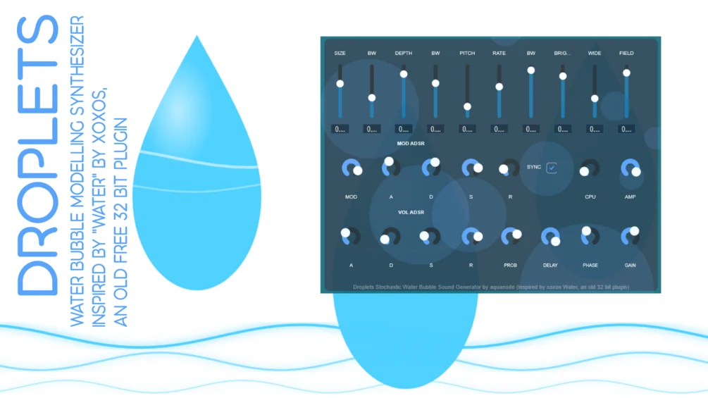

# Droplets

**Latest version:** 1.1 — download builds from the [Releases](../../../../releases) page.

Droplets is a plugin that aims to recreate the old 32 bit freeware plugin Water by xoxos, a physical water droplet model synthesizer that can create individual water bubble sounds, splashes or river sounds depending on the settings. I wanted to preserve it for the foreseeable future in vst3 form and of course in 64 bit. The old version still works in FL Studio, my favourite DAW, but not for example in Ableton.

While the original's source code is not publically available, a brief technical description of the general methods xoxos used to make it was, and with big help of the Claude Sonnet AI I was able to recreate it in JUCE relatively well. I compiled a vst3 and standalone .exe program for Windows, but the source code which is included in the download also works for Mac and Linux!

It might not have all the functions of the original and sound a little different, but can sound quite nice and simple - don't expect it to sound realistic though!

An explanation of the controls is provided in the download as well.

The plugin is free and the source code is open, meaning you are free to do whatever you like with it, but please do not sell it for profit unaltered.

Version 1.0 is the initial release, included is also a Version 1.1 with individual droplet fade in and fade out controls to avoid crackle noises when many bubbles of large size play simultaneously.
