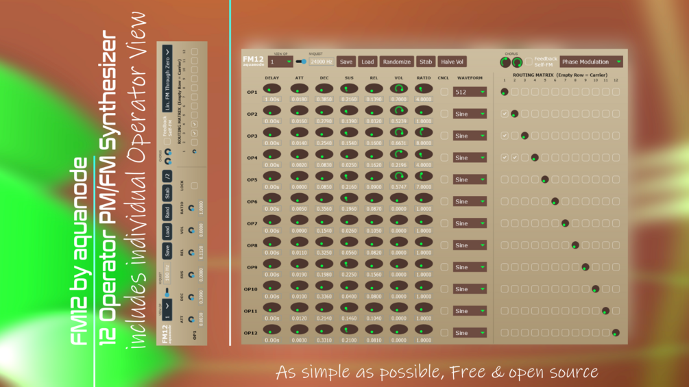

# FM12

**Latest version:** 2.1 — download builds from the [Releases](../../../../releases) page.

FM12 is an easy-to-use 12-operator PM/FM synthesizer featuring a flexible modulation matrix, user waveform import and integrated stereo chorus for simple, yet complex sound design. The source code is written in JUCE, and you can compile it freely for Windows, Mac and Linux. I provide a .vst3 and standalone .exe for Windows in the download.

Most prominently, it features self-FM or self-feedback (knobs on the matrix diagonal), phase modulation (like in a DX7), linear FM and exponential FM, as well as Through-Zero FM options for both linear and exponential FM. 

Each operator has a time offset, ADSR, volume, FM ratio, self-FM and cancel option. Delay buttons add an offset between the time you press a note and the time an operator starts generating sound or modulating other operators. Cancel buttons mute the carrier’s own sound and only let through the sound the modulators imprint onto the carrier.

When you freshly load up the plugin, all volumes except Operator 1 as carrier are off. Next to the sine wave setup, you can also load any single-cycle waveform audio file (with 512, 1024 or 2048 samples) into an operator. 

A 12 x 12 modulation matrix lets you freely choose from where you want to send signals. The sound comes from the “row” index and goes into the “column” index. An operator acts as a carrier (sound output) if its matrix row is empty, otherwise it modulates other operators.

The interface lets you view all 12 operators at once, or only 1, 2, 4 or 6 at a time. Right clicking and dragging the ratio knob changes it in 0.25 step sizes. 

FM12 also includes a Nyquist wavefolding slider, an EXP FM mode for improved self-feedback FM on the matrix diagonal knobs, and a “/2” button which halves the volume for each modulator. There are also built-in randomization features, including a matrix randomization button for operators 2 to 12 and a “Stb” button which randomly generates FM stab-style presets.

It is released under Creative Commons Attribution-NonCommercial v4.

---

## Manual

FM12 is an easy-to-use 12-operator PM/FM synthesizer featuring a flexible modulation matrix and integrated stereo chorus.

| Control | Function | Explanation |
| :--- | :--- | :--- |
| **ATT** | Attack time | Duration for the operator to reach its peak level. |
| **DEC** | Decay time | Duration to drop from the peak to the sustain level. |
| **SUS** | Sustain level | The fixed amplitude maintained while a key is held. |
| **REL** | Release time | Duration for the sound to fade to silence after the key is released. |
| **VOL** | Operator level | The output volume (for carriers) or modulation depth (for modulators). |
| **RATIO** | Frequency multiplier | Multiplies the base note frequency to create different harmonics and overtones. |
| **PHASE** | Initial phase offset | Determines where the sine wave starts its cycle when a note is triggered. |
| **MATRIX** | Operator routing | Grid used to connect the output of one operator (row wise) to the input of another (column wise). |
| **SAVE/LOAD** | Preset Management | Lets you save or load a .fm12preset file. |
| **FEEDBACK** | Self-modulation | A dedicated knob on the matrix diagonal that allows an operator to modulate itself. |
| **CHORUS** | Amount and Width | Controls the intensity and stereo spread of the built-in ensemble effect. |
| **RANDOMIZE**| Matrix Randomization | Randomizes the modulation assignments for operators 2 to 12. |
| **ADSR FM** | Toggles PM/FM mode | Changes between Phase Modulation and Frequency Modulation. |

*Note: The PM/FM toggle is labeled "ADSR FM" as the FM mode sounds like the ADSR controls the amount of FM over time.*