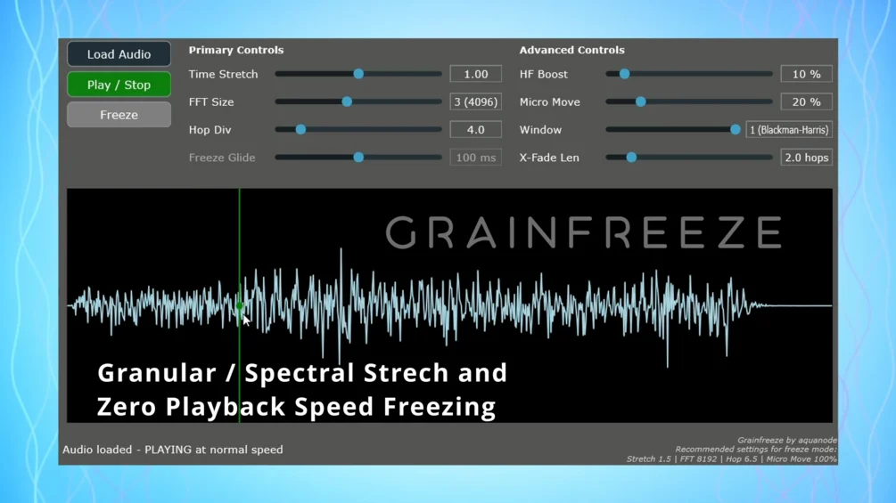

# Grainfreeze

**Latest version:** 1.1 — download builds from the [Releases](../../../../releases) page.

Grainfreeze is a real-time phase vocoder–based time-stretching and freeze processor[cite: 1]. It loads an audio file into memory and resynthesizes it using FFT analysis and overlap-add techniques[cite: 1]. The plugin features a spectral viewer that highlights the 10 loudest frequencies present in the current grain with their note name[cite: 1]. Please note that the plugin is CPU-intensive and designed for tonality preservation rather than transients, which will be smeared[cite: 1].

The source code is open source and written in JUCE/C++[cite: 1].

---

## Manual

Grainfreeze operates in two primary modes: normal playback and freeze mode[cite: 1].

### Core Processing Overview
The plugin uses a Short-Time Fourier Transform (STFT) process[cite: 1]:
*   A windowed block of audio is read from the loaded file[cite: 1].
*   The block is transformed into the frequency domain using an FFT[cite: 1].
*   Magnitude and phase are extracted for each frequency bin[cite: 1].
*   Phase differences are tracked to calculate true frequency[cite: 1].
*   Phases are advanced based on the time-stretch factor[cite: 1].
*   The signal is transformed back to the time domain using an inverse FFT and overlap-added into an output buffer[cite: 1].

### Controls

| Control | Function |
| :--- | :--- |
| **Load Audio** | Loads an audio file into the plugin. |
| **Play / Stop** | Starts or stops audio playback. |
| **Freeze** | Enables freeze mode, holding a spectral snapshot[cite: 1]. |
| **Time Stretch** | Controls playback speed ( < 1.0 is faster, > 1.0 is slower)[cite: 1]. |
| **FFT Size** | Sets FFT resolution; higher values provide smoother sound but increase latency[cite: 1]. |
| **Hop Div** | Controls overlap between FFT frames; lower values are smoother but use more CPU[cite: 1]. |
| **Freeze Glide** | Smooths transitions when moving the playhead in freeze mode[cite: 1]. |
| **HF Boost** | Compensates for energy loss in high frequencies during phase vocoder processing[cite: 1]. |
| **Micro Move** | Adds subtle random motion to grains to prevent static phasing artifacts[cite: 1]. |
| **Window** | Selects FFT window type (Hann for softer sound, Blackman-Harris for cleaner highs)[cite: 1]. |
| **X-Fade Len** | Sets the length of crossfades between grains to help avoid clicks[cite: 1]. |
| **Waveform Display** | Visualizes the loaded audio; click or drag to move the playhead[cite: 1]. |