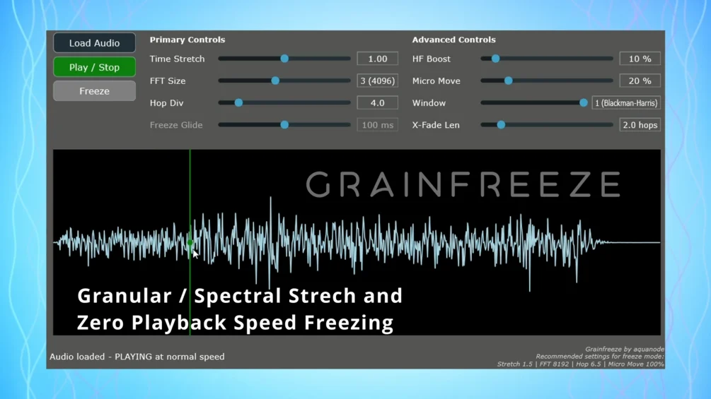

# Grainfreeze

**Latest version:** 1.2 — download builds from the [Releases](../../../../releases) page.

Grainfreeze is a real-time phase vocoder–based time-stretching and freeze processor, built as a VST3/AU instrument. It loads an audio file into memory and resynthesizes it using FFT analysis and overlap-add techniques. The plugin features a spectral viewer that highlights the 10 loudest frequencies present in the current grain with their note name. Please note that the plugin is CPU-intensive and designed for tonality preservation rather than transients, which will be smeared.

By default, Stereo mode, Phase Lock, and the Cepstral freeze type are all enabled, giving the smoothest, most transient-friendly starting sound.

The source code is open source and written in JUCE/C++.

---

## Manual

Grainfreeze operates in two primary modes: normal playback and freeze mode.

### Core Processing Overview
The plugin uses a Short-Time Fourier Transform (STFT) process:
*   A windowed block of audio is read from the loaded file.
*   The block is transformed into the frequency domain using an FFT.
*   Magnitude and phase are extracted for each frequency bin.
*   Phase differences are tracked to calculate true frequency.
*   Phases are advanced based on the time-stretch factor.
*   The signal is transformed back to the time domain using an inverse FFT and overlap-added into an output buffer.

### MIDI Playback

Grainfreeze is an instrument plugin: it accepts MIDI and can be played from a keyboard or piano roll instead of (or alongside) the Play button. Holding a note starts playback pitched relative to **C4 as the root** — C4 plays back at the loaded file's original pitch, notes above or below transpose it up or down accordingly. This works in both normal playback and freeze mode, so you can freeze a spectral snapshot and play it chromatically. Last-note priority is used: releasing the most recently held note falls back to any other note still held, or stops playback if none remain.

### Controls

| Control | Function |
| :--- | :--- |
| **Load Audio** | Loads an audio file into the plugin. |
| **Play / Stop** | Starts or stops audio playback. |
| **Freeze** | Enables freeze mode, holding a spectral snapshot. |
| **Freeze Type** | Spectral (raw magnitude/phase) or Cepstral (smoothed spectral envelope, less phasey) reconstruction. Enabled by default: Cepstral. |
| **Stereo** | Toggles independent L/R FFT analysis for stereo sources instead of a mono mixdown. Enabled by default. |
| **Phase Lock** | Locks each spectral neighbourhood's phase to its peak bin for sharper transients. Enabled by default. |
| **Time Stretch** | Controls playback speed ( < 1.0 is faster, > 1.0 is slower). |
| **FFT Size** | Sets FFT resolution; higher values provide smoother sound but increase latency. |
| **Hop Div** | Controls overlap between FFT frames; lower values are smoother but use more CPU. |
| **Freeze Glide** | Smooths transitions when moving the playhead in freeze mode. |
| **HF Boost / Character** | Spectral type: compensates for energy loss in high frequencies. Cepstral type: this slider becomes "Character", controlling the lifter cutoff (low = smoother, high = brighter). |
| **Micro Move** | Adds subtle random motion to grains to prevent static phasing artifacts. |
| **Window** | Selects FFT window type (Hann for softer sound, Blackman-Harris for cleaner highs). |
| **X-Fade Len** | Sets the length of crossfades between grains to help avoid clicks. |
| **Waveform Display** | Visualizes the loaded audio; click or drag to move the playhead. |
| **Playhead Slider** | Long slider tracking playback position; host-automatable. Follows playback when you're not touching it, and scrubs position while you drag it. |
| **MIDI** | Play the loaded file (or its frozen snapshot) chromatically from a keyboard, pitched relative to C4 as the root. |
