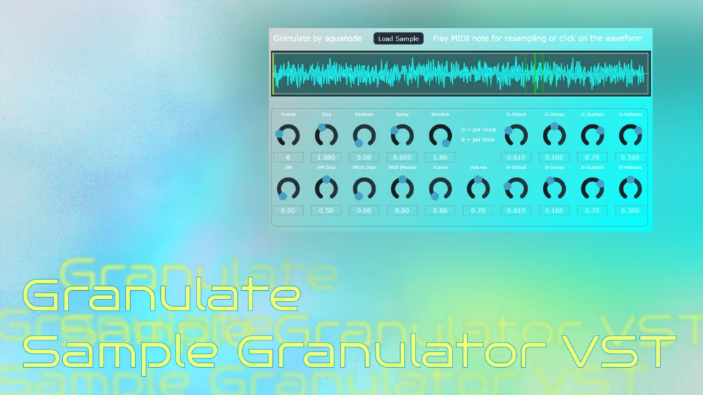

# Granulate

**Latest version:** 1.4 — download builds from the [Releases](../../../../releases) page.

Granulate is a Granulator VST Plugin (and Standalone .exe) modelled after a classic, now-unavailable granulator plugin[cite: 1]. It provides a sample playback engine with controls for grain density, position, spread, and duration[cite: 1]. Users can trigger grains via MIDI notes for resampling or by clicking directly on the loaded waveform[cite: 1]. A visual representation of grains as small playback heads is provided to aid in sound design[cite: 1].

The plugin supports audio files up to 3 hours long, with files over 1 hour being considered experimental due to memory requirements[cite: 1]. Key features include 12 voices of polyphony, project state restoration, and a customizable sidebar for GUI colors and preset management[cite: 1]. Additionally, Granulate includes a "Raw Data Import" feature that allows users to treat any file (such as images or text) as audio, which may result in white noise or unexpected experimental timbres[cite: 1].

---

## Manual

Granulate focuses on the fundamental elements of granular synthesis.

### Controls

| Control | Function |
| :--- | :--- |
| **Load Sample** | Opens a file browser to import a supported audio file[cite: 1]. |
| **Waveform Display** | Visualizes the sample and allows you to click or drag to set the playback position[cite: 1]. |
| **Grains** | Controls the number or density of grains playing simultaneously[cite: 1]. |
| **Size** | Sets the duration of each individual audio grain. |
| **Position** | Selects the point in the sample buffer where grains are grabbed from. |
| **Spray** | Adds random variation to the playback position to create a wider texture[cite: 1]. |
| **Window** | Defines the width of the playable area around the current position cursor. |
| **Rev Grains** | Sets how many grains are played in reverse (if the set amount exceeds total grains, all play in reverse)[cite: 1]. |
| **G-ADSR** | Attack / Decay / Sustain / Release; shapes the volume envelope of each individual grain[cite: 1]. |
| **N-ADSR** | Shapes the volume envelope of the overall MIDI note[cite: 1]. |
| **AM** | Applies amplitude modulation to the grains[cite: 1]. |
| **AM Disp** | Adds random variation to the amplitude modulation[cite: 1]. |
| **Pitch Disp** | Adds random pitch variation to the grains[cite: 1]. |
| **Pitch (Mouse)** | Manually changes the playback pitch offset for the mouse click mode[cite: 1]. |
| **Stereo** | Randomizes the panning of grains to widen the stereo image[cite: 1]. |
| **Volume** | Controls the master output level of the plugin[cite: 1]. |