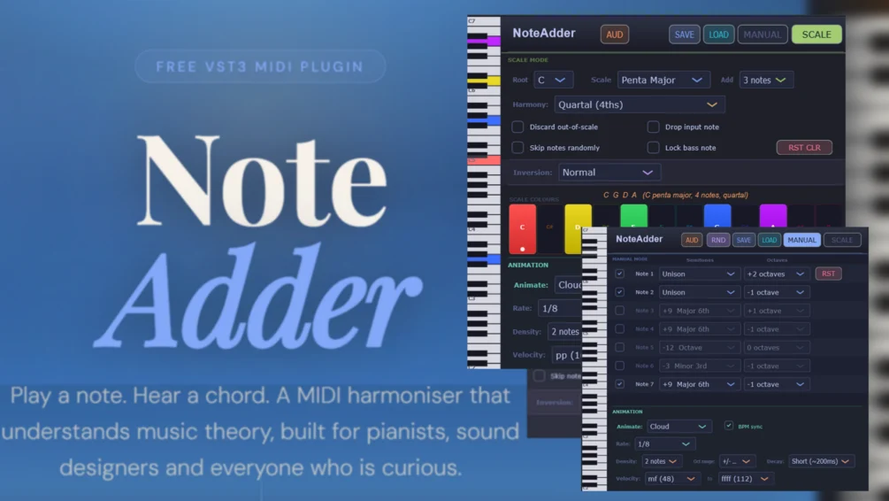

# NoteAdder

**Latest version:** 3.141592653 — download builds from the [Releases](../../../../releases) page.

NoteAdder is a MIDI plugin (VST3) that analyzes the notes you play and adds extra notes around them in real time. If you play a note, it plays a chord. If you play a chord, it plays many chords at once.

It has three independent ways of adding notes: **Manual mode**, where you define the extra notes yourself as fixed interval offsets for all notes equally; **Scale mode**, where it builds diatonic chords automatically from a key, scale and interval (e.g. tertian, quartal, ...) you choose; and **Custom mode**, where you assign a specific chord type to each of the twelve pitch classes (notes C, C#, ... B) individually, where you can also type in the exact intervals at which notes should be added from the note you play.

You can create cyclic inversions that bring rhythm into the same chord, experiment with scale-less chords, or lock yourself to a scale so that accidentally pressing a note outside it simply won't make a sound - to do so, use the scale mode, set the additional note amount to 0 and activate the "discard non-scale notes" mode in the selectors.

NoteAdder is able to humanize the time and velocity of the notes, shift all notes up or down from where you actually play them, either by notes in your chosen scale or by semitones, and increase the sustain length of the notes after you released them to simulate a sustain pedal. Finally, it also features animation modes that not only add static notes, but creates sound patterns similar to, but not quite like arpeggiators.

NoteAdder does not produce any sound itself (except sine waves in Audit mode for testing). It works as a MIDI processor that sits in front of your synthesizer or sampler. It appears as a synth plugin to make it compatible with both MIDI in and MIDI out for pretty much all common DAWs (for example FL Studio).

NoteAdder is not an AI tool. The control is fully yours, you can specify exactly which notes should be added for any note you play. See (an older version of) it in action:

---

## Setup

The setup for FL Studio is as follows, please refer to your DAW's manual for similar setups. Load NoteAdder as an instrument in a channel rack slot (or inside Patcher). If you want to use it inside Patcher, connect NoteAdder's MIDI out port to your synth's MIDI in port in the Patcher cable view. An example screenshot how the Patcher setup should look like is provided in the download. In NoteAdder's plugin settings, set Output port to 0. Load your target synthesizer in another channel rack slot. Its input port can be left at the default value (unset or 0). NoteAdder's MIDI output will now feed into your synth automatically.

## The Piano Roll Visualiser

A vertical piano roll strip runs along the left side of the plugin at all times. It shows every note currently playing out of NoteAdder in real time (at least from a section of the full keyboard), coloured by pitch class (see Note Colours below). You can also click or drag on the piano roll to play notes directly, useful for auditioning chords without a keyboard.

## Global Controls

These controls are always visible regardless of which mode is active.

*   **Clicking the NoteAdder title twice** resets the plugin window to its default size if you changed it, as NoteAdder is fully resizeable.
*   **The AUD button** (top of the plugin) activates Audit mode, which plays sine waves for all active output notes so you can hear what NoteAdder is generating even without a synth connected.
*   **Save and Load** deal with preset saving, presets are saved as .nastate (NoteAdder State) text files.
*   **Humanize Time** adds a random per-note delay of up to the set value (0–200 ms) to each added note independently. Larger values give a natural, slightly imprecise feel.
*   **Humanize Velocity** adds a random velocity offset (up to ±100 velocity) to each added note independently. Combined with Humanize Time, this makes generated chords feel played rather than programmed.
*   **Transpose** shifts every note coming out of NoteAdder by a fixed number of semitones (-12 to +12), applied after all other processing. Useful if you know a piece in one key and want to transpose it without relearning which notes to play when.
*   **Decay Length** adds sustain time - after you release a key on your keyboard, it will add some time (up to 20 seconds) until the note is actually registered as released. This simulates the behaviour of a pressed sustain pedal.
*   **A REC button** in the bottom right captures all MIDI output from NoteAdder - every note NoteAdder sends out, including added and animated notes - and saves it as a standard MIDI file. Press REC to start, press it again to stop. A file chooser appears and lets you save the recording wherever you like. The recorded file includes a tempo track matching the host BPM so it imports correctly into your DAW's piano roll.

## Three Modes for Adding Notes

At the top right of the plugin you will find the three mode buttons: MANUAL, SCALE, and CUSTOM. Only one is active at a time.

### MANUAL mode 
MANUAL mode gives you seven independent note slots. For each slot you can define an interval offset relative to whatever note you play. When a slot is active, that extra note plays alongside your original note every time. A checkbox enables or disables the slot. You have a semitone and octave control selector to exactly choose which note you want to add, where semitones range from Unison, Minor 2nd, Major 2nd, and so on up to Octave, either up- or downwards, and octaves range from -7 to +7. The combined total offset is then "semitones + (octaves * 12)". Using the RND Buttons, you can randomize either all settings or only the activation, semitone activation and / or octave shifts separately. The RST Button clears everything you changed.

### SCALE mode 
SCALE mode builds chords automatically based on music theory. You choose a key and scale, and NoteAdder figures out the correct chord tones for every note you play within that scale. You can choose:

*   the root note of the scale (C, C#, ..., B),
*   the scale type (available options are Major, Minor, Penta Major, Penta Minor, Lydian, Mixolydian, Dorian, Phrygian, Locrian, Harmonic Minor, Melodic Minor, Lydian Dom., Phrygian Dom., Altered, Whole Tone, Blues, Neapolitan Major / Minor),
*   how many notes to stack on top of your played note (0 to 7) diatonically,
*   up to two harmony interval sizes (each from secundal or stacked 2nds, the classic tertians, quartal and so on up to septimal) and
*   if and which inversion of the chord should play (you can choose a fixed inversion, let the plugin automatically pick whichever inversion is closest in total pitch to the respective previous chord you played before, drop the second highest note to open up the voicing, cycle up or down or randomly).

A dropdown controls what happens to notes played outside the selected scale, you can either allow non-scale notes, discard them or move out-of-scale notes to the nearest in-scale note ("rounded down" to the next lower note). Furthermore, you can discard the notes you actually play to only hear the added notes, so the chord floats without its root, skip notes randomly (65% chance of playing), or lock the bass note as deepest allowed note regardles of inversions. In Scale Mode, you also find the color picker for each note class; which changes the color of the pressed notes in the piano roll visualizer. Rainbow and black/white color schemes are provided by default. Click the individual color chip to change its color. This also transferres to the other modes.

### CUSTOM mode 
CUSTOM mode lets you assign a specific chord to each of the twelve pitch classes independently.  Each note has its own rule regardless of key or scale. For each pitch class you choose a chord type from a dropdown: None, Maj, Maj7, Maj9, Min, Min7, Min9, 6/9, Dom7, Sus2, Sus4, Power, Aug, Dim, Custom. Selecting Custom reveals a text field where you can type comma-separated semitone offsets (e.g. -5, 3, 7 for playing additional notes 5 semitones lower, 3 semitones higher and 7 semitones higher). Pressing that note will then also trigger notes at those intervals relative to the played pitch. This gives complete free-form control over voicing on a per-pitch-class basis.

## Animation Modes

Animation modes generate new notes over time while you hold a key, creating evolving harmonies. Manual, Scale, and Custom modes each have independent animation settings.

If you enable animation, you can set a time interval or BPM at which new notes should be introduced, where the "allow for longer notes" option will stretch a few of the notes, and depending on your activa MANUAL/SCALE/CUSTOM mode (not all animation modes are available in all note modes) choose between:

*   **Re-Voice** - cycle through all chord inversions automatically while holding a single note only
*   **Wander** - the chord tones drift up and down the scale with a configurable probability and maximum step range
*   **Drift** - moves the entire chord up or down through the scale degree by degree over time
*   **Cloud** - a granular MIDI generator. Short, overlapping notes diffuse around the scale at the set rate. Parameters: Mute input toggle to only hear animated notes, Density (notes per tick), Spread (scale-degree range around the held note), Velocity range (min/max), and Decay (note length). In manual mode, Cloud mode draws notes from your manual interval set. The Oct range parameter (0 / ±1 / ±2 / ±3 octaves) controls how far cloud notes can drift up or down in octaves from the base intervals, making this meaningful even without a scale or
*   **Cluster** - You have a lower and upper note cluster that randomly produce note sequences that then sound similar to cloud mode.

## Things You Can Do With It

*   **Instant harmonisation** - Scale mode, Add = 2, play a melody. Every note becomes a third or sixth, perfectly in key. Add = 3 gives four-note 7th chords on every scale degree and so on.
*   **Controlled improvisation** - Play nearest in-scale note keeps you in key even when you miss. Discard out-of-scale is the stricter option: anything outside the scale simply won't sound.
*   **Per-note chord mapping** - Custom mode lets you map completely different chord types to each key. C could be a minor seventh while F# triggers a suspended second.
*   **Key transposition on the fly** - Set the Transpose slider to shift everything coming out of NoteAdder by a fixed interval. Play a piece you know in a certain key, say A Major, and hear it transposed without changing your playing. In Manual and Custom mode this is a pure pitch shift; in Scale mode, additionally change the root to match if you're using scale filtering.
*   **Floating pad textures** - Discard input note + Skip notes randomly = partial, varying chords with no doubled root. Combine with Cloud animation for evolving, drifting harmony.
*   **Rhythmic chord animation** - Re-Voice or Cycle inversion on a held chord creates rhythmic movement from a single sustained keypress. Enable Allow for longer notes for a more uneven, human feel.
*   **Granular MIDI clouds** - Cloud animation in Scale mode with high Density and wide Spread turns a single held note into a shimmering wash of in-scale notes.
*   **Randomised chord discovery** - RND in Manual or Custom mode until something interesting comes up, then toggle slots or change chord types to refine.
*   **Capture a performance** - Use MIDI Recording to capture an improvisation including all the chords NoteAdder generated, then drag the result straight into your DAW's piano roll.

> Thank you for trying it out!

---

## Manual

### NOTEADDER - MANUAL

#### GLOBAL (always visible)

| Control | Function |
|---|---|
| **MANUAL / SCALE / CUSTOM** | Switches the active note-adding mode. |
| **AUD** | Toggles Audit mode: plays a sine wave for every active output note so you can hear what NoteAdder is generating without a synth connected. |
| **REC** | Starts / stops MIDI recording. On stop, a file chooser appears to save a .mid file with a tempo track matching the host BPM. |
| **SAVE** | Saves the complete plugin state (all modes, parameters, animation settings, note colours) as a .nastate file. |
| **LOAD** | Loads a previously saved .nastate file. |
| **Humanize Time** | Adds a random delay of 0 to the set value (0-200 ms) to each added note independently. The played note is always passed through at its original timing. |
| **Humanize Velocity** | Adds a random velocity offset (up to +/-100) to each added note independently. The played note is always passed through at its original velocity. |
| **Transpose** | Shifts all notes out of NoteAdder by -12 to +12 semitones, applied after all other processing including animation and humanization. In Scale mode, change the root to match if you are using scale filtering. |
| **Title (double-click)** | Resets the plugin window to its default size (560x592). |
| **Piano roll (click/drag)** | Triggers note-on / note-off events directly, as if played from a keyboard. Useful for auditioning chords without a MIDI controller. |

#### MANUAL MODE

| Control | Function |
|---|---|
| **Slot checkbox** | Enables or disables this slot. |
| **Semitones** | Semitone offset relative to the played note (-12 to +12). Displayed as interval names (Unison, Minor 2nd, etc.). |
| **Octaves** | Additional octave shift on top of the semitone value (-7 to +7). Total offset = semitones + (octaves * 12). |
| **RND** | Randomises all seven slots at once with musically relevant intervals, enabling roughly half of them. |
| **RST** | Resets all seven slots to disabled with zero offset. |

#### SCALE MODE

| Control | Function |
|---|---|
| **Root** | Root note of the scale (C through B). |
| **Scale** | Scale type. Options: Major, Minor, Penta Major, Penta Minor, Lydian, Mixolydian, Dorian, Phrygian, Locrian, Harmonic Minor, Melodic Minor, Lydian Dom., Phrygian Dom., Altered, Whole Tone, Blues. |
| **Add** | How many notes to stack above the played note (0-7), chosen by diatonic interval according to Harmony mode. |
| **Harmony** | Interval step used when stacking added notes.  • Secundal - stack in 2nds. Dense, clustered.  • Tertian - stack in 3rds. Classic triads and 7ths.  • Quartal - stack in 4ths. Open, ambient.  • Quintal - stack in 5ths. Spacious, parallel.  • Sextal - stack in 6ths. Warm, inverted thirds.  • Septimal - stack in 7ths. Wide, sparse voicings. |
| **Note Filter** | What happens to notes played outside the selected scale.  • Allow all - passed through unchanged.  • Discard out-of-scale - blocked entirely, no sound.  • Play nearest - rerouted to the closest in-scale note (lower note wins on a tie). |
| **Discard input note** | Suppresses the note you played; only added notes sound. |
| **Skip notes randomly** | Each added note after the first has ~65% chance of playing. Results in incomplete, varied chords. |
| **Lock bass** | Forces all added notes strictly above the played note. The played note always anchors the bottom. |
| **RST CLR** | Resets all 12 pitch-class colours to their defaults. |
| **BW CLR** | Sets all 12 pitch-class colours to greyscale. |
| **Inversion mode** | Controls how the chord is arranged.  • Normal - natural diatonic stacking order.  • Inversion Picker - fixed inversion chosen manually (root position through Nth inversion).  • Voice Leader - picks the inversion closest in total pitch distance to the previous chord.  • Drop 2 - second-highest note drops one octave.  • Cycle Up - steps to the next inversion on each new note press.  • Cycle Down - steps to the previous inversion.  • Random Cycle - random inversion on each note press. |
| **Inversion Picker** | Visible when Inversion mode = Inversion Picker. Selects the fixed inversion (root position, 1st, 2nd, ...). |
| **Colour chips (12)** | Click any chip to open a colour picker for that pitch class. Colour flows through the piano roll and scale key. |

#### CUSTOM MODE

| Control | Function |
|---|---|
| **Chord type (per note)** | Chord assigned to each of the 12 pitch classes. Options: None, Maj, Maj7, Maj9, Min, Min7, Min9, 6/9, Dom7, Sus2, Sus4, Power, Aug, Dim, Custom. None passes the note through without adding anything. |
| **Custom offsets field** | Visible when chord type = Custom. Enter comma-separated semitone offsets (e.g. -5, 3, 7). Pressing that note will also trigger notes at those intervals. |
| **RND** | Assigns a random chord type to all 12 pitch classes. |
| **RST** | Resets all 12 pitch classes to None. |

#### ANIMATION (Scale mode)

| Control | Function |
|---|---|
| **Animate** | Animation mode for Scale.  • Off - no animation.  • Re-Voice - cycles through all chord inversions on each tick.  • Wander - chord tones drift up/down the scale independently each tick.  • Drift - entire chord root walks up the scale one degree per tick.  • Cloud - fires short overlapping notes around the held note at the set rate. |
| **BPM sync** | When on, rate is set in BPM-synced subdivisions. When off, rate is set in free milliseconds. |
| **Rate (synced)** | Subdivision: 1/1, 1/2, 1/4, 1/8, 1/16, 1/32, 1/4T, 1/8T, 1/16T. |
| **Rate (free)** | Tick interval in milliseconds (10-2000 ms). |
| **Allow for longer notes** | When on, the rate becomes a maximum rather than a fixed interval. Some ticks fire later for a looser, more organic feel. |
| **Prob (Wander)** | Probability that each chord tone steps on a given tick (10%-100%). |
| **Spread (Wander)** | Maximum number of scale degrees a tone can wander from its base position. |
| **Mute incoming (Cloud)** | Mutes the incoming notes so only cloud notes will play. |
| **Density (Cloud)** | Number of notes fired per tick (1-8). |
| **Spread (Cloud)** | Scale-degree range around the held note from which cloud notes are chosen. |
| **Decay (Cloud)** | Note length for each cloud note (20-2000 ms). |
| **Velocity min/max (Cloud)** | Velocity range for cloud notes. Each note picks randomly within this range. |

#### ANIMATION (Manual mode)

| Control | Function |
|---|---|
| **Animate** | Animation mode for Manual.  • Off - no animation.  • Re-Voice - cycles through inversions of the manual note set on each tick.  • Cloud - fires short notes drawn from the manual interval set at the set rate. |
| **BPM sync** | Same as Scale animation. |
| **Rate** | Same as Scale animation. |
| **Allow for longer notes** | Same as Scale animation. |
| **Density (Cloud)** | Number of notes fired per tick (1-8). |
| **Oct range (Cloud)** | How far cloud notes can drift in octaves from the base intervals (0 / +/-1 / +/-2 / +/-3 octaves). |
| **Decay (Cloud)** | Note length for each cloud note (20-2000 ms). |
| **Velocity min/max (Cloud)** | Velocity range for cloud notes. |

#### ANIMATION (Custom mode)

| Control | Function |
|---|---|
| **Animate** | Animation mode for Custom.  • Off - no animation.  • Re-Voice - cycles through inversions of the chord assigned to each held pitch class.  • Cloud - draws cloud notes from the chord pool of each held pitch class. |
| **BPM sync** | Same as Scale animation. |
| **Rate** | Same as Scale animation. |
| **Allow for longer notes** | Same as Scale animation. |
| **Density (Cloud)** | Number of notes fired per tick (1-8). |
| **Oct range (Cloud)** | Octave drift range for cloud notes (same as Manual). |
| **Decay (Cloud)** | Note length for each cloud note (20-2000 ms). |
| **Velocity min/max (Cloud)** | Velocity range for cloud notes. |

> NoteAdder by aquanodemusic - Free & Open Source - Built with JUCE and Claude AI

---

## Version History

**NoteAdder VST Version History / Changelog**

**Hint:** If you are using FL Studio and the updated version does not work, this is usually resolved by deleting the NoteAdder.fst file in C:/Users/Documents/Image-Line/FL Studio/Presets/Plugin Database/ and scanning for plugins again. Also, in FL Studio, if you open NoteAdder in a Patcher Environment and switch back from the routing tab to the GUI, it might appear too small. I don't think this is a bug in my code and FL Studio simply keeps the last dimensions it knew of from his own menu window. So, you need to click and drag the frame to resize NoteAdder to its full dimensions again.

*   **Version 3.141592653** - added "Add Length" slider: This adds some time which the note is sustained after you let go of a key, simulating the logic of a sustain pedal. added "Scale Transpose Root" Toggle in Scale Mode. If active, the played root note will also be transposed in the given key, which previously stayed where it was. cleaned up the layout a little.
*   **Version 3.14159265** - added scale transpose slider: Similar to the global transpose slider, scale transpose skips notes that are out of scale. added "Cluster" automation mode: This plays chord progressions with bass and melody clustering. You can control how many notes should play per cluster, and which octave range the clusters should cover. Cluster mode is available in scale and custom mode, and it is an excellent tool for ambient music, with lush and wide chords.
*   **Version 3.1415926** - added individual randomizing for note activation, semitones and octaves individually in manual mode. added a second harmony mode option in the scale tab, so you can choose e.g. tertian and septimal simultaneously. added Neapolitan Major and Neapolitan minor scales in the scale tab.
*   **Version 3.141592** - improved transpose slider, which previously resulted in many stuck notes. you can now live-transpose notes while they play as well. humanize and transpose are now correctly stored in save files. Added a mute input notes toggle in the cloud animation mode so you only hear animated notes. Humanize Velocity now also works correctly in the sine wave audit mode.
*   **Version 3.14159** - added a global transpose slider. Good for when you know a piano piece in some key but want to play everything one semitone lower for example. Also added an "Allow for longer notes" toggle in the cloud animation, which will sustain a few random notes for a longer while than the value you have chosen in the rate selector. Clicking twice on the NoteAdder title will now resize the GUI back to the original size if you changed it. Finally, added the option to not only discard non-scale notes, but also that non-scale notes are mapped to the next lowest note that is actually in-scale.
*   **Version 3.1415** - added Custom mode where you can get a custom chord per note. NoteAdder is now GPLv3 software, basically meaning "you can do everything you want with NoteAdder, but if you make your own project out of the source code, then please release the source code of your product (which can be paid) too."
*   **Version 3.141** - GUI is now resizable.
*   **Version 3.14** - added MIDI recording to save .mid files of whatever you played. added humanize midi sliders. turned animation rate combobox into a slider. at low rates you might encounter stuck notes but only on edge cases.
*   **Version 3.1** - added scale visualizer with choosable note colors. animation mode stability and load / save stability improved.
*   **Version 3.0** - improved GUI with separate manual / scale mode tabs, save / load preset for manual mode, added cloud animation mode also for manual mode, added different harmony modes (e.g. quartal) for scale mode.
*   **Version 2.0** - added animation modes.
*   **Version 1.1** - added a "add 0 notes" option in the scale mode. This lets you use the "discard non-scale note" toggle without adding any other notes.
*   **Version 1.0** - initial release

## License

NoteAdder is licensed under the GPLv3 — you can do everything you want with it, but if you build your own (even commercial) product from the source code, please release your source code too. See [`LICENSE`](LICENSE).