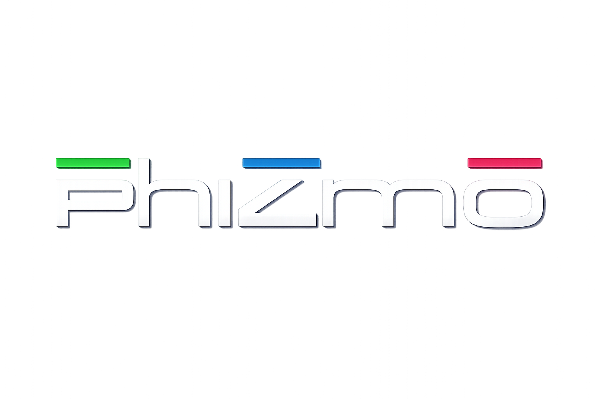

# Phizmo — User Manual



**Phizmo** is a transwave / wavetable synthesizer inspired by the Ensoniq Fizmo.
It closely emulates its behaviour, but is not a 1:1 clone. Phizmo scans through
multi-cycle wavetables ("transwaves") along editable *evolution curves*, with two
oscillators per voice, a full modulation set, an arpeggiator, per-voice insert
effects and global reverb, and a set of real-time performance macros.

Phizmo loads ordinary `.wav` wavetables — normally 2048 samples per cycle — and
it can also **generate transwaves from scratch**, so you never need a table you
don't have. **No factory wavetables are included**: the original Ensoniq tables
are copyrighted and I prefer not to include them here in the official release.
You may however find these on the web, look for the nilamox website for example
which provides these in the form of Vitaltables you can batch-convert to .wav
using the AI of your choice if you like.

---

## 1. Installation

The download contains:

```
Phizmo VST/
├── Phizmo.exe    ← standalone app (Windows 64-bit), part of the releases
├── Phizmo.vst3   ← VST3 plugin (Windows 64-bit), part of the releases
├── Presets/      ← the .phizmo preset files
└── src/          ← full source + .jucer project + logo
```

### Install the plugin
- **VST3:** copy `Phizmo.vst3` to your VST3 folder, usually
  `C:\Program Files\Common Files\VST3`, then rescan in your DAW.
- **Standalone:** run `Phizmo.exe` directly. No install needed.

### Install the presets
Phizmo keeps its content in your **Documents** folder and creates the folders on
first use:

```
Documents/
└── Phizmo/
    ├── Presets/       ← copy the supplied .phizmo files here
    └── Samples/       ← your own .wav wavetables and any audio to Transwavify
```

- Presets in **`Documents/Phizmo/Presets`** show up in the **LOAD** browser and
  are where **SAVE** writes to.
- **`Documents/Phizmo/Samples`** is where the per-oscillator **LOAD** menu, the
  **Transwavify** file chooser and the wavetable export all start from.

> The supplied presets carry no audio at all. Every wavetable they use is
> generated, and the preset stores the generator's seed and settings rather than
> the samples — so a `.phizmo` file is a couple of kilobytes, opens identically
> on a machine that has never seen the wave, and can be re-rolled at any time.
> Wavetables you load from a file are embedded into presets you save, so those
> stay self-contained too. You can also drag-and-drop a `.wav` straight onto a
> wavetable viewer.

---

## 2. Voice vs. Oscillator (the core concept)

Phizmo has two levels of sounds, and the panel is labelled to make the scope of
every control clear.

**Voice** *(4 of them — the `EDIT / ON  VOICE` row, top-left)*  
A Voice is a complete layer/patch with its own keyboard zone. You can stack or
split up to **four Voices** across the keyboard to build a single sound. Each
Voice has its own `LOW KEY` / `HIGH KEY` range, its own level, and its own full
parameter set. (Internally the code calls a Voice a "Sound.")

**Oscillator** *(2 per Voice — the `EDIT / ON  OSC` row)*  
Inside every Voice are **two oscillators, OSC 1 and OSC 2**. Each has its own
transwave, evolution curve, tuning, pan, level and wave settings. Ring
modulation and the A/B mix combine them.

So the full layout is **4 Voices × 2 Oscillators = up to 8 Transwaves playing simultaneously**.

### Scope labels
Every section title shows what it affects:

| Prefix | Affects |
|--------|---------|
| **GLOBAL …** | the whole instrument (all voices) |
| **VOICE …** | the currently focused Voice (both of its oscillators) |
| **OSC …** | only the currently focused Oscillator of the focused Voice |

### EDIT vs. ON
- **EDIT** buttons (1–4 for voices, OSC 1 / OSC 2 for oscillators) choose what the
  panel is *editing* right now. They don't change the sound — they change what
  the knobs point at.
- **ON** buttons switch a Voice or an Oscillator *in or out* of the sound.

Tip: many "OSC" knobs (TUNE, LEVEL, PAN, the wave/mod amounts, the evolution
EVO/SCAN, the OFS/SLW knobs, the OCT button) re-target when you switch OSC 1 ↔
OSC 2. If a knob seems to "not stick," check which oscillator is focused.

---

## 3. Transwaves & evolution (how the sound moves)

Each oscillator plays a **transwave**: a wavetable made of many single-cycle
frames. Instead of a static waveform, Phizmo *scans* through the frames over
time, which is what gives it its living, morphing character.

- The **evolution editor** (the big graph under each wavetable viewer) is the
  path the scan follows — draw the curve, or use **FLAT / RAMP / STEP** presets.
- **EVO** sets how fast the scan moves; **SCAN** sets the direction/style
  (forward, backward, ping-pong, one-shot…).
- The moving dot on the curve is the live playhead. The playhead may sometimes move quickly around and not match the actual sound you hear, this happens mostly when you play many notes at once and the processor does not know which midi note to listen to - somewhat of a bug, but it does not affect the sound output.
- **STEP** mode jumps frame-to-frame; **SLW** controls how much that (and the
  loop wrap-around) is smoothed so it doesn't click.
- There are 4 evo modes: `EVO: NORM` is the default mode, where each voice you play begins at the start of the evo curve, and each voice has its own playhead. `EVO: RAND` starts at some arbitrary position of the evolution curve per playhead. `EVO: LOCK` makes notes in a chord that are played later than the first note in the chord follow the latters evolution curve. `EVO: FIX` introduces a freeflowing playhead, and every voice follows it always.

### Cycle length
Each oscillator has its own cycle size, i.e. how many samples make up one frame
of its table. **2048 is the default and the usual case** — it is what the LOAD
browser assumes for a `.wav`, and what almost every wavetable in the wild uses.
The parameter accepts anything from 16 to 65536 if you have an unusual table or
want to slice a file differently. The current size is shown under each viewer.

---

## 4. Making wavetables (the GEN menu)

Every wavetable viewer has a generate menu alongside its LOAD button.

**To generate a transwave, first click load, then the archetype of your choice, then the popup menu will close at first but another click on load and then generate transwave will automatically add it into the transwave viewer.**


- **Generate random transwave** — rolls a new table from a random seed at the
  oscillator's current cycle size. Frame counts of 8, 16, 32, 64, 128 or 256 are
  offered.
- **Archetype** — biases the generator toward a character rather than leaving it
  entirely to chance: *Auto*, *Resonant Sweep*, *Formant*, *Bell Stack*, *Analog Smooth*, 
  *Unrelated*, *Hollow*, *Comb Groove*, *Organ Drawbar*, and the more sophisticated, closer to the original
  *Metallic Sweep*, *Inharmonic Bell*, *Spectral Grit* and *Vocal Morph*.
- **Re-roll** — same settings, new seed. Cheap way to audition variations of the
  same idea.
- **Transwavify a file…** — turns any audio file (`.wav`, `.aif`, `.aiff`,
  `.flac`, `.ogg`, `.mp3`) into a transwave. *Unpitched slice* mode chops the
  file into frames by position rather than by pitch, which is the right choice
  for drums, speech and noise.
- **Export slot as .wav…** — writes the current table out as an ordinary
  wavetable WAV, so anything you generate can leave the plugin.

Everything is built as a harmonic spectrum and inverse-FFT'd, with harmonics
capped at half the cycle length so a frame cannot alias against its own cycle,
whatever size you have dialled in.

---

## 5. Control reference

### Top area

**GLOBAL**
- **VOLUME** — master output level.

**PRESET**
- **LOAD** — open a preset from `Documents/Phizmo/Presets`.
- **SAVE** — save the current state as a `.phizmo` preset.
- *(the red display shows the current preset name, at least the first characters, like on the original)*

**EDIT / ON  VOICE**
- **EDIT 1–4** — choose which Voice the panel edits.
- **ON 1–4** — enable/disable each Voice.

**EDIT / ON  OSC**
- **OSC 1 / OSC 2** — choose which oscillator the panel edits.
- **ON / ON** — enable/disable each oscillator.

**OSC PITCH**
- **TUNE** — coarse pitch (semitones) of the focused oscillator.
- **FINE** — fine pitch.
- **LFO** — pitch LFO depth.
- **AMOUNT** — pitch modulation amount (from the selected source).
- **LFO** *(button)* — cycles the pitch modulation source.
- **Oct −2 … Oct +2** *(button)* — additional coarse octave for the focused oscillator; click to cycle.

**GLIDE**
- **TIME** — portamento/glide time.
- **MONO** *(button)* — monophonic / glide mode.

**OSC ENVELOPE** *(one ADSR, re-pointed at whichever envelope you select)*
- **AMP** *(button)* — selects which envelope the ADSR edits: Pitch, Filter, or Amp (label shows the current one).
- **nor** *(button)* — envelope mode (normal / finish-style behaviour).
- **ATTACK / DECAY / SUSTAIN / RELEASE** — the ADSR of the selected envelope.
- **VELOCITY** — how much velocity scales the amp envelope.
- **VEL>FR** *(button)* — velocity-to-frame on/off (velocity nudges the transwave start frame).

**OSC AMPLITUDE**
- **LEVEL** — oscillator level.
- **PAN** — oscillator pan.

### Middle area

**GLOBAL EFFECTS** *(insert effect)*

The effect style is closely modelled after the original, as it is described in its manual: many algorithms, all with a fixed architecture / signal path through a few different effect stages.
- **EFFECT** — effect algorithm (button below shows the short name, your DAW shows a longer name, similar to the original's behaviour).
- **DEPTH** — algorithm variation/depth.
- **MIX** — dry/wet mix of the insert.

**GLOBAL REVERB**
- **REVERB** — reverb type.
- **AMOUNT** — reverb send amount.
- **WET** *(button)* — per-oscillator route: whether this oscillator feeds the insert/reverb path.

**OSC WAVE**
- **MOD** — wave-modulation amount (moves the frame start with the selected source).
- **AMOUNT** — wave start position.
- **LFO** *(button)* — cycles the wave modulation source.

**OSC FILTER**
- **LP4** *(button)* — filter type / slope.
- **LFO** *(button)* — cycles the filter modulation source.
- **CUTOFF** — filter cutoff.
- **RESON.** — resonance.
- **LFO** — filter LFO depth.
- **AMOUNT** — filter modulation amount (from the selected source).
- **KEYBD** — filter keyboard tracking.
- **F.ENV** — filter-envelope depth.

**OSC MODULATION (LFO)** *(the per-oscillator LFO — its select button swaps it to the noise generator)*
- **SHAPE** — LFO waveform.
- **SPEED** — LFO rate (or noise rate).
- **SYNC** — tempo sync for the LFO (or noise).
- **LFO** *(button)* — swaps the section between the LFO and the noise source.

**TEMPO**
- **TEMPO** — internal tempo (used when host tempo isn't driving sync).
- **TAP** *(button)* — tap it a few times to set the tempo at which you are tapping.

**GLOBAL KEYBOARD**
- **CURVE** — velocity response curve.
- **BEND** — pitch-bend range.
- **KEY TRK** — keyboard tracking to the transwave frame position.

### Lower-middle area

**GLOBAL ARPEGGIATOR**
- **OFF** *(button)* — arpeggiator on/off.
- **KEYBD** *(button)* — keyboard/latch behaviour.
- **RANGE** — octave range.
- **MODE** — arp pattern (up / down / up-down / random / as-played).
- **RATE** — arp rate.

**VOICE NOISE** *(a noise generator with its own filter, per voice)*
- **NOISE** — noise level.
- **N.FREQ** — noise filter cutoff.
- **N.RESO** — noise filter resonance.
- **N.TYPE** — noise filter type.

**TRANSWAVE ENV** *(the transwave position envelope)*
- **TW AMT** — envelope depth on the transwave position.
- **TW ATT** — attack.
- **TW DEC** — decay.
- **TW>FLT** — amount of this envelope routed to the filter.
- **TW VEL** — how much velocity scales the transwave envelope.

**REALTIME CONTROL** *(the "Ph-I-Z-M-O" performance macros)*
- **Ph / I / Z / M / O** — five real-time macro knobs for live wave/tone morphing.
- **O DEST** — selects the destination the **O** macro controls.

### Evolution pads (per oscillator)
- **Wavetable viewer** — shows the current table; the **LOAD** button (bottom-right) picks a `.wav` from `Documents/Phizmo/Samples`, the generate menu builds one from scratch, or drag-drop a `.wav` onto it.
- **FLAT / RAMP / STEP** — evolution curve shape presets (STEP = stepped scan).
- **SLW** — curve fade/slew time. `0` = hard (steps and loop wraps click); a few ms smooths them. Drives both stepped-mode and the forward/backward loop declick.
- **OFS** — scan phase / start offset for that oscillator's playhead.

### Bottom row
- **EVO** — evolution scan speed (focused oscillator).
- **SCAN** — scan style/direction.
- **EVO LFO** — evolution LFO rate.
- **LFO AMT** — evolution LFO depth.
- **A/B MIX** — balance between OSC 1 and OSC 2.
- **DETUNE** — detune between oscillators.
- **LOW KEY / HIGH KEY** — keyboard zone of the focused Voice.
- **V.LEVEL** — level of the focused Voice (layer gain).
- **SPREAD** (stereo spread)
- **WIDTH** (stereo width) 
- **UNISON** (unison detune).
- **SNAP** (quantise frame position to steps)
- **GRIT** (digital grit/edge)
- **JUMP** (random frame-jump probability)
- **RING** (OSC 1 × OSC 2 ring modulation)
- **POS LFO** (position LFO rate)
- **POS AMT** (position LFO depth).

---

## 6. Band-limiting

The default oscillator engine reads the raw frames with bilinear interpolation
and no band-limiting. On a bright table that aliases above roughly C4 — which is
arguably correct, since the hardware's sample playback chip does linear
interpolation and nothing else, and the **GRIT** control leans into exactly that
character.

A switchable band-limited engine is available for when you want the same table
to stay clean at the top of the keyboard. Each frame is analysed once into a mip
pyramid (mip 0 keeps 1024 harmonics, mip 1 keeps 512, and so on) and playback
picks the mip whose top harmonic still fits under Nyquist for the note being
played. Cost is about 2 MB per slot for a 64-frame table, built once on load.
Same frames, same evolution curves, same visualiser.

---

## 7. Quick start

1. Load Phizmo in your DAW (or run the standalone).
2. Hit **LOAD** and pick a preset.
3. Play. Use the **Ph-I-Z-M-O** macros for instant motion.
4. To build your own: pick a Voice with **EDIT**, generate or load a wavetable
   into each oscillator, draw an **evolution** curve, set **EVO/SCAN**, then
   shape with the filter and envelopes.

---

## Credits

The whole concept of Transwaves and the design idea belongs to Ensoniq.

The code, the DSP engine, the GUI, the preset/wavetable system and all the fixes
along the way, was written by **Claude, the AI by Anthropic**, working from my
direction across a series of sessions.

---

## License

AGPLv3 as every free JUCE plugin project should be.

**Wavetables:** none are bundled. Every wavetable in the supplied presets is
generated procedurally from a seed by Phizmo's own wave factory — no sampled
material from the original hardware is included or distributed. The Phizmo Logo
was made with ChatGPT's Image Generator.
