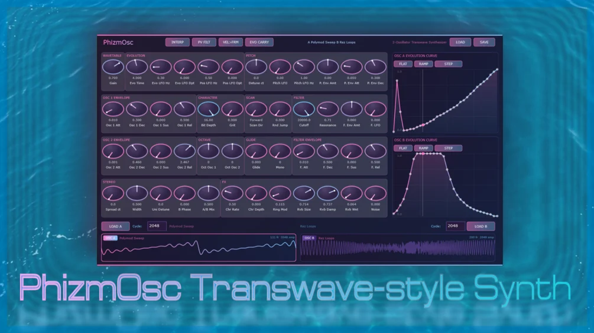

# PhizmOsc

**Latest version:** 1.4 — download builds from the [Releases](../../../../releases) page.

PhizmOsc is a 2-Oscillator Transwave Synthesizer loosely modelled after (or rather, inspired by) the Ensoniq Fizmo Hardware Synthesizer.

### About the Project

PhizmOsc is NOT an emulation of the Fizmo, but is capable of generating very similar sounds as the Fizmo's Transwaves / Wavetables are included in the download as .wav files. I obtained the wavetables from nilamox.com, which were originally .vitaltable files, and converted them to .wav files myself.

Even though I own other great Fizmo emulations (Echograin's Tranzwave and Puremagnetik's Waveframe), I wanted a standalone .vst3 version to play around with and wanted to give a free alternative to the community. If you have the money, please purchase those products; I am not affiliated in any way with either of them.

### What PhizmOsc offers

PhizmOsc is a dual oscillator transwave synthesizer. Each oscillator morphs through its transwave at a rate and trajectory the user can design visually in a sound evolution envelope. The two oscillators share a single scan clock but can follow completely different curve shapes, so their timbres evolve in lockstep but may diverge in character. A single cycle through the evolution pattern can last to anywhere from 0.1 seconds to 100 seconds, perfect for slowly evolving pads.

**Please Note:** The transwaves are not directly built-in into the synthesizer. Make sure to save them into a directory of your choice and always load them from there. When you load a preset, the synth expects the transwave .wav files to be at the same location from where you accessed them when saving the preset. Preset loading may fail if the directory changed, however you can always reconstruct the name of the wavetable from opening the .phizm preset files using a text editor, which saves the absolute path to the presets.

The oscillator is the focus of PhizmOsc. Other characteristics that make up the Fizmo or other great synthesizers, like the Fizmo's extensive FX section, are not included besides a simple Chorus and Reverb. For many more free effects, feel free to have a look around my other VSTs!

Included in the download is the vst3 and a standalone .exe program of PhizmOsc, both for Windows, and the Source Code for JUCE so you can compile it yourself for Mac or Linux. PhizmOsc was in large parts coded with Claude.ai, specifically the free Sonnet 4.6 model.

---

## Manual

### Installation
Simply move the .vst3 folder to `C:/Program Files/Common Files/VST3`. The .exe can be run from anywhere, no install needed.

### Title Bar
*   **INTERP**: Frame interpolation. When ON (default), the engine uses bilinear interpolation. Turn OFF for a slightly rougher texture.
*   **PV FILT**: Per-Voice Filter. When OFF (default), a global 4-pole lowpass filter processes the summed output. When ON, every voice gets its own independent filter instance.
*   **VEL>FRM**: Velocity to Frame Position. When ON, harder playing offsets the starting frame position.
*   **EVO CARRY**: Evolution Phase Carry. When OFF (default), each new note resets its scan position. When ON, it inherits the current scan position from the most recently active voice.
*   **SET DIR**: Set the default location for opening a transwave / wavetable or a .phizm preset.
*   **LOAD / SAVE**: Load or save a .phizm preset file. A .phizm file is in fact a .zip file.

### Wavetable Section
*   **Gain**: Master output level multiplicator.

### Evolution Section
*   **Evo Time**: How long one full pass takes (0.1s - 100s).
*   **Evo LFO Hz/Dpt**: Rate and depth of the LFO that modulates the scan position on top of the curve.
*   **Pos LFO Hz/Dpt**: Rate and depth of a second LFO that is also added to the frame position (also modulates Filter).

### Pitch Section
*   **Detune ct**: Global coarse/fine detune in cents.
*   **Pitch LFO**: Depth (semitones) and Rate of the pitch LFO.
*   **P. Env Amt/Att/Dec**: Pitch envelope settings (Attack to full offset, Decay to zero).

### Misc Section
*   **frameSnap**: Quantises wavetable frame position. 0 = off.
*   **twToFilter**: Cross-modulates the Transwave position envelope into the filter cutoff.
*   **evoBPhaseOff**: Offsets the scan position of Osc B's evolution curve relative to Osc A.
*   **keytrack**: Maps MIDI note number to a frame-position offset.
*   **evoTimeB**: Independent evolution cycle time for Osc B.
*   **evoRestart**: When ON, the evolution scan position resets to the start of the curve on note-on.

### Transwave Envelope Section
*   ADSR controls for frame position.
*   **twAmt**: Scales the overall displacement.
*   **twVelAmt**: How much note velocity scales the TW envelope amount.

### Osc 1, 2 Envelope
*   Controls the amplitude of each oscillator. Use different values for swelling effects.

### Character Section
*   **Bit Depth**: Bit-crusher (16 = max/clean, 4 = lo-fi).
*   **Grit**: Quantises the oscillator's playback phase. Creates stair-stepped "clanginess."

### Scan Section
*   **Scan Dir**: 
    0 - Forward
    1 - Fwd Stay
    2 - Back & Forth
    3 - Bwd Stay
    4 - Backward
*   **Rnd Jump**: Random frame jump probability after each full cycle.

### Filter Section
*   **Cutoff / Resonance**: 24 dB/oct lowpass filter settings.
*   **F. Env Amt**: Amount of filter envelope applied.
*   **F. LFO**: Depth of the Pos LFO applied to the filter cutoff.

### Octave Section
*   **Oct Osc 1 / 2**: Transpose for each oscillator (-2 to +2 octaves).

### Glide Section
*   **Glide**: Portamento time (0-4s).
*   **Mono**: Monophonic mode toggle.

### Filter Envelope Section
*   ADSR that modulates the filter cutoff (depth set by F. Env Amt).

### Stereo Section
*   **Spread ct**: Detunes oscillators in opposite directions for stereo width.
*   **Width**: Stereo width of each individual oscillator (mid-side widening).
*   **Uni Detune**: Per-voice random detune for thickening chords.
*   **B Phase**: Phase offset for Oscillator B.
*   **A/B Mix**: Crossfade between Oscillator A and Oscillator B.

### FX Section
*   **Chr Rate/Depth**: Stereo dual-delay chorus.
*   **Ring Mod**: Amplitude multiplication between Osc A and B.
*   **Rvb Size/Damp/Wet**: Reverb settings.
*   **Noise**: White noise level (pre-filter).

### Evolution Curve Editors
*   Two 32-point editors. Click/drag to draw.
*   **FLAT**: Reset points to 0.5.
*   **RAMP**: Linear ramp 0-1.
*   **STEP**: Toggle stepped vs. smooth interpolation.

### Wavetable Loading
*   **LOAD A/B**: Load .wav files.
*   **Cycle**: Samples per single cycle (Default: 2048).
*   **Smooth**: Smoothing for wavetable edges (0-15%).

---

## Version History

*   **Version 1.4**: Added Smoothing knobs for wavetables; clicking the logo resets plugin size.
*   **Version 1.3**: GUI memory fixes, internal naming/code fixes.
*   **Version 1.2**: Overhauled Preset saving (now stores wavetables inside .phizm), added drag-and-drop, resizeable GUI, added Misc and TW Envelope sections.
*   **Version 1.1**: Minor bugfixes.
*   **Version 1.0**: Initial release.