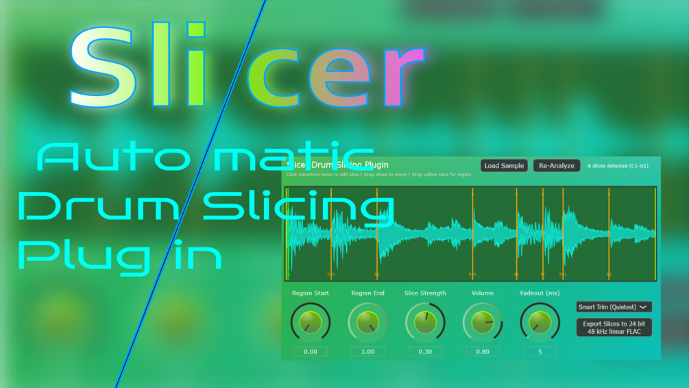

# Slicer

**Latest version:** 1.3 — download builds from the [Releases](../../../../releases) page.

Slicer is a recreation of a classic drum slicing plugin, focused on simplicity without the need for installers or online activation. It automatically detects transients in loaded samples, making it ideal for drum loops, though it can also be used for granular sound design on pads by increasing the "Slice Strength". 

The plugin supports files of any length, though it loads only the first 10 minutes to maintain performance. Users can manually edit, create, or delete slice positions (via right-click). It features various playback modes, including a random stream mode (triggered by B1/B2 notes), reverse playback, and loop mode. Exporting slices as FLAC files preserves the reverse and playback speed settings. 

*Note: Saving plugin state can be buggy; it is recommended to save slices to FLAC before closing your DAW to avoid data loss.*

---

## Manual

Slicer allows users to load samples and automatically slice them based on detected transients.

### Controls

| Control | Function |
| :--- | :--- |
| **Load Sample** | Loads a sample; supports many common file formats. |
| **Re-Analyze** | Updates slice regions after manual changes. |
| **Region Start / End** | Defines the sample range where the plugin performs slicing. |
| **Slice Strength** | Determines slice density; higher values place more slices but may become inaccurate. |
| **Volume** | Adjusts the master output volume. |
| **Fadeout (ms)** | Sets the time taken for the volume to drop to 0 at the end of each slice. |
| **Export as FLAC** | Saves all slices as 24-bit 48 kHz linearly interpolated FLAC files. |

### Mode Selector (Slicing Algorithms)

*   **Full Length:** Slices end and the next begins based on standard transient detection.
*   **-40dB:** Recalculates slice ends to occur when volume drops below -40 dB within the last 10% of the slice.
*   **Smart/Quiet Trim:** Recalculates slice ends at the quietest point within the last 10% of the slice; this is the default mode and is optimized for classic Jungle/DnB break slicing.