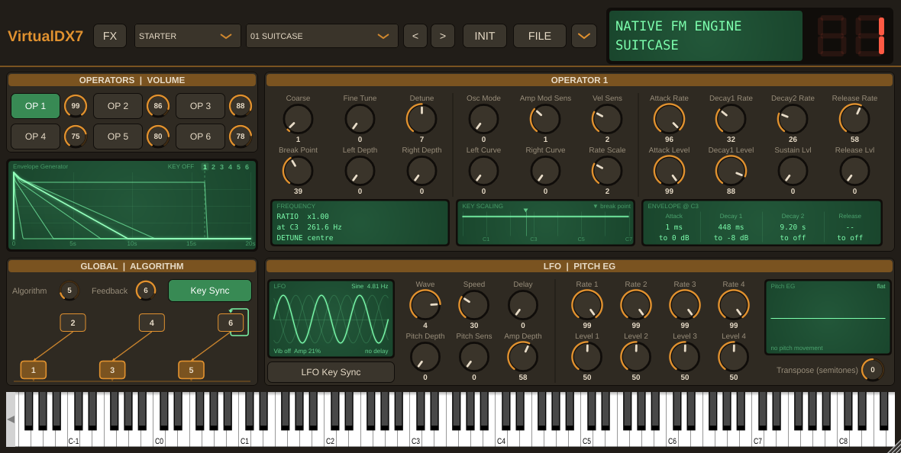
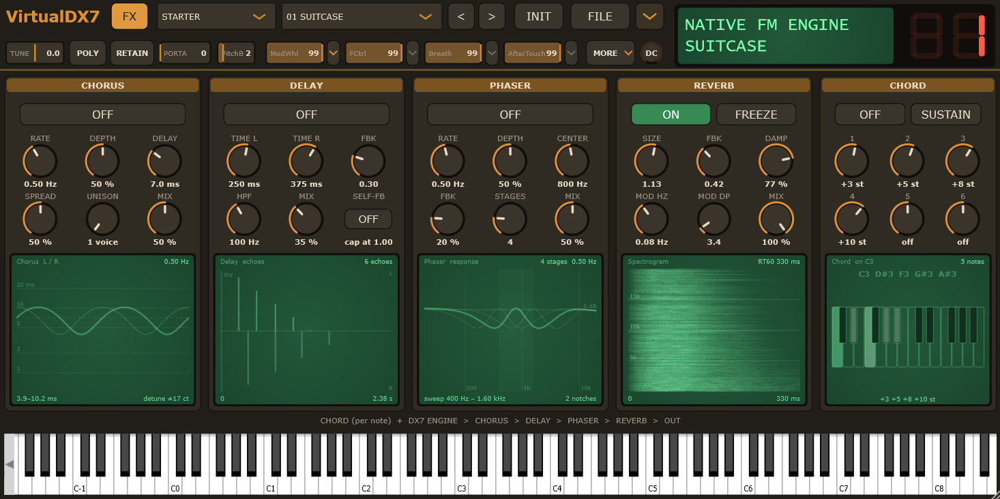

# VirtualDX7



A **Windows/cross-platform VST3 + Standalone** six-operator FM synthesizer built
in JUCE, with a **Dexed-inspired** knob-based editor GUI and **two interchangeable sound
engines**:

* a **native FM engine** that runs out of the box, needs no ROM of any kind, supports MTS-ESP Microtuning and
  responds to knob and automation moves in real time, even under a held note;
* the bit-accurate **VDX7** Yamaha DX7 emulation, originally for Linux made by chiaccona@gmail.com,
  an emulated HD6303 CPU driving emulated OPS/EGS sound chips, available to anyone who can supply their own
  firmware ROM. 

**No copyrighted data ships with this plugin.** The DX7 firmware ROM and the
factory voice ROMs are copyrighted by Yamaha and are thus not redistributable, so they are loaded
at runtime from files you point the plugin at. Without them, the plugin is still fully
playable on the native engine and its bundled starter bank. The starter bank is a set of classic DX7 presets, but
in fact only show a slice of the DX7's full potential for great sound design. 
There are tons of great presets to be found on the web which all versions of VirtualDX7 (Windows, Android, 
your own builds in both native and emulator mode) will be able to import.

---

## The two engines

### Native engine (default)

An independent implementation of the DX7 synthesis architecture, written from
the public DX7 parameter specifications. It consumes exactly the same 155-byte
VCED patch data and supports every function the panel exposes.

It is deliberately **not** a bit-accurate model. It runs in floating point at
the host sample rate, so there is no 49.096 kHz resampling stage and none of the
OPS's log-domain quantisation artefacts. Patches read as clearly "the same
patch" — same algorithm, same envelope shapes, same brightness tracking — while
sounding a little smoother and cleaner than the hardware.

What *is* taken from the hardware, because it is structural rather than tonal,
is the algorithm table. The 32 algorithms are not stored in the DX7 as a
modulation matrix; they live in the OPS as per-timeslot control bits. Running
that register machine symbolically recovers the familiar chart, including which
operator carries the feedback tap and how many carriers each algorithm sums, so
the table agrees with the emulator by construction.

Three things the native engine offers that the hardware cannot:

* **Live knob response.** Output level, keyboard scaling, velocity sensitivity
  and both envelope generators are re-evaluated from the live patch every
  control block, meaning you can turn a knob and the sound still continues to 
  play, where a real DX7 would cut off the voice when a setting changes.
* **Microtuning** via ODDSound MTS-ESP, built in (see below).
* **More voices.** 64 notes at once instead of the DX7's 16, so the Chord section can
  stack seven notes per key without stealing. When every voice is busy, the oldest
  released note is reused first. The emulated engine keeps the hardware's 16.

### Emulated engine (bring your own ROM)

Load a firmware ROM and the plugin switches to the real thing: MIDI in →
authentic DX7 FM audio out, generated by the emulated firmware and chips rather
than a DSP re-implementation. This also brings the original's limitations back
with it — the hardware's keyboard range, turning knobs while a sound plays is not supported, 
and no microtuning, because the original DX7 mkI has none to reach (this only came with the DX7 mkII 
or special extension boards).

### Loading ROMs

The **ROM menu** is the small **v** button at the end of the header row, to the right
of the FILE toggle. It is amber while the native engine plays and turns green
while a firmware ROM (the emulated engine) is in charge; the menu's heading
names the engine that is running.

* *Load firmware ROM (dx7.bin)…* — 16384 bytes. Switches to the emulated engine.
* *Load factory voices (voices.bin)…* — 32768 bytes, eight cartridge banks of
  4096. Optional. Without it the bank selector offers the bundled starter bank;
  with it, ROM1A…ROM4B are added and the **STARTER** bank stays available at
  the end of the list. Loading the file does not change the patch you are on.
* *Unload Firmware* — back to the native engine; loaded voices stay.
* *Unload Factory Voices* — back to the starter bank; the firmware stays.

Each plugin instance owns its own ROM situation, and what it loaded is written
into that instance's own plugin state, so reopening a project puts every
instance back the way it was, individually. Two instances in the same project
can differ freely — one loaded, one not, or two different files. You can place the 
ROM files anywhere you like, the plugin only remembers where you last put them.

---

## The panel

**Header, first row** (left to right, beside the two-line LCD):
*VirtualDX7* · **FX** (swaps the voice page for the effects page) · **bank** and
**program** selectors · **<** **>** step through the bank · **INIT** loads a
blank voice · **FILE** (SysEx import/export, below) · **▾** ROM menu (above) ·
the **LCD** and voice-number LED.

**Header, second row: the DX7's FUNCTION page.** These belong to the instrument,
not the voice, so changing patches never touches them; they are automatable and
saved with the project, and both engines follow them (the emulator through the
firmware's own function-parameter SysEx). The values are bars: drag sideways.
Clicking twice returns any control in this row to its default (on a **v** menu
button: everything in that menu).
* **TUNE** - master tune in cents, ±75 around A440 (the DX7's own range).
* **POLY / MONO** and the **portamento mode**: RETAIN / FOLLOW in poly (do notes
  held by the sustain pedal keep their pitch or glide to the new key),
  FINGERED / FULL in mono (glide only when playing legato, or always).
* **PORTA** - portamento time, 0 (off) … 99. The native engine's glide was
  measured against the emulated DX7: a short hold, then an exponential approach.
* **PB** - pitch bend range, 0 … 12 semitones.
* **MW**, **FC**, **BC**, **AT** - mod wheel, foot controller, breath controller
  and aftertouch: range 0 … 99, and the small **v** beside each opens its
  assignment menu (headed with the controller's full name): pitch (vibrato),
  amplitude (tremolo) and EG bias, each switched on or off. The **v** is amber
  while the controller is assigned to something.
* **MORE v** - the MIDI receive channel (Omni or 1 … 16; the on-screen keyboard
  always plays) and memory protect (voice and bank dumps arriving over MIDI are
  refused; the emulator's LCD answers MEMORY PROTECTED).
* **DC** - native engine only: a DC blocker (a leaky integrator subtracting the
  signal's offset), off at 0, up to a 5 Hz corner at full.

**OPERATORS | VOLUME** card: six buttons, **OP 1**…**OP 6**, choose which
operator the big card on the right edits. The small knob beside each button is
that operator's **output level**, so all six can be balanced without switching
operators. Clicking twice on a level knob to return it to the INIT voice's level:
99 for OP1, 0 for the others, which silences that operator and takes its curve
off the envelope scope.

**Envelope Generator** scope: the six operator envelopes on one phosphor-green
display, for a note held at middle C (C3) until every operator has settled and
then released at the dashed **KEY OFF** line. A DX7 envelope is not an ADSR:
it moves to Level 1 at Rate 1, then Level 2 at Rate 2, then Level 3 at Rate 3,
holds at Level 3 (the sustain, which can be 0) while the key is down, and goes
to Level 4 at Rate 4 on release. The scope runs the native engine's own
envelope code, so what you see is what plays.
* Operators at output level 0 are hidden; the selected operator glows.
* Click a curve, or one of the numbers **1–6** in its corner, to select that
  operator.
* Some operators are done in milliseconds while others ring for many seconds,
  so the scope zooms and scrolls in time, with mouse or finger alike: **drag
  sideways** to move, **drag up / down** to zoom in / out around the point you
  grabbed, or use the **mouse wheel** / a trackpad. **Clicking twice** shows the
  whole envelope again. While zoomed, a thin amber strip along the bottom
  shows which part you are looking at. With the scope focused, ←/→ move, ↑/↓
  zoom and Home resets.

**GLOBAL | ALGORITHM** card: along the top, the **Algorithm** knob (1–32, as printed on
the DX7), the **Feedback** knob (0–7) and the oscillator **Key Sync** switch
(green = on: every note starts its operators from the same point in their
cycle). Underneath, the routing diagram: which operator modulates which
(arrows), which are carriers (dropping to the output line), and the feedback
loop (green, closed with an arrowhead; brighter with more feedback, dashed at
0). Where that loop sits is fixed by the algorithm - the Feedback knob only
sets how much. Drawn from the engine's own routing table, including operators
that modulate several others at once (algorithms 19–25 and 31) and the loops of
algorithms 4 and 6, which run back across several operators.

**OPERATOR n** card: the selected operator's frequency (Coarse, Fine Tune,
Detune), keyboard scaling (Break Point, Left/Right Depth, Left/Right Curve,
Rate Scale), mode and sensitivities (Osc Mode, Amp Mod Sens, Vel Sens) and its
eight envelope knobs (Attack/Decay 1/Decay 2/Release rate and level). Along the
bottom, three green readouts say what those knobs mean in real units:
* **Frequency** — the ratio the Coarse/Fine pair really produces (Coarse 3 +
  Fine 50 is ×4.50, not ×3.50) or the fixed frequency, the resulting pitch at
  C3, and the detune in cents.
* **Key scaling** — this operator's level across the keyboard, with the break
  point marked. It includes the clamp at full scale, which is why a boosting
  curve does nothing on an operator already at level 99.
* **Envelope @ C3** — how long Attack, Decay 1, Decay 2 and Release each take
  (rate scaling included) and the level each heads for, one column under each
  rate/level knob pair, respective to a C3 note.

**LFO | PITCH EG** card:
* **LFO** — Wave, Speed, Delay, Pitch Depth, Pitch Sens and Amp Depth, the
  **LFO Key Sync** switch (green = every key restarts the wave), and a small
  scope in two parts. On the left, the delay: a flat line while it holds the
  LFO off, then a wedge opening up as the wave fades in - wider for a longer
  delay. On the right, always three cycles of the wave, so its shape reads the
  same at any speed. The caption gives the wave and its rate, the bottom line
  the vibrato depth in cents, the amplitude depth and the delay time. With Key
  Sync off, faint extra traces show that a note can start anywhere in the
  cycle; when neither depth is up the trace is dimmed, since the LFO then
  changes nothing.
* **Pitch EG** — Rate 1–4 over Level 1–4 (50 = no change) and a scope of the
  pitch in semitones for a held and released note. Unlike the operator
  envelopes, a note *starts* at Level 4 as well as ending there, so Level 4 is
  where a pitch swoop begins.
* **Transpose (semitones)** — a small knob showing the shift, −24 to +24
  (0 = none).

**Keyboard**: click to play. Keys you hold light up as usual; notes the Chord
section adds (or its Sustain keeps sounding) are tinted amber.

**Knobs** everywhere: drag vertically, or focus one and use the arrow keys;
hover for its full name and range. **Clicking twice** returns a knob to its value
in the INIT voice - the same patch the INIT button loads (a plain sine on OP1,
flat envelopes, algorithm 1, transpose 0) - so any single setting can be
put back to neutral without losing the rest of the patch.
On/off settings (Key Sync, LFO Key Sync) are green switches.

---

## What else it does

* **Starter bank:** 32 original patches, written from scratch in the VCED
  format, covering keys, basses, brass, strings, organs, tuned percussion, leads,
  reeds and effects. These are not the Yamaha factory voices and are not derived from
  them — the plugin is playable the moment it loads, with no ROM files at all. 
  The starter bank plays some classic recreated patches but nothing special, it is only a quick starting point.
  Every operator has its own full envelope, level, velocity and keyboard-scaling
  settings, and the bank is level-matched to within a few dB.
* Original 6-operator editor: every voice parameter (per-operator envelopes,
  frequency, keyboard scaling, plus global algorithm / feedback / LFO / pitch
  envelope) is editable with rotary controls, with an envelope scope, real-unit
  readouts and an algorithm diagram alongside (see *The panel*).
* Live emulated **LCD** and **voice-number LED**.
* Factory bank browser plus an INIT voice.
* **FILE menu** (SysEx):
  * *Import bank* — load any standard 32-voice `.syx` bank (4104-byte bulk
    dump); its 32 voices appear as a **USER** bank in the browser.
  * *Export current voice* — save the current (edited) voice as a 163-byte
    single-voice `.syx`.
  * *Export bank* — save the current bank as a 4104-byte 32-voice `.syx`, with
    the current edited voice written into its slot. This will save a bank that can be imported in a real DX7 or other DX7 emulation VSTs.
  * *Save voice into existing bank* — write the current voice into a slot of a
    `.syx` file on disk.
* **Global effects** after the engine, in a fixed Chorus → Delay → Phaser →
  Reverb chain, each independently switchable and all host-automatable:
  * *Chorus* — Rate, Depth, Delay, Spread, Unison (1–6 voices, their LFOs spread
    evenly round the cycle for a thicker, ensemble-like sound), Mix
  * *Delay* — independent Time L/R, Feedback, High-Pass, Mix, and *Self-FB*
    (Allow Self-Feedback, off by default): off, Feedback stops at 1.00 however
    far the knob turns, so echoes can hold but never grow; on, the knob's range
    up to 1.20 is live and the delay can run away into self-oscillation
  * *Phaser* — Rate, Depth, Center, Feedback, Stages (2–12), Mix
  * *Reverb* — Size, Feedback, Damping, Mod Rate, Mod Depth, Freeze, Mix
  * *Chord* — before the engine: every note you play also plays up to six more,
    each set by its own knob from −36 to +36 semitones (0 = off). *Sustain*
    holds every note-off back while it is on and releases them all when it is
    switched off. The added notes are real voices, shown tinted on the keyboard.

  

  Each unit has a green scope under its knobs, dimmed while the unit is off:
  * *Chorus* — the delay time each channel sweeps over two LFO cycles (left
    bright, right dim, so Spread shows as the phase between them; one trace
    per Unison voice), with the swept range and the detune it causes in cents.
  * *Delay* — the echoes of a single click, left above the line and right
    below, with the dry click first so Mix is the balance between them, and
    how many repeats it takes to fall 60 dB. It says *runaway* when the loop gain
    at its least damped frequency reaches 1, which takes Self-FB (at 1.00 the
    high-pass keeps it below); it is worked out at the host's actual
    sample rate.
  * *Phaser* — the frequency response at Center, the two ends of the sweep
    faintly, and the band the notches travel; Stages sets how many notches.
  * *Reverb* — a spectrogram of the tail, generated on the fly: a 10 ms burst
    of noise through a private copy of the reverb, cut into short FFTs - time
    left to right, frequency (log, 40 Hz-20 kHz) bottom to top, level as
    brightness over 60 dB, with the burst's own colour divided out. Damping
    shows as the highs dying before the lows; the corner gives the measured
    RT60. Freeze dims it and says what it does: the tail is held and new
    input is muted.
  * *Chord* — what one key plays: a small keyboard around C3 with the played
    key in phosphor green, the added notes in a paler mint, their names and the intervals.

  Knob values on this page are rounded for reading (two decimals at most, never
  finer than the knob's own step); chord intervals read as *+7 st* or *off*.

  The DSP is ported from my Aquanode Modular (another plugin of mine) effect modules. Dry/Wet and the
  enable state are ramped, because on a phone these get moved by finger and
  would otherwise zipper. The delay is free-running in milliseconds rather than
  tempo-synced: standalone on Android there is no transport to sync to.
* **Accessibility:** every knob has a full descriptive title (e.g. *"OP3 EG Rate
  1 (Attack)"*) exposed to screen readers and shown as a tooltip, is
  keyboard-focusable and arrow-key manipulatable, and its whole tile is grabbable.
* Patches are saved with the host session.

## Microtuning

Microtuning (MTS ESP) is supported by default, but again only in the native engine.
MTS-ESP is not a MIDI message — it is a small shared library that a tuning
master plugin and its clients both talk to, so the master can change the scale
live and every client follows, including under held notes.

ODDSound's client library is vendored in
`Source/External/MTS-ESP/` and compiled with the plugin. There is nothing to
switch on, and no new control on the panel: load a master into the session and VirtualDX7 follows it. The heading
of the ROM menu (the ▾ button) reports the state — `Native FM (no ROM) - MTS-ESP`,
with the master's scale name in brackets when it publishes one.

Details worth knowing:

* The frequency is looked up **per control block while a note sounds**, not only
  at note-on, so a scale change or an automated tuning glides through held
  notes, exactly as ODDSound recommend.
* Keys a master leaves **unmapped are silent**, rather than sounding at some
  fallback pitch (`MTS_ShouldFilterNote`).
* With no master in the session, or on a machine where LIBMTS was never
  installed, the plugin runs exactly as before: the client reports no master and
  the engine stays on its own tuning table. Nothing has to be installed for the
  plugin to work.
* Without MTS-ESP, the native engine still accepts **MIDI Tuning Standard
  SysEx** — bulk dumps, single-note changes and scale/octave messages.
* To leave the client out of a build entirely, define `VDX7_USE_MTS_ESP=0`.
* Linux builds need `-ldl`, since the client loads LIBMTS at runtime.

Only the native engine can use any of this — loading a firmware ROM turns
microtuning off, and clearing it turns microtuning back on. That is a property
of the hardware being modelled, not a limitation of this code: the mk1 DX7 has
no microtuning, so there is no parameter to retune and no SysEx that would reach
one.

# ROM files

VirtualDX7 ships with **no Yamaha data of any kind**. It runs out of the box on
its own native FM engine, and you can optionally point it at a firmware ROM to
switch on the bit-accurate emulation instead.

## The two files

| File | Size | Needed for |
|---|---|---|
| `dx7.bin` | 16384 bytes | The emulated engine. Without it, the native engine runs. |
| `voices.bin` | 32768 bytes | The eight factory cartridge banks (ROM1A–ROM4B). Optional. |

`voices.bin` is eight 4096-byte banks back to back. Shorter files are accepted
as long as they are a whole number of 4096-byte banks; the selector repeats what
you gave it to fill the remaining slots.

## Loading them

Click the **v** button at the end of the header row. Load the firmware, and optionally the voices.
The menu's heading tells you which engine is live.

**On desktop**, the paths are remembered two ways: in the plugin state, so
reopening a project reloads them silently, and in a global settings file, so a
freshly inserted instance finds them too.

**On Android**, the file picker hands back a document URI rather than a path,
and the permission behind it does not reliably survive an app restart. So you
will be asked once per session. This is a platform constraint, not an
oversight — the alternative would be copying Yamaha's ROM into the app's private
storage, which is exactly what you don't want for copyright safety.

## If you have no ROM

You lose nothing structural. The native engine implements the same architecture
— 32 algorithms, six operators, the same envelopes, keyboard scaling, LFO and
pitch EG — and reads the same patches. Your `.syx` banks load and play normally.

The native engine is measured against the real firmware:

| | agreement |
|---|---|
| Operator level curve | within 0.5 dB, levels 40–99 |
| Modulation index | within 0.4 dB out to the 9th harmonic |
| Feedback, all 8 levels | within 0.2 dB across 8 harmonics |
| Keyboard scaling, all 4 curves | within 0.2 dB |
| Velocity response | within 0.05 dB |
| LFO amplitude modulation depth | within 0.2 dB |
| Envelope rates and rate scaling | within about 5% |

Several rules are the hardware's own rather than curve fits, cross-checked
against Dexed: the keyboard-scaling group tables, the LFO rate table, the pitch
envelope tables, and the rate-scaling form.

Where it differs: it runs in floating point at the host sample rate, so there is
none of the DX7's log-domain quantisation and none of its 49.096 kHz resampling.
Patches read as unmistakably the same patch, a little cleaner and smoother.

Rendering the same patches through Dexed's own synthesis core for comparison
puts this in perspective. Spectral centroid, 200 ms into a middle-C note:

| patch | hardware | Dexed | native |
|---|---|---|---|
| E.PIANO 1 | 576 Hz | 573 Hz | 435 Hz |
| STRINGS 2 | 1121 Hz | 1159 Hz | 1442 Hz |
| TRAIN | 7004 Hz | 9171 Hz | 8613 Hz |
| BRASS 1 | 2792 Hz | 1796 Hz | 1333 Hz |

BRASS 1 is the interesting row: **Dexed is also markedly duller than the
hardware there**, so this is a known characteristic of floating-point DX7
implementations rather than something peculiar to this one. That patch drives
full feedback into a modulator which is not carrier-attenuated - the most
extreme regime the chip has - and every operator in it sits within about 4 dB of
the emulator's own envelope registers, so it is not a level or scaling error.

Worth recording as ruled out: the emulator's `clean()` mode, which disables the
OPS output quantisation, comes out *brighter*, so the hardware's grit is not the
explanation either.

## Build

A `.jucer` project is included. Open it in the Projucer (with the global JUCE
path), pick an exporter (Visual Studio 2026, Xcode, Linux Makefile or Android
Studio), save to generate the IDE project, and build. All engine and
`libsamplerate` sources are already listed, and the required `HAVE_CONFIG_H` /
`INLINE_EGS` defines and header-search-paths are set.

For Android, save the project in the Projucer first: that writes
`Builds/Android` and the `JuceLibraryCode` folder the generated CMake expects.
Open `Builds/Android` in Android Studio.

## Project layout

```
VirtualDX7/
  Source/
    PluginProcessor.{h,cpp}   patch model, engine wrappers, processor
    PluginEditor.{h,cpp}      the whole UI (look & feel, knobs, panels, LCD)
    NativeFM.h                the ROM-free six-operator FM engine
    RomStore.h                runtime loading of user-supplied ROM files
    StarterBank.h             32 original patches, bundled
    FxChain.h                 chorus / delay / phaser / reverb
    MtsEsp.h                  MTS-ESP microtuning client wrapper
    External/                 vendored VDX7 emulator, libsamplerate, MTS-ESP client (3rd party)
  VirtualDX7.jucer
```

## Portability notes

The vendored engine has four tiny, documented edits vs. upstream VDX7 so it
compiles with MSVC as well as GCC/Clang: a portable `INLINE` macro (`EGS.h`), a
portable endian shim (`HD6303R.h`), a guarded `<unistd.h>` include and one
fixed-size buffer in place of a VLA (`Synth.cc`).

The vendored `libsamplerate` is configured for `SRC_SINC_FASTEST` only, so the
medium- and best-quality coefficient tables are not present and not needed.

## Credits & license

* **VDX7** — the DX7 emulation — © chiaccona@gmail.com, licensed **GPLv3**.
  This project vendors and links it. No firmware or voice data is included.
* The voice pack/unpack byte layout follows the public DX7 SysEx voice format,
  as also implemented by **Dexed** (which inspired this editor's layout).
* **MTS-ESP client** © 2021 ODDSound Ltd, vendored unmodified from
  <https://github.com/ODDSound/MTS-ESP> under its permissive licence — see
  `Source/External/MTS-ESP/LICENSE.MTS-ESP`. Only the client half is included;
  the LIBMTS shared library and any master plugin are ODDSound's to distribute.
* **libsamplerate** by Erik de Castro Lopo is vendored under
  `Source/External/samplerate/` (**BSD-2-Clause**, GPL-compatible) — see
  `LICENSE.libsamplerate`.
* This combined work is distributed under the **GNU GPL v3** — see `LICENSE`.

This project is not affiliated with or endorsed by Yamaha. "DX7" is a trademark
of Yamaha Corporation and is used here only descriptively.
